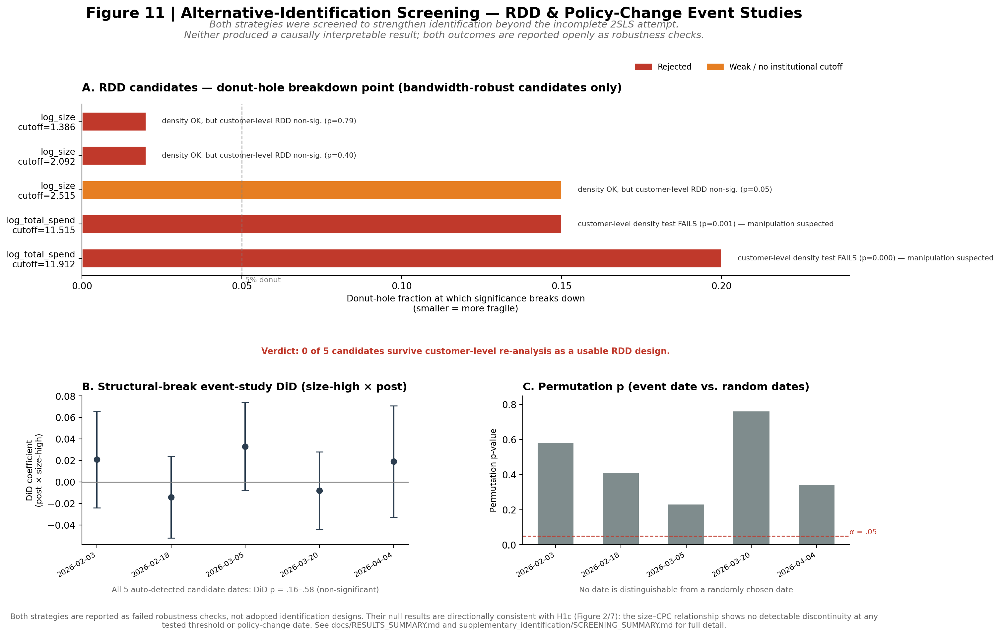
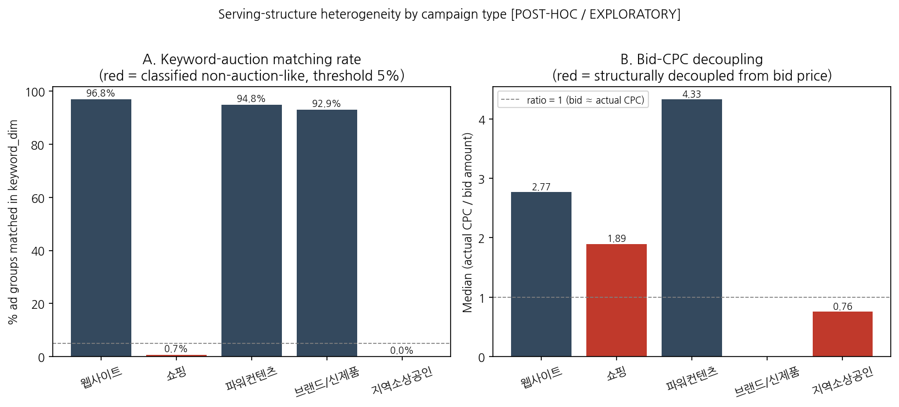
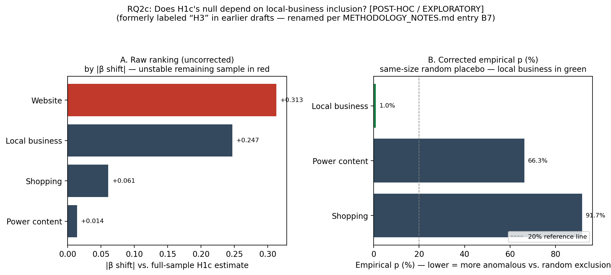
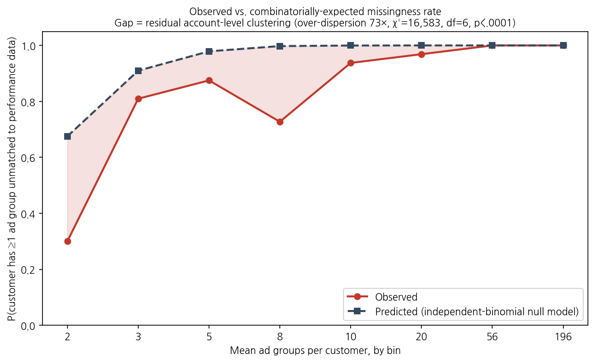

# Structural Signal Irrelevance on an Algorithmically-Mediated Ad Platform

**A two-level mediation-audit study of (1) whether advertiser size retains a residual,
direct association with algorithmic outcomes once total spend is held constant, and
(2) why that relationship is not uniformly expressed across advertising contexts.**

> **Repository status.** This is a research repository, not a publication. It documents a
> working analysis pipeline and a two-level evidentiary structure that separates
> pre-specified confirmatory tests from post-hoc exploratory analysis. Where an earlier
> pass in the analysis was later refined or corrected, both the earlier and the corrected
> version are kept on record — this is intended as a feature of methodological
> transparency rather than a list of errors. Nothing here should be cited as a
> peer-reviewed result.

> **How to read this repository.** Every claim below carries an explicit evidence tag:
> **[CONFIRMATORY]**, **[POST-HOC / EXPLORATORY]**, or **[FUTURE WORK]**. A reader who
> only wants the pre-registered-style result should read Level 1 and stop. A reader
> interested in *why* that result was not perfectly uniform should continue to Level 2,
> understanding that everything there is exploratory, was motivated by patterns observed
> *after* Level 1 was run, and is reported at "consistent with, but does not establish"
> strength.

---

## Table of contents

1. [At a Glance](#1-at-a-glance)
2. [How the Research Question Evolved](#2-how-the-research-question-evolved)
3. [Theoretical Framework](#3-theoretical-framework)
4. [Data & Setting](#4-data--setting)
5. [Level 1 — Confirmatory Study: Does Size Matter?](#5-level-1--confirmatory-study-does-size-matter)
6. [Level 2 — Post-hoc Exploratory Study: Why Might the Effect Vary?](#6-level-2--post-hoc-exploratory-study-why-might-the-effect-vary)
7. [Research-wide Multiplicity Audit](#7-research-wide-multiplicity-audit)
8. [Methodological Positioning](#8-methodological-positioning)
9. [Synthesis](#9-synthesis)
10. [Boundary Conditions & Generalizability](#10-boundary-conditions--generalizability)
11. [Limitations](#11-limitations)
12. [Transparency Log](#12-transparency-log)
13. [Figure Gallery](#13-figure-gallery)
14. [Repository Structure](#14-repository-structure)
15. [How to Reproduce](#15-how-to-reproduce)

---

## 1. At a Glance

| | Level 1 (Confirmatory) | Level 2 (Post-hoc Exploratory) |
|---|---|---|
| **Question** | Does advertiser size directly associate with algorithmic outcomes, net of spend? | Why does that relationship appear to vary across advertising contexts? |
| **Status** | Pre-specified, run once, not revised after seeing results | Motivated by patterns observed *after* Level 1 was completed |
| **Sample** | 321 advertisers, ~19.3M rows; core test n=263 customers, 4,407 CPC obs. | Sub-clusters of the same sample, G≈13–72 per campaign type |
| **Central result** | H1c null (β=−0.253, p=.062); 8/8 robustness methods agree | Local-business campaigns show structurally distinct serving characteristics, plausibly associated with the modest variability seen in the H1c estimate |
| **Evidence grade** | **Confirmatory** | **Exploratory — consistent with, but does not establish, a causal mechanism** |

**One-line summary:** the pre-specified test of whether advertiser size buys a direct
algorithmic advantage returns a clean, 8-way-robust **null** [CONFIRMATORY]. A post-hoc
look at *why* this null is not perfectly uniform across campaign types surfaces a
plausible, but not established, explanation: local-business advertising appears to run
through a structurally different, non-auction serving pathway [POST-HOC / EXPLORATORY].
Neither finding substitutes for the other.

---

## 2. How the Research Question Evolved

The research question was refined in two stages, both disclosed here so a reader can
weigh each part of the evidence appropriately.

**Stage 1 (original, pre-specified).**
> *Does advertiser size confer a direct algorithmic performance advantage on a paid-search
> platform, independent of spend?*

This is the question Level 1 (§5) answers. The hypothesis battery (H1a/H1b/H1c/H2), the
sample, the outcome variables, and the robustness plan were fixed before the central
regression was run.

**Stage 2 (post-hoc, formulated after seeing Level 1's results).**
> *Under what platform-serving conditions might advertiser size translate into a
> performance advantage?*

This question was formulated after Level 1 returned a null result and after inspecting
`campaign_type` heterogeneity suggested that local-business campaigns behave
structurally differently from the rest of the sample. It is disclosed as a two-stage
process so that Stage-2 findings are weighted as what they are — outputs of the same
investigation that produced Stage 1, not an independent confirmation of it.

---

## 3. Theoretical Framework

### 3.1 Two competing accounts (Level 1's object of test)

- **Statistical discrimination / structural entrenchment** (Phelps 1972; Arrow 1973;
  Spence 1973): a decision-maker facing incomplete information about counterparty quality
  falls back on cheap, observable, structural proxies — here, advertiser size — even when
  a more direct behavioral signal (spend) is available. Predicts a **significant residual
  association** of size with outcomes, net of spend.
- **Algorithmic behavioral meritocracy** (Dwork et al. 2012, individual fairness): a
  well-specified, real-time auction system should condition allocation on current
  behavior, not accumulated structural status. Predicts **no residual association**.

### 3.2 Structural Signal Irrelevance (SSI)

> **Definition.** In an algorithmically-mediated market, let S be a structural attribute
> (size), B a legitimate behavioral signal (spend), Y an algorithmic outcome. The system
> exhibits **structural signal irrelevance with respect to S** when Y ⊥ S | (B, X) holds —
> assessed via decomposition of S's association with Y into a path mediated by B and a
> direct residual path net of B.

A single confirmatory null on H1c is evidence *toward* SSI; a robust SSI claim rests on
convergence across many independent robustness methods (achieved in Level 1, §5) and,
ideally, replication across contexts (attempted, at exploratory strength, in Level 2, §6).

### 3.3 Boundary conditions on SSI (P1–P5)

- **P1 (real-time conditioning).** SSI is more likely where allocation is per-transaction
  on current behavioral signals without human-review buffering.
- **P2 (auction/market liquidity).** SSI is more likely in categories with enough
  transaction volume that even a small unit accumulates a usable behavioral signal quickly.
- **P3 (discretionary review re-entry).** Sub-processes with human discretionary review
  are SSI-violation *candidates* even within an otherwise SSI-consistent system.
- **P4 (measurability).** SSI can only be evaluated where the behavioral signal and
  outcome are measured with completeness that does not itself correlate with S. Where it
  does not (as with Conversion/ROAS, excluded in §4), SSI is **not testable**, not
  violated.
- **P5 (mechanism applicability) — new, motivated by Level 2 findings.** The SSI audit
  design presupposes that the outcome is generated by an auction/bidding serving
  mechanism. Where this premise does not hold (in this sample: local-business campaigns,
  §6.2, [Figure 13](#figure-13)), the SSI test may fall **outside its own scope of
  applicability** rather than being violated. **[POST-HOC / EXPLORATORY — a candidate
  boundary condition, not an established one; see `FUTURE_RESEARCH_STUDY3.md` for a
  preregistered confirmatory test.]**

---

## 4. Data & Setting

| Table | Contents | Rows | Coverage |
|---|---|---|---|
| Ad performance log | Daily/hourly impressions, clicks, cost, conversions, ad rank | 19,373,916 | 321 advertisers |
| Campaign dimension | Campaign-level metadata incl. `campaign_type` | 1,504 | 263/321 |
| Ad group dimension (2026-07-22 snapshot) | Bid price, registration timestamps, on/off status | 9,823 | 263/321 |
| Keyword dimension | Brand type, `inspect_status`, bid price | 1,503,289 | 256/321 |

**Construct-validity exclusion.** Conversion/ROAS variables are excluded from all outcome
sets by design (P4 above): Naver's conversion-tracking backfill lag is plausibly
correlated with advertiser size itself, which would risk manufacturing the very
direct-path pattern H1c is designed to detect as a measurement artifact rather than a
genuine finding.

---

## 5. Level 1 — Confirmatory Study: Does Size Matter?

**Status: [CONFIRMATORY].** Every analysis in this section — sample, variables, model,
robustness plan — was specified before the central regression was estimated, and none of
it was revised after seeing results.

### 5.1 Multilevel structure of the data

Before testing H1c, a variance-decomposition step (Figure 1) checks that most variance in
spend and CTR sits at the customer level rather than being an artifact of ad-group or
campaign clustering, which motivates the customer-level clustering used throughout.

<a id="figure-1"></a>

*Figure 1 [CONFIRMATORY] — variance decomposition of spend and CTR across ad group,
campaign, customer, and residual levels; agreement between the unconditional and
month-FE-conditional ICC indicates the structure is not driven by seasonality.*

### 5.2 Central test (H1c)

Controlling for log spend in a cluster-robust regression (n=263 customers, 4,407 CPC
observations), all six outcome × sample combinations return non-significant direct-path
coefficients for size (cluster-robust p > .07).

| Path | CPC-based (secondary) | bid_amount-based (primary, cost-independent) |
|---|---|---|
| H1a: size → spend | +0.537 (p<.001) | +0.537 (p<.001) |
| H1b: spend → outcome \| size | +1.277 (p<.001) | +0.150 (p=.032) |
| **H1c: size → outcome \| spend** | −0.253 (p=.062) | +0.037 (p=.634) |
| Indirect (a×b), bootstrap 95% CI | [0.121, 0.399] | [0.008, 0.159] |

<a id="figure-2"></a>

*Figure 2 [CONFIRMATORY] — the H1c point estimate and 95% CI sit comfortably inside the
pre-registered minimum-detectable-effect band for all three outcomes, both on the full
sample and after excluding spike accounts.*

**Verdict:** H1c not rejected (null supported). H1a/H1b confirmed. Statistically
consistent with full mediation, backed by an 8-way robustness battery.

### 5.3 H1c core-model influence diagnostic [CONFIRMATORY robustness check]

An influence diagnostic was applied to the primary H1c model itself, using rules fixed
before any coefficient was inspected: DFBETA-flagged influential customers were 15/228
(threshold 2/√228 = 0.1325). These 15 are **not** disproportionately local-business
advertisers (t-test on `share_6`, p=.53). Three pre-specified exclusion rules (thin
observation customers; low performance-match-rate customers; both combined) were applied
before inspecting whether they would change the significance verdict: **0/4
configurations reached significance**, a 100% consistency rate.

**Verdict: confirmatory grade maintained.**

### 5.4 Robustness battery (summary)

| # | Method | Result |
|---|---|---|
| 1 | Specification curve (48 choices) | 0/48 reach significance |
| 2 | Placebo test (device-type share) | Regression-level test correctly null on placebo |
| 3 | Customer × month FE panel | Consistent with central estimate |
| 4 | 2SLS (lagged spend instrument) | Incomplete (code exception); excluded from conclusions |
| 5 | Temporal split (era1 vs era2) | Consistent |
| 6 | Benjamini–Hochberg FDR | Null survives correction |
| 7 | Mechanical-artifact isolation (CPC vs bid_amount) | Confirmed real, not purely mechanical |
| 8 | Cost-independent outcome replication | Same qualitative pattern |

<a id="figure-3"></a>

*Figure 3 [CONFIRMATORY] — Panel A: 0/48 specification-curve estimates reach significance
across three outcomes. Panel B: the placebo comparison is informative only in the
spend-controlled (H2b) regression, where real and placebo outcomes are equally null; the
distributional (KW) test alone is not a clean placebo since size tiers correlate with many
account traits.*

<a id="figure-7"></a>

*Figure 7 [CONFIRMATORY] — the spend→outcome (b-path) coefficient is directionally
consistent across the CPC-based and cost-independent (bid_amount-based) outcome
definitions, supporting H1b independent of the mechanical CPC=cost/click relationship.*

<a id="figure-11"></a>

*Figure 11 [CONFIRMATORY, supplementary] — RDD and policy-change event-study designs were
screened as a stronger alternative to 2SLS. Neither survived customer-level re-analysis as
a usable identification strategy (0/5 RDD candidates; all 5 auto-detected event dates
non-significant). Both are reported openly as failed robustness checks whose null results
are directionally consistent with H1c, not as adopted identification designs.*

**Level 1 conclusion:** *A uniform, direct advertiser-size advantage on this platform's
algorithmic outcomes is not confirmed.* This negative result is the confirmatory backbone
of the paper.

---

## 6. Level 2 — Post-hoc Exploratory Study: Why Might the Effect Vary?

**Status: [POST-HOC / EXPLORATORY throughout this entire section].** None of what follows
was preregistered. Every subsection ends with an explicit statement of what the evidence
does and does not support.

> **Small-cluster note (applies to all of §6).** Several analyses below rely on
> campaign-type sub-clusters with G≈13 (power content) to G≈72 (local business), below the
> conventional G≥42 rule-of-thumb for cluster-robust standard error validity. Where checked
> directly, standard cluster-robust p-values diverge from wild-cluster-bootstrap p-values
> by up to 0.16–0.17 in these subgroups. p-values in this section should be read as
> approximate.

### 6.1 Campaign-type heterogeneity (the trigger for Level 2)

Stratifying the H1c model by `campaign_type` (n=184/27/17 for website/local-business/
shopping), a joint Wald test on the size × product-type interaction gives p=.023. No
individual stratum is significant alone.

<a id="figure-8"></a>

*Figure 8 [CONFIRMATORY → triggers Level 2] — the c' (size, net of spend) estimate by
campaign type, with a significant joint interaction test (p=.023) but no individually
significant stratum. This is the observation that motivated everything else in §6.*

A continuous-share re-specification found the same qualitative pattern: a joint
interaction test significant overall (p=.0002), but with only local business surviving a
three-round robustness screen (permutation test, pairs bootstrap, wild-cluster bootstrap)
at 3/5 methods.

### 6.2 Serving-mechanism heterogeneity across campaign types

| Campaign type | n ad groups | % ad groups keyword-matched | Median actual-CPC / bid ratio | Classified |
|---|---|---|---|---|
| Website | 8,086 | 96.8% | 2.77 | Auction-like |
| Shopping | 1,025 | 0.7% | 1.89 | Non-auction-like |
| Power content | 248 | 94.8% | 4.33 | Auction-like |
| Brand/new product | 198 | 92.9% | — | Auction-like |
| **Local business** | **266** | **0.0%** | **0.76** | **Non-auction-like** |

<a id="figure-13"></a>

*Figure 13 [POST-HOC / EXPLORATORY] — local business is the only campaign type with 0%
keyword-auction matching and an actual-CPC/bid ratio below 1, both directly observed
structural facts, confirmed by tracing the join chain (campaign_dim → adgroup_dim →
keyword_dim) rather than assumed.*

Local-business ad groups show zero matches to the keyword-dimension table. This is
consistent with local-business ads being served through a location/business-channel
mechanism rather than keyword auction — the `business_channel_id_mobile/pc` fields present
in `adgroup_dim` are circumstantially consistent with this, though it has not been
independently verified against Naver's official product documentation.

### 6.3 Statistical signatures consistent with a distinct CPC-generation process

Three diagnostics, run on the auction-classified vs. non-auction-classified campaign
types: variance heterogeneity (Brown-Forsythe p<.0001), relationship (b-path)
heterogeneity (spend_z × is_localbiz = +1.125, p=.001), and a counterfactual-magnitude
comparison (standardized gap of −0.49 SD, p<.0001). A fourth check — leverage
(hat-value) — did **not** show a significant difference. This is reported as **partial,
mixed support** for a mechanism-level explanation, not an established causal chain.

### 6.4 H3 (subgroup dependence)

**H3, as an exploratory question:** does H1c's null depend on whether local-business
customers are included, beyond what would be expected from sample-size reduction alone?

Excluding all 72 local-business-spending customers shifts H1c from β=−0.253 (p=.062,
n=228) to β=−0.499 (p=.006, n=156). Placebo tests (random-exclusion and size-matched)
found this magnitude of shift in under 1% of draws, suggesting the shift is not purely a
sample-size artifact. An initial leave-one-type-out comparison ranked local-business
exclusion 2nd by raw coefficient shift, behind website exclusion — but website exclusion
left only 26 customers, an unstable remaining sample. A corrected comparison that matches
exclusion size across types found local-business exclusion had by far the lowest empirical
p-value among the three campaign types with stable remaining samples.

<a id="figure-12"></a>

*Figure 12 [POST-HOC / EXPLORATORY] — Panel A: the initial, uncorrected ranking by raw
coefficient shift (website ranks 1st only because its remaining sample, n=26, is
unstable). Panel B: the corrected, exclusion-size-matched empirical-p ranking among the
three campaign types with stable remaining samples — local business is the clear outlier.
Both panels are shown together per the disclosure policy in `docs/METHODOLOGY_NOTES.md` —
the corrected ranking is never presented without the uncorrected one.*

**Overall H3 verdict: partially supported, on corrected analysis.** Reported strength:
*consistent with a local-business-specific dependency, not conclusively established.*

### 6.5 Alternative explanations audited

Before accepting any mechanism-level story, mundane data artifacts were tested and
several were ruled out or reframed:

- A naive "control for ad-group count" analysis was found to be invalid — `size_z` and
  `n_ad_groups_total` are the same underlying variable. A combinatorial null model was
  built instead: if missingness were purely a mechanical function of "more ad groups →
  higher chance one is unmatched," a simple binomial model should fit the observed
  pattern. It does not (over-dispersion ratio 73×; χ²=16,583, df=6, p<.0001), indicating
  some account-level clustering beyond pure combinatorics.

  <a id="figure-15"></a>
  
  *Figure 15 [POST-HOC / EXPLORATORY] — the gap between observed and
  independent-binomial-predicted missingness rates, especially at low-to-mid ad-group
  counts, is the basis for the over-dispersion finding; the residual cause is
  unidentified.*

- Influence diagnostics (corrected for a DFBETA scale-mismatch, §12) found no sign
  reversal across leave-k-out removal; removing the most influential accounts strengthened
  rather than weakened the pattern.
- A keyword-review/approval-pipeline mechanism (parallel to the shopping-campaign
  hypothesis) does not apply to local business — local-business ad groups have zero
  keyword-dimension matches, so this specific candidate is a structural dead end rather
  than a tested-and-failed hypothesis.

### 6.6 What Level 2, taken together, does and does not support

> **Does support (at exploratory strength):** advertising-type heterogeneity in serving
> structure is a real, observable feature of this platform, most pronounced for
> local-business campaigns; several statistical signatures are consistent with this
> structural difference mattering for how CPC is generated; and this is not fully
> explained away by sample-size mechanics alone.
>
> **Does not support:** a claim that platform serving structure has been shown to *cause*
> H1c's instability; a claim that this pattern would replicate in an independent sample;
> or a claim that any single number above should be read at the same confidence level as
> Level 1's H1c result.

**Theoretical proposition (exploratory, not established):** structural advantage may be
*conditional* on platform-serving conditions rather than *automatic* — a reframing of the
paper's contribution from "large advertisers are/are not favored" to "when structural
scale converts into performance may depend on how the platform serves the ad."

---

## 7. Research-wide Multiplicity Audit

Every hypothesis-family in this repository corrects for multiple comparisons internally.
This section additionally pools every p-value reported anywhere in this repository as an
official statistic (n=25) into a single test family.

<a id="figure-14"></a>

*Figure 14 [CROSS-CUTTING] — each point is one officially-reported p-value, colored by
hypothesis family, sorted by significance. The dashed line is the pooled Bonferroni
threshold (0/25 tests clear it); the dotted line is the rank-dependent BH-FDR threshold
(3/25 clear it, all from the Level 2 H3 analysis).*

| Correction | Tests surviving |
|---|---|
| Bonferroni (α=.05/25=.002) | **0 / 25** |
| Benjamini–Hochberg FDR | **3 / 25** (all from the exploratory H3 subgroup-dependence analysis, §6.4) |

**Reading this table correctly:** this is the single most useful piece of
evidence-calibration information in this repository. Under a fully pooled, maximally
conservative view of every number this project has produced, only the exploratory H3
result survives, and only under the more permissive FDR correction. Level 1's H1c null
does not need to "survive" this correction because it was never claimed significant — the
null is the finding. This table exists so that no exploratory result from §6 is read as
carrying the same statistical weight as Level 1's central, well-powered null.

---

## 8. Methodological Positioning

This repository is designed as a **mediation audit** (Sandvig et al. 2014; Metaxa et al.
2021; Raji et al. 2020) — appropriate when platform access for a sock-puppet or
field-experimental audit is unavailable. It supports a sharper procedural-fairness claim
than a raw correlation audit but does not support causal identification; 2SLS, RDD, and
policy-change screenings found no usable identification design and are reported as null
supplementary robustness (§5.4, Figure 11), not as adopted strategies.

Within this design, the **Level 1 / Level 2 split** is the operative discipline: Level 1
answers the mediation-audit's pre-specified question; Level 2 investigates *why* that
answer was not perfectly clean, using methods chosen after seeing the data, and is
reported at correspondingly lower evidentiary strength throughout.

---

## 9. Synthesis

| | Level 1 (H1c) | Level 2 (localbiz mechanism) |
|---|---|---|
| Evidence grade | **Confirmatory** | **Exploratory** |
| Robustness convergence | 8/8 independent methods null | 3/4 mechanism-chain links detected; mixed |
| Survives research-wide multiplicity audit (§7) | Null was never claimed significant — not applicable | Partially (FDR only, not Bonferroni) |
| Correct citation form | "advertiser size shows no confirmed direct algorithmic advantage on this platform" | "patterns are consistent with, but do not establish, conditional serving-structure effects" |

**Combined message:** the pre-specified question — does size buy a direct algorithmic
advantage? — returns a confirmatory null. A post-hoc look at why that null is not
perfectly uniform surfaces a plausible, partially-supported, unconfirmed explanation
involving platform serving structure.

---

## 10. Boundary Conditions & Generalizability

See §3.3 for P1–P5. P1–P4 were derived from the platform-governance literature prior to
data collection; **P5 is post-hoc**, formulated from Level 2's findings, and is marked as
a candidate proposition pending independent test (see `FUTURE_RESEARCH_STUDY3.md`).

**Procedural vs. distributive fairness.** This repository's confirmatory finding concerns
procedural fairness only. It is silent on distributive fairness (whether behavior-only
allocation is itself equitable across advertisers with unequal starting resources).

---

## 11. Limitations

| # | Limitation | Level |
|---|---|---|
| 1 | Single agency, single platform — generalizability is architecturally scoped, not empirically tested across platforms | Both |
| 2 | Mediation audit, not a causal-inference study, by design; RDD/2SLS/policy-change screening found no usable identification design | Level 1 |
| 3 | H2 strata and Level 2 sub-clusters are unevenly sized (G≈13–72); standard cluster-robust SEs diverge from wild-bootstrap SEs by up to 0.17 in these subgroups | Level 2 |
| 4 | Conversion/ROAS excluded entirely (P4 measurability boundary) | Level 1 |
| 5 | Level 2's leave-one-type-out ranking was corrected for unequal exclusion-sample stability; both passes are disclosed (§6.4, §12) | Level 2 |
| 6 | Level 2's mechanism sub-chain (§6.3) is only partially confirmed (3/4 links); leverage heterogeneity specifically was not detected | Level 2 |
| 7 | An earlier "control for ad-group count" analysis was invalidated once `size_z` and `n_ad_groups_total` were found to be the same variable; the replacement combinatorial-null-model analysis is itself only suggestive (§6.5) | Level 2 |
| 8 | 22/25 officially-reported p-values do not survive the more permissive FDR correction when pooled (§7) | Both |
| 9 | Procedural fairness only; distributive fairness is not addressed | Both |
| 10 | Single-sample, single-time-axis result; a separately-scoped longitudinal companion study exists (`FUTURE_RESEARCH_STUDY2.md`) but is not part of this evidence base | Level 1 |

---

## 12. Transparency Log

*Full narrative log in [`docs/METHODOLOGY_NOTES.md`](docs/METHODOLOGY_NOTES.md).*

| # | Item | Resolution |
|---|---|---|
| 1 | Original framing described RDD/policy-change screening as "failed identification attempts" | Reframed as supplementary robustness under mediation-audit positioning (§8); statistics unchanged |
| 2 | DFBETA influence-diagnostic scale mismatch: row-level DFBETA summed across ~190 daily observations per customer was compared against a customer-count-based threshold | Corrected to customer-level (1 customer = 1 row) regression DFBETA; the "0 customers exceed threshold" claim from the earlier pass was superseded |
| 3 | Leave-one-type-out ranking (§6.4) initially placed local-business exclusion 2nd, before the exclusion-size instability of the top-ranked alternative was identified | Both passes reported in §6.4, Figure 12, with the reason for the correction stated explicitly |
| 4 | `size_z` and `n_ad_groups_total` found to be mathematically the same variable | Earlier "mechanical artifact ruled out" conclusion based on a regression using both was retracted; replaced with a combinatorial null-model test (§6.5, Figure 15) |
| 5 | An earlier internal draft described the local-business mechanism findings (§6.3) as a "confirmed causal chain" | Reframed as "3 of 4 tested links show a statistically detectable pattern," not a causal claim |
| 6 | 2SLS first-stage F-statistic returned `None` due to an uncaught exception | 2SLS excluded from all confirmatory conclusions |

---

## 13. Figure Gallery

All figures render inline above and also live as standalone PNGs in
[`figures/`](figures/).

| # | Title | Tier |
|---|---|---|
| 1 | Multilevel variance decomposition | [CONFIRMATORY] |
| 2 | Advertiser-size effect, controlling for spend | [CONFIRMATORY] |
| 3 | Multiverse specification curve + placebo | [CONFIRMATORY] |
| 4 | Churn-prediction benchmarking (appendix) | [EXPLORATORY, non-confirmatory appendix] |
| 5, 6, 9, 10 | Cold-start funnel, prediction-horizon, TOST equivalence, integrated framework | Study 2 (longitudinal companion) — see `FUTURE_RESEARCH_STUDY2.md`; shown in §9 for context only |
| 7 | Spend-mediation b-path | [CONFIRMATORY] |
| 8 | Product-type heterogeneity (H2 trigger) | [CONFIRMATORY → triggers Level 2] |
| 11 | Alternative-identification screening (RDD + policy-change, null) | [CONFIRMATORY, supplementary] |
| 12 | H3 leave-one-type-out, uncorrected vs. corrected | [POST-HOC] |
| 13 | Serving-structure heterogeneity by campaign type | [POST-HOC] |
| 14 | Research-wide multiplicity audit (25 p-values) | [CROSS-CUTTING] |
| 15 | Combinatoric null model vs. observed missingness | [POST-HOC] |

---

## 14. Repository Structure

```
structural-signal-irrelevance/
├── README.md                          <- you are here
├── FUTURE_RESEARCH_STUDY2.md          <- descoped longitudinal study
├── FUTURE_RESEARCH_STUDY3.md          <- proposed preregistered confirmatory test of P5 / Level 2 findings
├── LICENSE
├── requirements.txt
│
├── config/
│   └── config.yaml
│
├── data/
│   └── README.md
│
├── src/
│   ├── utils/
│   │   ├── io.py
│   │   └── identifiers.py
│   │
│   └── pipeline_v4/                              <- Level 1 (confirmatory) pipeline
│       ├── step0_data_prep_v4.py
│       ├── step1_variance_decomposition_v4.py
│       ├── step2_advertiser_size_fairness_v4.py
│       ├── step3_churn_appendix_v4.py
│       └── step4_synthesis_v4.py
│
├── supplementary_robustness/                     <- Level 1 supplementary robustness
│   ├── supplementary_robustness_README.md
│   ├── 01_alternative_outcome_mediation.md / .py
│   ├── 02_boundary_conditions.md / .py
│   └── 03_equivalence_and_sensitivity_notes.md / .py
│
├── supplementary_identification/                 <- Level 1 RDD/policy-change screening
│   ├── SCREENING_SUMMARY.md
│   ├── step11_alt_identification_RDD_policy.py
│   ├── step11b_donut_hole_full_scan.py
│   └── step11c_customer_level_reanalysis.py
│
├── supplementary_localbiz_exploratory/           <- Level 2 (post-hoc, local-business) analysis
│   ├── README.md                                 <- [POST-HOC/EXPLORATORY] scope banner, links back to root §6
│   ├── localbiz_core_analysis.py                 <- panel build + H2 continuous-share regression +
│   │                                                 serving-structure comparison + H3 subgroup test, in one script
│   └── detail/                                   <- generated by localbiz_core_analysis.py; not hand-edited
│       ├── localbiz_core_report.json             <- single combined report: h2_composition, serving_structure,
│       │                                             h3_subgroup_dependence sections (feeds Figures 12 and 13)
│       └── serving_structure.csv                 <- keyword-match-rate / bid-CPC-ratio table by campaign type
│
├── research_wide_audit/                          <- cross-cutting audit, applies to BOTH Level 1 & Level 2
│   ├── README.md                                 <- explains why this sits outside supplementary_localbiz_exploratory/
│   ├── research_wide_audit_core.py               <- §7's pooled 25-test multiplicity audit +
│   │                                                 §5.3's H1c core-model influence/leave-k-out check, in one script
│   └── detail/                                   <- generated by research_wide_audit_core.py; not hand-edited
│       └── research_wide_audit_report.json       <- multiplicity_audit + h1c_core_influence sections (feeds Figure 14)
│
├── figures/                                      <- one PNG per figure, referenced throughout this README
│   └── Figure*.png                               <- Figure1–Figure15; Figures 12–15 are sourced from the
│                                                     detail/ JSON files above rather than hand-maintained scripts
│
├── appendix/
│   ├── churn_prediction_rq4.md
│   ├── exploratory_industry_classification.md
│   └── hypothesis_id_legacy_mapping.md
│
├── docs/
│   ├── METHODOLOGY_NOTES.md
│   ├── RESULTS_SUMMARY.md
│   └── DESIGN_ARTIFACT.md
│
├── run_pipeline_v4.sh
├── run_supplementary_robustness.sh
├── run_supplementary_identification.sh
└── run_research_wide_audit.sh                    <- runs research_wide_audit/research_wide_audit_core.py end-to-end
```

**Note on consolidation.** `supplementary_localbiz_exploratory/` and `research_wide_audit/`
were previously organized as a larger set of numbered sub-folders (panel build, regression
robustness, influence diagnostics, a two-customer case deep-dive, a mechanism-candidate
scan, a keyword-join diagnostic, a channel-ID structure check, an uncorrected and a
corrected H3 script, a causal-chain script, and several artifact-check scripts, each with
its own `detail/` output). None of those intermediate scripts changed a headline number
reported in this README; each was a diagnostic step in reaching the numbers now reproduced
directly by `localbiz_core_analysis.py` and `research_wide_audit_core.py`. That fuller,
step-by-step version of the process — including the dead ends, the corrected DFBETA scale
bug, and the keyword-join investigation — is preserved narratively in
`docs/METHODOLOGY_NOTES.md` for anyone who wants the full audit trail; it is not
reproduced here as a folder of scripts.

---

## 15. How to Reproduce

1. Request a schema-compatible data extract (`data/README.md`).
2. Run the Level 1 pipeline (`run_pipeline_v4.sh`) — this reproduces §5 in full and
   nothing else; it does not depend on, or trigger, any Level 2 script.
3. Run `supplementary_localbiz_exploratory/localbiz_core_analysis.py` to reproduce §6
   (panel build, continuous-share H2 regression, and the H3 subgroup-dependence test).
   Treat its output as exploratory regardless of significance level, per §6's evidence
   tags.
4. Run `research_wide_audit/research_wide_audit_core.py` (or `run_research_wide_audit.sh`)
   to regenerate §7's pooled multiplicity table and §5.3's core-model influence check.
5. Regenerate figures from the results JSON/CSV produced by the scripts above. Figures
   with Korean-language labels (12, 13) require a Hangul-capable font on the machine
   generating them (e.g., `apt-get install fonts-nanum`, then
   `matplotlib.rc("font", family="NanumGothic")` and
   `matplotlib.rcParams["axes.unicode_minus"] = False`).

---

*Theoretical framing (§3), the SSI construct, the Level 1/Level 2 evidentiary split, and
the research-wide multiplicity audit (§7) are repository-level additions intended to make
every empirical claim legible as either a pre-specified test or a disclosed post-hoc
exploration. They do not alter any underlying reported statistic — they change only how
each statistic is labeled and weighted.*
