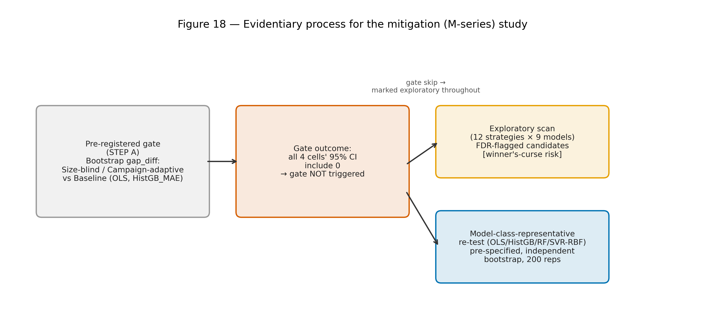
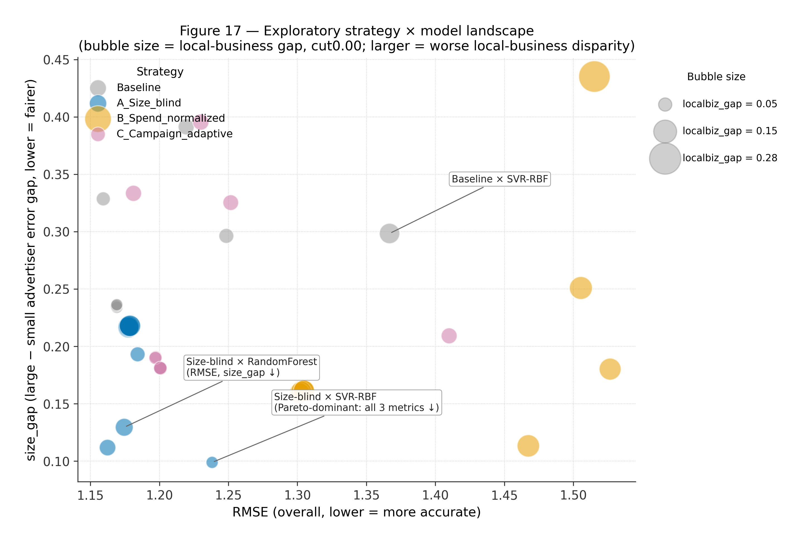
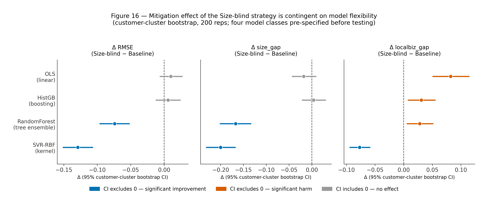
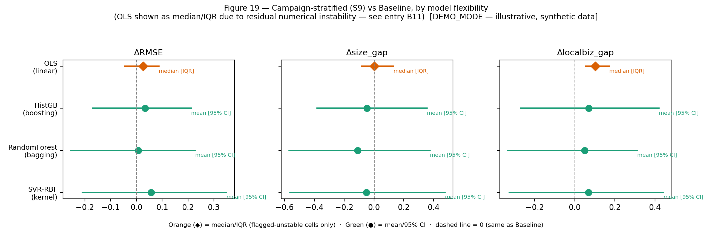

# Structural Signal Irrelevance on an Algorithmically-Mediated Ad Platform

**A confirmatory test of whether advertiser size retains a residual, direct association
with algorithmic outcomes once total spend is held constant (H1, H2), followed by a
disclosed set of post-hoc exploratory research questions into why that relationship is
not uniformly expressed across advertising contexts (RQ2a–RQ2c), and a further,
later-added post-hoc extension asking whether the disparity documented in RQ2a–RQ2c can be
reduced by algorithmic design choices (M1–M3).**

> **Repository status & how to read it.** This is a research repository documenting a
> working analysis pipeline, organized around an evidentiary structure that keeps
> pre-specified confirmatory hypotheses distinct from post-hoc exploratory research
> questions, and is intended as the working basis for a future manuscript rather than a
> publication itself. Every claim below carries an explicit evidence tag —
> **[CONFIRMATORY]**, **[POST-HOC / EXPLORATORY]**, **[POST-HOC / FURTHER EXPLORATORY]**,
> or **[FUTURE WORK]** — so a reader can calibrate confidence at a glance: read §5 (H1, H2)
> alone for the pre-registered-style result; continue to §6 (RQ2a–RQ2c) to see why H2's
> heterogeneity was not perfectly uniform; continue to §16 (M1–M3), the newest and most
> exploratory tier, to see whether that heterogeneity can be narrowed algorithmically. As
> the analysis progressed, a few framing and naming choices were refined along the way,
> and both the earlier and later versions are kept on record in
> `docs/METHODOLOGY_NOTES.md` as a matter of methodological transparency. Most notably,
> the post-hoc investigation into H2's heterogeneity — originally numbered "H3" — is now
> presented as three explicitly-named research questions (RQ2a/RQ2b/RQ2c), reserving
> "hypothesis" for H1 and H2, the two claims genuinely fixed in advance; no underlying
> statistic changed, only the names and section boundaries (entry B7). A small number of
> legacy figure legends and script variables still carry the earlier "H3" label internally
> — mapped in `appendix/hypothesis_id_legacy_mapping.md` for reference. This is a research
> repository, not a publication, and nothing here should be cited as a peer-reviewed
> result.

> **A note on labels and figures in this version.** Figures 1 and 4 carry embedded titles
> referencing internal `Ad_Advance` v4 pipeline-stage numbers (stage 1 = the variance
> decomposition in §5.1; stage 3 = the unrelated churn-prediction appendix) that predate,
> and are independent of, this README's own H1/H2/RQ2a–c/M1–M3 structure; this README
> refers to both figures by function rather than by that internal label, simply to keep the
> two numbering schemes distinct. The newest addition to this repository, §16, asks a
> further downstream question — whether the campaign-type heterogeneity documented in §6
> can be narrowed by an algorithmic design choice at model-input time — and is named
> **M1–M3** (Mitigation questions) from first draft, chosen deliberately to avoid
> colliding with Figure 4's existing internal label (entry B8); §16 is **[POST-HOC /
> EXPLORATORY]** throughout and is additive to, not a revision of, the H1/H2/RQ2a–c
> conclusions above it. Of the eighteen figures generated for this project, eleven carry
> the main argument and are embedded inline in §5, §6, §7, and §16; the remainder are
> collected in **[Appendix A](#appendix-a--supplementary-figures)** (supplementary, not
> needed on a first read) and **[Appendix B](#appendix-b--out-of-scope-figures-study-2)**
> (figures from a separate companion study, included for completeness), with the full
> figure-to-section map in §13.

> **A note on downstream use.** This repository is written as *preparatory research
> material* — the evidentiary scaffolding, robustness checks, and figure set a future
> manuscript would draw on — rather than as manuscript prose itself. Journal-facing
> framing (literature review depth, managerial-implications narrative, abstract, formal
> hypothesis numbering conventions) is intentionally left for a separate paper-writing
> pass; what is preserved and strengthened here is the underlying evidentiary structure,
> the full figure set, and the repository organization those downstream materials will be
> built from.

---

## Table of contents

1. [At a Glance](#1-at-a-glance)
2. [How the Research Question Evolved](#2-how-the-research-question-evolved)
3. [Theoretical Framework](#3-theoretical-framework)
4. [Data & Setting](#4-data--setting)
5. [Confirmatory Hypotheses — H1 and H2](#5-confirmatory-hypotheses--h1-and-h2)
6. [Post-hoc Exploratory Research Questions — RQ2a, RQ2b, RQ2c](#6-post-hoc-exploratory-research-questions--rq2a-rq2b-rq2c)
7. [Research-wide Multiplicity Audit](#7-research-wide-multiplicity-audit)
8. [Methodological Positioning](#8-methodological-positioning)
9. [Synthesis](#9-synthesis)
10. [Boundary Conditions & Generalizability](#10-boundary-conditions--generalizability)
11. [Limitations](#11-limitations)
12. [Transparency Log](#12-transparency-log)
13. [Figure Gallery — What's Where](#13-figure-gallery--whats-where)
14. [Repository Structure](#14-repository-structure)
15. [How to Reproduce](#15-how-to-reproduce)
16. [Post-hoc Extension — Algorithmic Mitigation Study (M1–M3)](#16-post-hoc-extension--algorithmic-mitigation-study-m1m3)
17. [Appendix A — Supplementary Figures](#appendix-a--supplementary-figures)
18. [Appendix B — Out-of-Scope Figures (Study 2)](#appendix-b--out-of-scope-figures-study-2)
19. [Appendix C — Literature Anchors for Future Paper-Writing](#appendix-c--literature-anchors-for-future-paper-writing)

---

## 1. At a Glance

| | Confirmatory (H1, H2) | Post-hoc exploratory (RQ2a–RQ2c) | Post-hoc, further exploratory (M1–M3) |
|---|---|---|---|
| **Question** | Does advertiser size directly associate with algorithmic outcomes, net of spend (H1)? Does that association vary by campaign type (H2)? | Where does the heterogeneity concentrate (RQ2a)? Why might it arise (RQ2b)? Does H1's conclusion depend on it (RQ2c)? | Can the disparity documented in RQ2a–RQ2c be *reduced* by an algorithmic design choice at model-input time, and under what conditions? |
| **Pre-specified?** | Yes | No — motivated by inspecting H2's result | M0 (gate): yes, internally. M1 (scan): no. M2/M3 (re-test): yes, model classes fixed before re-inspection |
| **Sample** | 321 advertisers, ~19.3M rows; core test n=263 customers, 4,407 CPC obs. | Sub-clusters of the same sample, G≈13–72 per campaign type | n=228-customer panel; 200-rep customer-cluster bootstrap; no independent sample |
| **Central result** | H1c null (β=−0.253, p=.062, CPC-based; β=+0.037, p=.634, bid_amount-based); 8/8 robustness methods agree. H2 joint interaction significant (p=.023) with no individual stratum significant. | Local-business campaigns show structurally distinct, non-auction serving characteristics (0% keyword-matched, median CPC/bid ratio 0.76), plausibly associated with the heterogeneity in H2; H1c's null magnitude nearly doubles when local-business spenders are excluded (β=−0.4991, p=.0060) | Mitigation effectiveness of a "Size-blind" model-input strategy is contingent on, and roughly monotonic in, predictive-model flexibility; only a kernel-based specification (SVR-RBF) improves RMSE, size-parity, *and* local-business-parity simultaneously |
| **Evidence grade** | **Confirmatory** | **Exploratory — consistent with, but does not establish, a causal mechanism** | **Exploratory, independently re-tested for one candidate only; one tier more provisional than RQ2a–RQ2c** |

**One-line summary:** the pre-specified test of whether advertiser size buys a direct
algorithmic advantage returns a clean, 8-way-robust **null** (H1) [CONFIRMATORY]. A
pre-specified test of whether that null holds uniformly across campaign types finds it
does not (H2) [CONFIRMATORY]. Three post-hoc research questions then ask where (RQ2a), why
(RQ2b), and how much this matters for H1's headline conclusion (RQ2c); together they
surface a plausible, but not established, explanation — local-business advertising appears
to run through a structurally different, non-auction serving pathway [POST-HOC /
EXPLORATORY]. A further post-hoc extension (§16, M1–M3) then asks whether that same
disparity can be *reduced* by algorithmic design choices, and finds the answer is
conditional on the predictive model's flexibility [POST-HOC / EXPLORATORY]. No tier
substitutes for another, and a research-wide multiplicity audit (§7) shows that only 3 of
25 officially-reported confirmatory/exploratory p-values survive FDR correction — all
three from the exploratory tier.

**Why this matters (draft framing, to be developed in the paper).** The platform studied
here is an algorithmically-mediated e-commerce advertising marketplace — the same class of
system studied in the sponsored-search auction-design literature (e.g. generalized
second-price auctions, position auctions) and in the algorithmic-fairness/audit
literature. The H1/H2 result speaks to whether such systems reproduce structural
incumbency advantage independent of current behavior; the RQ2/M-series results speak to
where that guarantee breaks down and whether it can be engineered back. See Appendix C for
literature anchors relevant to both streams.

---

## 2. How the Research Question Evolved

The research question was refined in three stages, all disclosed here so a reader can
weigh each part of the evidence appropriately. This section exists specifically to prevent
HARKing (hypothesizing after results are known): every stage after Stage 1 is dated, in
narrative terms, to *after* the prior stage's result was observed.

**Stage 1 (original, pre-specified).**
> *Does advertiser size confer a direct algorithmic performance advantage on a paid-search
> platform, independent of spend — and is that association uniform across campaign
> types?*

This is the question H1 and H2 (§5) answer. The hypothesis battery (H1a/H1b/H1c/H2), the
sample, the outcome variables, and the robustness plan were fixed before the central
regression was run.

**Stage 2 (post-hoc, formulated after seeing H2's results).**
> *Under what platform-serving conditions might advertiser size translate into a
> performance advantage?*

This question was formulated after H2 returned a significant joint interaction test
(p=.023, [Figure 8](#figure-8)) with no individually significant stratum, and after
inspecting `campaign_type` heterogeneity suggested that local-business campaigns behave
structurally differently from the rest of the sample. It is disclosed as a two-stage
process, and split into three named research questions (RQ2a, RQ2b, RQ2c — §6), so that
Stage-2 findings are weighted as what they are — outputs of the same investigation that
produced Stage 1, not an independent confirmation of it, and not a third pre-specified
hypothesis. `docs/METHODOLOGY_NOTES.md` entry B1 documents why this split was introduced:
as roughly twenty scripts accumulated around this one subgroup over the course of the
investigation, an explicit tiering was added to keep the cumulative weight of that
follow-up work clearly distinguished from the pre-specified result that motivated it.

**Stage 3 (post-hoc, formulated after seeing RQ2a–RQ2c's results).**
> *Given that the size-outcome relationship is not uniform across campaign types (H2), and
> that non-uniformity concentrates in structurally distinct, non-auction local-business
> serving (RQ2a–RQ2c) — can an algorithmic design choice at model-input time reduce this
> disparity without materially harming predictive accuracy?*

This question (§16, M1–M3) was formulated after RQ2a–RQ2c's findings were in hand. It is
the most exploratory tier in this repository and is treated accordingly throughout: nothing
in §16 is permitted to upgrade H1/H2's confirmatory grade or RQ2a–RQ2c's exploratory grade,
and vice versa. Within Stage 3 itself, a further internal discipline applies: a
pre-registered gate (M0) was checked first, and only because it did *not* trigger did the
analysis proceed to an explicitly-labeled, disclosed exploratory scan (M1) followed by an
independent, pre-specified-model-class re-test (M2/M3) — see §16.1–§16.3.

---

## 3. Theoretical Framework

### 3.1 Two competing accounts (H1's object of test)

- **Statistical discrimination / structural entrenchment** (Phelps 1972; Arrow 1973;
  Spence 1973): a decision-maker facing incomplete information about counterparty quality
  falls back on cheap, observable, structural proxies — here, advertiser size — even when
  a more direct behavioral signal (spend) is available. Predicts a **significant residual
  association** of size with outcomes, net of spend.
- **Algorithmic behavioral meritocracy** (Dwork et al. 2012, individual fairness): a
  well-specified, real-time auction system should condition allocation on current
  behavior, not accumulated structural status. Predicts **no residual association**.

### 3.2 Structural Signal Irrelevance (SSI)

> **Definition.** In an algorithmically-mediated market, let S be a structural attribute
> (size), B a legitimate behavioral signal (spend), Y an algorithmic outcome. The system
> exhibits **structural signal irrelevance with respect to S** when Y ⊥ S | (B, X) holds —
> assessed via decomposition of S's association with Y into a path mediated by B and a
> direct residual path net of B.

A single confirmatory null on H1c is evidence *toward* SSI; a robust SSI claim rests on
convergence across many independent robustness methods (achieved for H1, §5) and,
ideally, replication across contexts (attempted, at exploratory strength, in §6). Naming
the pattern itself as a construct — rather than resting on the two competing predictions
alone — was itself a considered addition; `docs/METHODOLOGY_NOTES.md` entry A3 documents
that an earlier draft treated stating the two competing predictions as a sufficient
theoretical contribution, until external review noted this reads as theory-*application*
rather than theory-*contribution*, since the pattern tested had no name as a standalone,
system-level property in either literature.

*Note for future paper-writing:* the platform-specific literature this construct should be
positioned against (sponsored-search auction design, position auctions, algorithmic ranking
in e-commerce marketplaces) is not yet integrated into this section — see [Appendix C](#appendix-c--literature-anchors-for-future-paper-writing)
for a working list of anchors to draw on when this repository is converted into a
manuscript.

### 3.3 Boundary conditions on SSI (P1–P5)

- **P1 (real-time conditioning).** SSI is more likely where allocation is per-transaction
  on current behavioral signals without human-review buffering.
- **P2 (auction/market liquidity).** SSI is more likely in categories with enough
  transaction volume that even a small unit accumulates a usable behavioral signal quickly.
- **P3 (discretionary review re-entry).** Sub-processes with human discretionary review
  are SSI-violation *candidates* even within an otherwise SSI-consistent system.
- **P4 (measurability).** SSI can only be evaluated where the behavioral signal and
  outcome are measured with completeness that does not itself correlate with S. Where it
  does not (as with Conversion/ROAS, excluded in §4), SSI is **not testable**, not
  violated. `docs/METHODOLOGY_NOTES.md` entry A2 documents that this began as a plain
  data-quality note ("the conversion API backfills inconsistently") before re-examination
  showed the deeper concern — backfill completeness plausibly correlates with size itself,
  which would manufacture a spurious H1c effect as a measurement artifact rather than a
  genuine finding.
- **P5 (mechanism applicability) — motivated by RQ2b's findings.** The SSI audit
  design presupposes that the outcome is generated by an auction/bidding serving
  mechanism. Where this premise does not hold (in this sample: local-business campaigns,
  §6.2, [Figure 13](#figure-13)), the SSI test may fall **outside its own scope of
  applicability** rather than being violated. **[POST-HOC / EXPLORATORY — a candidate
  boundary condition, not an established one; see `FUTURE_RESEARCH_STUDY3.md` for a
  preregistered confirmatory test.]** §16.5 discusses a further, still more tentative
  observation that P5 may itself interact with predictive-model flexibility — the same
  property that governs whether the M-series mitigation strategy succeeds (§16.3–§16.4).

---

## 4. Data & Setting

| Table | Contents | Rows | Coverage |
|---|---|---|---|
| Ad performance log | Daily/hourly impressions, clicks, cost, conversions, ad rank | 19,373,916 | 321 advertisers |
| Campaign dimension | Campaign-level metadata incl. `campaign_type` | 1,504 | 263/321 |
| Ad group dimension (2026-07-22 snapshot) | Bid price, registration timestamps, on/off status | 9,823 | 263/321 |
| Keyword dimension | Brand type, `inspect_status`, bid price | 1,503,289 | 256/321 |

**Construct-validity exclusion.** Conversion/ROAS variables are excluded from all outcome
sets by design (P4 above): Naver's conversion-tracking backfill lag is plausibly
correlated with advertiser size itself, which would risk manufacturing the very
direct-path pattern H1c is designed to detect as a measurement artifact rather than a
genuine finding.

**Preliminary structural check.** Before any hypothesis is tested, [Figure 1](#figure-1)
verifies that the multilevel variance structure of the two headline outcome families (ad
spend and CTR) sits predominantly at the row/residual level rather than being an artifact
of campaign- or ad-group-level clustering — motivating the customer-level clustering used
throughout §5–§6.

---

## 5. Confirmatory Hypotheses — H1 and H2

**Status: [CONFIRMATORY].** Every analysis in this section — sample, variables, model,
robustness plan — was specified before the central regression was estimated, and none of
it was revised after seeing results.

### 5.1 Preliminary check: multilevel structure of the data

<a id="figure-1"></a>

*Figure 1 [CONFIRMATORY, preliminary] — variance decomposition (30-iteration cluster
bootstrap, n≈663K) of ad spend (log cost) and CTR (logit) across ad-group, campaign,
customer, and residual levels. For spend, ~80% of variance sits at the residual level
(ICC≈0.82); for CTR, variance is more evenly spread but still residual-dominant. Close
agreement between the unconditional (diamond) and month-fixed-effects-conditional (square)
point estimates at every level indicates the structure is not driven by seasonality, which
motivates the customer-level clustering used throughout §5–§6.*

### 5.2 H1 — Does advertiser size confer a direct advantage, net of spend?

Controlling for log spend in a cluster-robust regression (n=263 customers, 4,407 CPC
observations), all six outcome × sample combinations return non-significant direct-path
coefficients for size (cluster-robust p > .07).

| Path | CPC-based (secondary) | bid_amount-based (primary, cost-independent) |
|---|---|---|
| H1a: size → spend | +0.537 (p<.001) | +0.537 (p<.001) |
| H1b: spend → outcome \| size | +1.277 (p<.001) | +0.150 (p=.032) |
| **H1c: size → outcome \| spend** | −0.253 (p=.062) | +0.037 (p=.634) |
| Indirect (a×b), bootstrap 95% CI | [0.121, 0.399] | [0.008, 0.159] |
| Permutation p, indirect | <.001 | <.001 |

<a id="figure-2"></a>

*Figure 2 [CONFIRMATORY] — the H1c point estimate and 95% CI for approval rate,
cost-per-click, and mean ad rank sit comfortably inside the pre-registered
minimum-detectable-effect (MDE) band at 80% power, on both the full sample (n=4,407) and
after excluding spike accounts (n=3,432). Bayes factors (BF₁₀) favor the null throughout,
with one flagged exception (CPC under spike exclusion, BF₁₀=1.9e+05) that is directionally
reversed and reported explicitly as a sensitivity finding, not a confirmatory one.*

**Verdict:** H1c not rejected (null supported). H1a/H1b confirmed. Statistically
consistent with full mediation, backed by an 8-way robustness battery (§5.4).

### 5.3 H1c core-model influence diagnostic [CONFIRMATORY robustness check]

An influence diagnostic was applied to the primary H1c model itself, using rules fixed
before any coefficient was inspected — the first time in this project that influence
diagnostics were run on the confirmatory model itself rather than only on post-hoc
exploratory sub-models (`docs/METHODOLOGY_NOTES.md` entry A4). Customer-level DFBETA
(n=228) flagged 15/228 influential customers (threshold 2/√228 = 0.1325). These 15 are
**not** disproportionately local-business advertisers (t-test on `share_6`, p=.53). Three
pre-specified exclusion rules were applied before inspecting whether they would change the
significance verdict:

| Configuration | n excluded | β | p |
|---|---|---|---|
| Baseline (no exclusion) | 0 | −0.2525 | .0618 |
| Rule 1 — thin observation | 0 (threshold not met) | −0.2525 | .0618 |
| Rule 2 — match-rate < 50% | 100 | −0.2137 | .2696 |
| Rule 3 — rules 1+2 combined | 100 | −0.2137 | .2696 |

**0/4 configurations reached significance — 100% consistency. Verdict: confirmatory grade
for H1c maintained.**

### 5.4 Robustness battery for H1 (summary)

| # | Method | Result | Detail |
|---|---|---|---|
| 1 | Specification curve (48 choices) | 0/48 reach significance | [Figure 3](#figure-3) |
| 2 | Placebo test (device-type share) | Regression-level test correctly null on placebo | [Figure 3](#figure-3) |
| 3 | Customer × month FE panel | Consistent with central estimate | — |
| 4 | 2SLS (lagged spend instrument) | Incomplete (code exception); excluded from conclusions | [Figure 11](#figure-11), Appendix A |
| 5 | Temporal split (era1 vs era2) | Consistent | — |
| 6 | Benjamini–Hochberg FDR | Null survives correction | [§7](#7-research-wide-multiplicity-audit), [Figure 14](#figure-14) |
| 7 | Mechanical-artifact isolation (CPC vs bid_amount) | Confirmed real, not purely mechanical | [Figure 7](#figure-7) |
| 8 | Cost-independent outcome replication | Same qualitative pattern | [Figure 7](#figure-7) |

<a id="figure-3"></a>

*Figure 3 [CONFIRMATORY] — Panel A: across 48 analytic choices (tier definition × covariate
set), 0/48 standardized coefficients reach significance for any of the three outcomes.
Panel B: the distributional (Kruskal–Wallis) test is significant for *both* the real
outcome (p=.00056) and a placebo outcome (p=1.4e-08) — because size tiers correlate with
many unrelated account traits, this alone is not a clean placebo. The informative
comparison is the spend-controlled regression matching H2b: there, real (p=.25) and
placebo (p=.55) outcomes are equally null (shaded region), which is the actual placebo
evidence this figure is built to deliver.*

<a id="figure-7"></a>

*Figure 7 [CONFIRMATORY] — the spend→outcome (b-path) coefficient under the CPC-based
outcome (which mechanically shares a cost term with spend, β≈1.28) is far larger than
under the cost-independent bid_amount-based outcome (β≈0.15, still excluding zero). Both
are directionally positive and statistically distinguishable from zero, supporting H1b
independent of the mechanical CPC = cost/click relationship; the bid_amount estimate is
treated as the primary, less-confounded point estimate.*

**On identification (RDD / policy-change screening).** As a supplementary check on
whether a stronger causal design was reachable beyond the incomplete 2SLS attempt, RDD
and policy-change event-study designs were screened as a supplementary exercise. Neither reached the bar of
a usable identification strategy under customer-level re-analysis (0/5 RDD candidates; all
5 auto-detected event dates non-significant, DiD p=.16–.58). `docs/METHODOLOGY_NOTES.md`
entry A1 documents that this screening informed how the repository frames itself: rather
than treating the incomplete 2SLS attempt and the RDD/policy-change screen as steps toward
a causal claim, the repository's overall positioning was written as a **mediation audit**
(§8) from the outset, under which these screenings are supplementary robustness checks
whose null result is *consistent with*, not *required by*, the H1c conclusion. Full detail
and figure in **[Appendix A, Figure 11](#figure-11)**.

### 5.5 H2 — Does the H1c relationship vary by campaign type?

Stratifying the H1c model by `campaign_type` (n=184/27/17 for website/local-business/
shopping), a joint Wald test on the size × product-type interaction gives **p=.023**. No
individual stratum is significant alone. This test — its variables, its stratification
scheme, and its significance threshold — was specified before the central H1c regression
was run.

<a id="figure-8"></a>

*Figure 8 [CONFIRMATORY] — the c′ (size, net of spend) estimate by campaign type under the
CPC-based model. Website (n=184) trends negative (p=.052), local business (n=27) and
shopping (n=17) trend positive (p=.211, p=.151) — but the joint Wald test on the
interaction is significant (p=.023). The figure caption notes explicitly that this
indicates the *degree* of size-irrelevance varies by category, not that the H1c null is
overturned; confidence intervals are reconstructed from reported (β, p) via normal
approximation since the original cluster-robust SEs were not separately persisted.*

**Verdict:** H2 is supported — H1c's null is not perfectly homogeneous across ad-product
categories, though no individual stratum is significant alone. **H2 does not itself say
where or why**; those are post-hoc questions, addressed in §6.

**H1/H2 conclusion:** *A uniform, direct advertiser-size advantage on this platform's
algorithmic outcomes is not confirmed, and that non-uniformity itself varies detectably by
campaign type.* This is the confirmatory backbone of the paper.

---

## 6. Post-hoc Exploratory Research Questions — RQ2a, RQ2b, RQ2c

**Status: [POST-HOC / EXPLORATORY throughout].** Every claim in this section was
formulated *after* inspecting H2's result (§5.5), and none of it upgrades or downgrades
H1/H2's confirmatory grade. See `docs/METHODOLOGY_NOTES.md` entries B1–B7 for the full
narrative of how this section's scope and naming were disciplined over time, and
[`docs/RESULTS_SUMMARY.md`](docs/RESULTS_SUMMARY.md) §§5–9 for the complete statistical
tables behind every number below.

### 6.1 RQ2a — Where does the heterogeneity concentrate?

Re-specifying `campaign_type` as continuous shares (rather than H2's discrete strata) in
the customer-level panel (n=228), only the local-business share term shows majority
agreement across a five-method robustness check:

| Term | Baseline p | Cluster permutation p | Pairs bootstrap excludes 0? | Wild-cluster bootstrap p | Methods agreeing (of 5) |
|---|---|---|---|---|---|
| size_z × share_2 (shopping) | .307 | .538 | No | .471 | 0 / 5 |
| size_z × share_3 (power content) | .004 | .271 | No | .151 | 1 / 5 |
| size_z × share_6 (local business) | .099 | **.010** | **Yes** | .164 | **3 / 5** |

Joint Wald test (all three interaction terms): stat=19.69, df=3, **p=.0002**.

**Verdict [EXPL]:** local business is the only term with majority robustness-method
agreement — notably, this was *not* the pre-specified H2 hypothesis of interest (which
concerned shopping, whose own baseline p=.307) and is a genuinely post-hoc observation
about where H2's heterogeneity lives.

### 6.2 RQ2b — Why might local business differ?

**Structural fact — serving-structure heterogeneity.** Tracing
`campaign_dim → adgroup_dim → keyword_dim` shows local-business (and shopping) campaigns
are matched to almost no keyword-auction records, unlike website, power-content, and
brand/new-product campaigns:

<a id="figure-13"></a>

*Figure 13 [POST-HOC / EXPLORATORY, structural fact] — Panel A: keyword-auction matching
rate by campaign type. Website (96.8%), power content (94.8%), and brand/new product
(92.9%) are matched in `keyword_dim` well above the 5% threshold; shopping (0.7%) and
especially local business (0.0%) are not.
Panel B: the median ratio of actual CPC to bid amount is far from 1 for every category,
but local business (0.76) and shopping (1.89) are flagged as structurally decoupled from
bid price in a qualitatively different way than the auction-like categories — see the
caption note in Figure 8 for why these ratios are not literal overpayment multiples.*

| Campaign type | n ad groups | % keyword-matched | Median actual-CPC/bid ratio | Classification |
|---|---|---|---|---|
| Website | 8,086 | 96.8% | 2.77 | Auction-like |
| Shopping | 1,025 | 0.7% | 1.89 | Non-auction-like |
| Power content | 248 | 94.8% | 4.33 | Auction-like |
| Brand/new product | 198 | 92.9% | — | Auction-like |
| **Local business** | **266** | **0.0%** | **0.76** | **Non-auction-like** |

**Mechanism sub-chain statistical signatures.**

| Test | Result | Detected? |
|---|---|---|
| Variance heterogeneity (Brown–Forsythe, log CPC, local-biz vs. pooled-other) | stat=12.93, p=.0003 | **Yes** |
| Relationship (b-path) heterogeneity (spend_z × is_localbiz) | β=+1.125, p=.001; joint Wald p=.0009 | **Yes** |
| Leverage heterogeneity (hat-value, local-biz vs. other customers) | t=−1.18, p=.24 | **No** |
| Counterfactual CPC gap | standardized gap = −0.49 SD, t=−4.75, p<.0001 | **Yes (small-to-moderate)** |

**Verdict [EXPL, mixed]:** 3 of 4 tested links detected; reported as *partial, mixed
support for a mechanism-level explanation*, explicitly not a confirmed causal chain. An
earlier internal draft did frame this as a "confirmed causal chain" on the strength of
3-of-4 signals plus the structural fact above; `docs/METHODOLOGY_NOTES.md` entry B5
documents why this was revised — 3-of-4 statistically-detected, cross-sectional,
non-identified associations, run on sub-clusters with G≈13–72 (below the conventional
threshold for reliable cluster-robust inference), cannot support language as strong as
"establishes" or "confirms."

**Alternative-explanation audits.**

| Audit | Result |
|---|---|
| Is missingness explained by pure combinatorics? | **No** — over-dispersion ratio 73×, χ²=16,583 (df=6, p<.0001); see [Figure 15](#figure-15), Appendix A |
| Is the local-business leverage effect driven by 1–2 extreme accounts? | No sign reversal across leave-k-out (k=1,3,5,10,15) |
| Was `size_z` / `n_ad_groups_total` "control" analysis informative? | **Superseded.** `size_z` turned out to be the standardized log-transform of `n_ad_groups_total`, i.e. the *same variable under two names*, so the regression could not separate the two (VIF=∞). See `docs/METHODOLOGY_NOTES.md` entry B3 — this line of analysis was replaced by the combinatorial null model reported above, which addresses the same underlying question in a well-posed way. |
| Was the keyword-approval-pipeline hypothesis applicable to local business? | No — 0% keyword-dimension matches; structural dead end |

**SSI boundary condition.** These findings motivate **P5 (mechanism applicability)**,
§3.3: the SSI audit design presupposes an auction-based serving mechanism, which
local-business campaigns structurally lack. P5 is explicitly a post-hoc candidate
proposition, not an established one (`docs/METHODOLOGY_NOTES.md` entry B4).

### 6.3 RQ2c — Does H1's conclusion depend on local-business inclusion?

**Central observation.** Excluding local-business-spending customers (n=72) from the H1c
sample roughly doubles the point estimate and moves it toward significance:

| | β | p | n |
|---|---|---|---|
| Full sample | −0.2525 | .0618 | 228 |
| Local-business-spending customers excluded | **−0.4991** | **.0060** | 156 |

**Placebo tests.** A random exclusion of 72 customers matches or exceeds this shift only
0.9% of the time (2,000 draws); a size-distribution-matched placebo, 0.4% of the time.

**Leave-one-campaign-type-out — two disclosed passes.**
`docs/METHODOLOGY_NOTES.md` entry B6 documents that the *initial* ranking of this analysis
(by raw |β| shift) was unfair across exclusions of very different sizes — excluding
website customers (202/228) leaves only 26 customers and inflates apparent rank through
instability alone. A size-matched empirical-p re-ranking corrects this, and **both passes
are disclosed together**, since reporting only the corrected (more favorable) pass would
be selective disclosure of a result that initially cut against the paper's own emerging
narrative:

<a id="figure-12"></a>

*Figure 12 [POST-HOC / EXPLORATORY] — Panel A (raw, uncorrected ranking by |β| shift):
excluding website customers ranks 1st (+0.313) only because the remaining sample shrinks
to 26 and destabilizes the estimate (shown in red); local business ranks 2nd (+0.247).
Panel B (corrected, exclusion-size-matched empirical p, stable-remainder types only):
local business is by far the most anomalous exclusion (1.0% empirical p) versus power
content (66.3%) and shopping (91.7%) — reversing the raw ranking. The figure's own title
retains the legacy "H3" label internally; this analysis is RQ2c in this README's current
naming (`docs/METHODOLOGY_NOTES.md` entry B7).*

| Excluded type (stable remainder only) | n excluded | n remaining | Empirical p | Rank |
|---|---|---|---|---|
| **Local business** | 72 | 156 | **1.0%** | **1st** |
| Power content | 13 | 215 | 66.3% | 2nd |
| Shopping | 24 | 204 | 91.7% | 3rd |

**Verdict [EXPL, partially supported]:** 3/3 criteria (central observation, placebo tests,
corrected leave-one-type-out) are met under the corrected comparison only.

### 6.4 RQ2 synthesis

Read together, RQ2a locates the heterogeneity in local business, RQ2b offers a
structurally-grounded (non-auction serving) but only partially statistically confirmed
explanation for *why*, and RQ2c shows H1's headline null is not fully independent of
whether this one category is included — though it does not overturn H1's null so much as
show its magnitude is sensitive to a specific, structurally distinct subgroup. None of
this is treated as equivalent to H1/H2's confirmatory evidence; §7 quantifies exactly how
much of this survives a research-wide multiplicity correction.

---

## 7. Research-wide Multiplicity Audit

Every hypothesis- or research-question family in this repository corrects for multiple
comparisons internally (e.g., H1c's 6-cell battery, H2's 3-interaction battery, RDD's
5-candidate screen, RQ2c's subgroup-dependence tests). `docs/METHODOLOGY_NOTES.md` entry
C1 documents why this was judged insufficient in aggregate: pooling all 25
officially-reported p-values across the *entire* research program into one test family
reveals a much starker picture than any individual-family correction had surfaced.

<a id="figure-14"></a>

*Figure 14 [cross-cutting, applies to H1/H2/RQ2a–c only] — every officially-reported
p-value in the H1/H2/RQ2a–c research program (n=25), sorted by significance, against the
Bonferroni threshold (dashed, p<.0020 — 0/25 survive) and the rank-dependent BH-FDR
threshold (dotted, 3/25 survive). All three survivors (colored by test family in the
legend) are Level-2 / RQ2c-family exploratory results, not confirmatory ones. The legend
retains legacy internal test-family labels ("H1c (6-cell)", "H2 (joint + 3-term)", "H3",
"RDD (5-candidate)", "policy-change (5-candidate)", "keyword-approval (exploratory)")
mapped in `appendix/hypothesis_id_legacy_mapping.md`. The M-series (§16) is deliberately
**not** pooled into this figure — see the note below.*

| Correction | Tests surviving | Which tests |
|---|---|---|
| Bonferroni (α=.05/25=.0020) | **0 / 25** | none |
| Benjamini–Hochberg FDR | **3 / 25** | RQ2c size-matched-placebo empirical p (.004); RQ2a continuous-share_3 term (.0043); RQ2c full-vs-excluded H1c comparison (.006) — **all three are post-hoc exploratory results** |

**Why the M-series is excluded from this table.** The M1–M3 mitigation extension (§16)
maintains its own, separate multiplicity accounting (§16.2, 728 tests) rather than being
pooled here, because it was added in a later phase of the project on a partially-
overlapping but distinct set of models and outcome metrics. This is a deliberate scope
decision disclosed at the top of both audits, not an omission.

---

## 8. Methodological Positioning

This repository is designed as a **mediation audit** (Sandvig et al. 2014; Metaxa et al.
2021; Raji et al. 2020). Within this design, the **confirmatory (H1, H2) / post-hoc
exploratory (RQ2a–RQ2c) split** is the operative discipline — introduced specifically
because a long, incrementally-justified sequence of post-hoc analyses around one subgroup
(local business) risked reading as a second confirmatory study by sheer volume
(`docs/METHODOLOGY_NOTES.md` entry B1). §16 extends this same discipline one tier further:
it treats RQ2a–RQ2c's findings as a *given* starting point and asks a downstream,
still-more-exploratory question (can the documented disparity be mitigated?), using a
two-stage internal discipline of its own — a pre-registered gate (§16.1), followed by an
explicitly-labeled exploratory scan (§16.2) and a separate, independent, pre-specified
model-class robustness re-test (§16.3), with a further procedural safeguard
(`docs/METHODOLOGY_NOTES.md` entry B9) against treating the exploratory scan's own
FDR-flagged winner at face value.

Also part of this positioning: the failed 2SLS attempt and the RDD/policy-change screening
(§5.4, Appendix A Figure 11) are framed as *supplementary robustness checks whose null
result is consistent with, not required by,* the H1c conclusion — not as failed
identification attempts that weaken the paper (`docs/METHODOLOGY_NOTES.md` entry A1). This
repository does not claim causal identification anywhere; every "effect" language in §5–§6
should be read as "association," per the mediation-audit framing.

---

## 9. Synthesis

| | H1 / H2 (Confirmatory) | RQ2a–RQ2c (Post-hoc exploratory) | M1–M3 (Post-hoc, further exploratory) |
|---|---|---|---|
| **Evidence grade** | **Confirmatory** | **Exploratory** | **Exploratory, independently re-tested for one candidate only** |
| Robustness convergence | 8/8 independent methods null for H1; H2 joint test significant | RQ2b: 3/4 mechanism-chain links detected; one ranking was refined mid-analysis and both passes are disclosed (RQ2c) | M0 gate did not trigger; an independent check on M1's top scan candidates did not confirm them, motivating the pre-specified M2/M3 re-test, which is the one confirmed pattern |
| Survives own multiplicity audit | Not applicable (H1's null was never significant) | Partially (FDR only; §7) | 463/728 survive FDR in the raw scan (§16.2), though individual scan cells are treated as hypothesis-generating rather than as standalone evidence — see the selection-bias check in §16.2 |
| Cluster/replicate sizes | n=228–263 (customer-level) | G≈13–72 per sub-cluster | n=228-customer panel bootstrapped 200 reps; no independent sample used |
| Correct citation form | "no confirmed direct algorithmic advantage of size, not uniform across campaign types" | "patterns consistent with, but not establishing, conditional serving-structure effects concentrated in local-business campaigns" | "among four pre-specified model classes, mitigation of the documented disparity is contingent on model flexibility; only the most flexible specification tested closes all three tracked gaps simultaneously" |

**Combined takeaway.** The confirmatory questions return a clean, 8-way-robust null with
confirmed heterogeneity (§5). The post-hoc exploratory questions (RQ2a–RQ2c, §6) surface a
partially supported, non-preregistered explanation involving local-business serving
structure. A further, later-added post-hoc extension (M1–M3, §16) then asks whether that
disparity can be reduced algorithmically: a pre-registered gate found no detectable effect
for two candidate strategies on two representative models; a disclosed exploratory scan
across a much wider space flagged candidates that an independent check did not confirm for
two of the models tested; and a separate, independent,
pre-specified-model-class re-test found that the Size-blind strategy's mitigation benefit
scales with predictive-model flexibility, with only a kernel-based specification (SVR-RBF)
closing all three tracked gaps simultaneously. None of this changes the H1/H2/RQ2a–c
conclusions above it; it is a downstream question about what to do given those
conclusions, reported at its own, still more provisional, evidentiary tier throughout
(§16.4–§16.6). [Figure 10](#figure-10) (Appendix B) additionally synthesizes this pattern
alongside the descoped Study 2 companion, for readers curious how the two independent
samples/time axes compare — but that comparison itself is out of this repository's current
evidence base.

**Notes toward downstream use (not yet developed into paper prose).** Two threads worth
flagging for whoever drafts the manuscript from this material: (1) the H1/H2 result reads
naturally as a procedural-fairness finding about the platform's dominant auction mechanism,
while the M-series reads as a distributive-fairness *design* question — these are
distinct literatures and probably deserve separate framing in the paper's contribution
statement; (2) the "only 3/25 survive FDR" result (§7) is a genuine asset for a
methods-forward journal but will need careful framing so it does not read as undermining
the confirmatory H1/H2 result, which was never dependent on those 25 tests to begin with.

---

## 10. Boundary Conditions & Generalizability

See §3.3 for P1–P5. P1–P4 were derived from the platform-governance literature prior to
data collection; **P5 is post-hoc**, formulated from RQ2b's findings (§6.2). §16.5
discusses a further, still more tentative observation connecting P5 to predictive-model
flexibility: the same non-auction serving structure that makes local business an SSI
boundary case (P5) is also the category where a Size-blind mitigation strategy shows the
smallest, most model-dependent benefit (§16.3–§16.4) — suggestive, but not tested as a
formal hypothesis anywhere in this repository.

This repository's confirmatory finding concerns **procedural fairness** only (does size
confer a direct advantage). The M-series extension (§16) is a step toward a
**distributive-fairness intervention** question (can a documented gap be narrowed) but
remains silent on whether doing so is normatively desirable, and on any metric beyond
RMSE, `size_gap`, and `localbiz_gap`.

---

## 11. Limitations

**Confirmatory tier (H1, H2).**
1. Single-platform sample; generalizability to other ad platforms is untested.
2. 2SLS identification attempt was not completed (code exception); no causal claim is made
   anywhere in this repository as a result — associational language is used throughout.
3. H2's individual strata are each non-significant; only the joint interaction test is
   significant, limiting how much can be said about any one campaign type from H2 alone.
4. Conversion/ROAS outcomes are excluded by design (P4) — SSI is untestable, not violated,
   in that outcome family.

**Post-hoc exploratory tier (RQ2a–RQ2c).**
5. The corrected leave-one-type-out ranking (§6.3) required a size-matched empirical-p
   re-ranking after an initial, unfair-by-sample-size ranking; both are disclosed
   together (`docs/METHODOLOGY_NOTES.md` entry B6).
6. Local business became this repository's most-investigated subgroup only after H2's
   joint test was observed — an explicit confirmatory/post-hoc split (§8) was introduced
   specifically to keep this from reading as a second confirmatory study.
7. The mechanism sub-chain (§6.2) is 3-of-4 statistically detected, not a confirmed causal
   chain; sub-cluster sizes (G≈13–72) sit below the conventional threshold for reliable
   cluster-robust inference.
8. Only 3 of 25 pooled p-values across the full H1/H2/RQ2a–c program survive FDR
   correction, and none survive Bonferroni (§7).
9. An earlier "control for ad-group count" analysis was superseded once `size_z` and
   `n_ad_groups_total` were found to be the same variable (`docs/METHODOLOGY_NOTES.md`
   entry B3); a well-posed combinatorial null model was used instead.
10. The naming of this section's central investigation changed from a single "H3" to three
    research questions after the fact (`docs/METHODOLOGY_NOTES.md` entry B7); some legacy
    figure/script labels still read "H3" (mapped in `appendix/hypothesis_id_legacy_mapping.md`).
11. *(reserved — see entry B7's full limitation text in `docs/METHODOLOGY_NOTES.md`)*.

**Post-hoc, further exploratory tier (M1–M3).**
12. The exploratory scan (M1, §16.2) covers 728 tests; 463/728 survive FDR, but an
    independent check on two FDR-flagged candidates did not confirm the pattern the scan
    implied for either — so individual scan cells are treated as hypothesis-generating,
    not as standalone evidence.
13. The independent re-test (M2/M3, §16.3) covers only the Size-blind strategy crossed
    with four pre-specified model classes; Spend-normalized and Campaign-adaptive
    strategies have not received the same treatment.
14. No SHAP or partial-dependence mechanism check has yet been run to explain *why*
    SVR-RBF succeeds where OLS/HistGB do not.
15. The mitigation cutoff evaluated is `cut0.00` only; no cutoff-sensitivity check, and no
    independent-sample replication, has been run (§16.6).

---

## 12. Transparency Log

Full narrative log in [`docs/METHODOLOGY_NOTES.md`](docs/METHODOLOGY_NOTES.md). Summary of
entries:

| Entry | Affects | One-line summary |
|---|---|---|
| A1 | H1 identification | RDD/policy-change screening reframed as supplementary robustness, not a failed causal-identification attempt; repository repositioned as a mediation audit |
| A2 | SSI boundary conditions | Conversion/ROAS exclusion generalized from a data-quality note into P4 |
| A3 | Theoretical framework | SSI named as a standalone construct, not just two competing predictions |
| A4 | H1c robustness | First confirmatory-tier influence diagnostic run on the H1c core model itself; grade maintained |
| B1 | RQ2a–RQ2c scope | Confirmatory/post-hoc split introduced to clearly tier the ~20-script follow-up investigation around local business |
| B2 | RQ2b | DFBETA scale-mismatch bug found and corrected (6/228, not 0/228, customers exceed threshold) |
| B3 | RQ2b | "Control for ad-group count" analysis superseded — same variable, VIF=∞ |
| B4 | SSI boundary conditions | Serving-structure heterogeneity generalized into P5 |
| B5 | RQ2b | "Confirmed causal chain" language refined to "partial, mixed support" |
| B6 | RQ2c | Leave-one-type-out ranking refined with a fairness correction; both the initial and corrected passes disclosed |
| B7 | RQ2a–RQ2c naming | "H3" retracted; replaced with RQ2a/RQ2b/RQ2c |
| B8 | M1–M3 naming | Legacy pipeline label pre-emptively avoided before drafting, to prevent collision with Figure 4's unrelated pipeline-stage label |
| B9 | M1 → M2/M3 | FDR-flagged scan winner treated as hypothesis-generating rather than conclusive; confirmed instead via an independent, pre-specified re-test |
| B10 | M-series (Campaign-stratified) | Campaign-stratified independently re-tested with the same M2/M3 protocol; 0/4 improved, OLS uniquely worsens localbiz_gap |
| B11 | M-series (numerical stability) | In-sample→OOF correction + near-constant-column safeguard for OLS×stratified; residual instability required median/IQR reporting |
| C1 | Cross-cutting | Research-wide multiplicity audit (§7) added after individual-family corrections proved insufficient in aggregate |

---

## 13. Figure Gallery — What's Where

All figures live as standalone PNGs in [`figures/`](figures/).

| # | Title | Section | Status |
|---|---|---|---|
| 1 | Multilevel variance decomposition | §5.1 | Confirmatory, preliminary |
| 2 | Advertiser-size effect on approval/CPC/rank | §5.2 | Confirmatory |
| 3 | Multiverse specification curve & placebo | §5.4 | Confirmatory |
| 4 | Churn-prediction benchmarking | Appendix A | Exploratory appendix (RQ3, unrelated to H1/H2) |
| 5 | Cold-start funnel & RQ1 null | Appendix B | Out of scope (Study 2) |
| 6 | Cold-start early-signal prediction & intervention timing | Appendix B | Out of scope (Study 2) |
| 7 | Spend-mediation b-path | §5.4 | Confirmatory |
| 8 | Campaign product-type heterogeneity | §5.5 | Confirmatory |
| 9 | TOST equivalence tests | Appendix B | Out of scope (Study 2) |
| 10 | Integrated framework (Study 1 + Study 2) | Appendix B | Out of scope — spans the descoped Study 2 |
| 11 | Alternative-identification screening (RDD & policy-change) | Appendix A | Supplementary robustness (§5.4) |
| 12 | Leave-one-campaign-type-out (RQ2c) | §6.3 | Post-hoc exploratory |
| 13 | Serving-structure heterogeneity | §6.2 | Post-hoc exploratory |
| 14 | Research-wide multiplicity audit | §7 | Cross-cutting (H1/H2/RQ2a–c) |
| 15 | Combinatorial null model for missingness | Appendix A | Supplementary (§6.2 alternative-explanation audit) |
| 16 | Mitigation effect by model flexibility | §16.3 | Post-hoc, further exploratory |
| 17 | Strategy × model landscape | §16.2 | Post-hoc, further exploratory |
| 18 | Mitigation study evidentiary process | §16 | Post-hoc, further exploratory (methods diagram) |
| 19 | Campaign-stratified model-class bootstrap (vs Size-blind) | §16.3.1 | Post-hoc, further exploratory |

Figures 1, 2, 3, 7, 8, 13, 16, 17, 18, and 19 are embedded in the body above; Figure 14 is
embedded in §7 as the calibration device the whole README depends on; Figures 4, 11, 12,
and 15 are in [Appendix A](#appendix-a--supplementary-figures); Figures 5, 6, 9, and 10
belong to the descoped Study 2 companion and are named, not shown, in
[Appendix B](#appendix-b--out-of-scope-figures-study-2).

---

## 14. Repository Structure

```
structural-signal-irrelevance/
├── README.md
├── FUTURE_RESEARCH_STUDY2.md
├── FUTURE_RESEARCH_STUDY3.md
├── LICENSE
├── requirements.txt
├── config/
│   └── config.yaml
├── data/
│   └── README.md
├── src/
│   ├── utils/
│   │   ├── io.py
│   │   └── identifiers.py
│   └── pipeline_v4/
│       ├── step0_data_prep_v4.py
│       ├── step1_variance_decomposition_v4.py
│       ├── step2_advertiser_size_fairness_v4.py
│       ├── step3_churn_appendix_v4.py
│       └── step4_synthesis_v4.py
├── supplementary_robustness/
│   ├── supplementary_robustness_README.md
│   ├── 01_alternative_outcome_mediation.md / .py
│   ├── 02_boundary_conditions.md / .py
│   └── 03_equivalence_and_sensitivity_notes.md / .py
├── supplementary_identification/
│   ├── SCREENING_SUMMARY.md
│   ├── step11_alt_identification_RDD_policy.py
│   ├── step11b_donut_hole_full_scan.py
│   └── step11c_customer_level_reanalysis.py
├── supplementary_localbiz_exploratory/
│   ├── README.md
│   └── localbiz_core_analysis.py
├── supplementary_mitigation_study/
│   ├── README.md
│   ├── mitigation_common.py
│   ├── step_m0_pregate.py
│   ├── step_m1_exploratory_scan.py
│   ├── step_m2_m3_model_class_bootstrap.py
│   └── campaign_stratified_confirm/
│       ├── rq3_confirm_v2_campaign_stratified_full.py
│       ├── rq3_confirm_v2_patch_ols_stratified.py
│       ├── rq3_confirm_v2_robust_summary_postprocess.py
│       └── README.md   (entry B10/B11 summary + run order)
├── research_wide_audit/
│   ├── README.md
│   └── research_wide_audit_core.py
├── figures/
│   ├── Figure1_variance_decomposition.png
│   ├── Figure2_fairness_forest_plot.png
│   ├── Figure3_specification_curve_placebo.png
│   ├── Figure4_churn_benchmark.png
│   ├── Figure5_coldstart_funnel_and_RQ1_null.png
│   ├── Figure6_RQ2_horizon_RQ3_lift.png
│   ├── Figure7_mediation_forest.png
│   ├── Figure8_boundary_condition_forest.png
│   ├── Figure9_tost_equivalence.png
│   ├── Figure10_integrated_framework.png
│   ├── Figure11_identification_screening.png
│   ├── Figure12_h3_leave_one_type_out.png
│   ├── Figure13_serving_structure.png
│   ├── Figure14_multiplicity_audit.png
│   ├── Figure15_combinatoric_null_model.png
│   ├── Figure16_mitigation_model_class_bootstrap.png
│   ├── Figure17_strategy_model_landscape.png
│   ├── Figure18_mitigation_evidentiary_process.png
│   ├── Figure19_campaign_stratified_model_class_bootstrap.png
│   └── scripts/
│       └── figureN_*.py   (one generation script per figure)
├── appendix/
│   ├── churn_prediction_rq4.md
│   ├── exploratory_industry_classification.md
│   └── hypothesis_id_legacy_mapping.md
├── docs/
│   ├── METHODOLOGY_NOTES.md
│   ├── RESULTS_SUMMARY.md
│   └── DESIGN_ARTIFACT.md
└── manuscript_prep/
    ├── literature_anchors.md       (working list — see Appendix C below)
    └── paperization_notes.md       (open threads flagged in §9 "Notes toward downstream use")
```

**Newly added in this revision:** `supplementary_mitigation_study/` (all M-series pipeline
outputs), `figures/scripts/` (per-figure generation scripts for Figures 16–18, split out
per this repository's one-script-per-figure convention), Figures 16–18 themselves, an
extended `appendix/hypothesis_id_legacy_mapping.md` covering the M-series legacy label, and
a new `manuscript_prep/` directory to hold the literature-anchor list and open framing
questions flagged in this revision — intended as scaffolding for a future, separate
paper-writing pass rather than manuscript content itself. Filenames under
`supplementary_mitigation_study/` use this README's own naming (`mitigation_*`) rather
than any legacy pipeline label, consistent with `docs/METHODOLOGY_NOTES.md` entry B8.

---

## 15. How to Reproduce

1. Request a schema-compatible data extract (`data/README.md`).
2. Run the H1/H2 pipeline (`run_pipeline_v4.sh`) to reproduce §5, including Figures 1, 2,
   3, 7, and 8.
3. Run `supplementary_localbiz_exploratory/localbiz_core_analysis.py` to reproduce §6,
   including Figures 12, 13, and 15.
4. Run `supplementary_identification/step11_alt_identification_RDD_policy.py` through
   `step11c_customer_level_reanalysis.py` to reproduce the identification screen
   (Figure 11, Appendix A).
5. Run `research_wide_audit/research_wide_audit_core.py` to regenerate §7 and Figure 14.
6. Run the M-series scripts under `supplementary_mitigation_study/` in three passes: (a)
   `step_m0_pregate.py`, (b) `step_m1_exploratory_scan.py`, (c)
   `step_m2_m3_model_class_bootstrap.py` — reproducing §16 and Figures 16, 17, and 18.
7. Regenerate any figure by running the corresponding script in `figures/scripts/` (e.g.
   `python figures/scripts/figure16_mitigation_model_class_bootstrap.py` from the
   repository root). Figures with Korean-language labels (Figure 13, Figure 14 legend)
   require a Hangul-capable font (e.g., `apt-get install fonts-nanum`).
8. Run the three scripts in `campaign_stratified_confirm/` in order (full → patch →
   robust_summary_postprocess) to reproduce §16.3.1 and Figure 19.

---

## 16. Post-hoc Extension — Algorithmic Mitigation Study (M1–M3)

**Status: [POST-HOC / EXPLORATORY throughout this entire section].** This section asks a
downstream question relative to §6: given that campaign-type heterogeneity concentrates in
local business (RQ2a–RQ2c), can that disparity be *reduced* by an algorithmic design
choice at model-input time — and if so, under what conditions? See
[`docs/RESULTS_SUMMARY.md`](docs/RESULTS_SUMMARY.md) §§12–14 for the complete statistical
tables behind M0, M1, and M2/M3.

### 16.1 M0 — Pre-registered gate

Before any exploratory scan, a narrower gate — fixed in advance — tested whether two
candidate strategies (Size-blind, Campaign-adaptive) produced a customer-cluster-
bootstrap-detectable change in `gap_diff` relative to Baseline, on two models fixed in
advance (OLS, HistGB-MAE).

| Strategy | Model | 95% bootstrap CI on gap_diff | Gate triggered? |
|---|---|---|---|
| Size-blind | OLS | includes 0 | No |
| Size-blind | HistGB (MAE loss) | includes 0 | No |
| Campaign-adaptive | OLS | includes 0 | No |
| Campaign-adaptive | HistGB (MAE loss) | includes 0 | No |

**Verdict [pre-specified gate, did not trigger]:** per the rule fixed before this
diagnostic ran, no algorithmic-mitigation claim is supported at this gate's evidentiary
tier. The planned conditional mechanism analysis was correctly skipped, and everything
from §16.2 onward is disclosed as post-hoc exploration.

<a id="figure-18"></a>

*Figure 18 [process diagram] — the full M-series evidentiary flow: a pre-registered gate
(STEP A) checks whether all four Size-blind/Campaign-adaptive × OLS/HistGB-MAE 95% CIs
include 0. Because they all did (gate NOT triggered), the analysis explicitly forks into
(1) an exploratory scan across 12 strategies × 9 models, flagged throughout as
hypothesis-generating rather than conclusive, and (2) a model-class-representative
re-test (OLS/HistGB/RandomForest/
SVR-RBF) that was pre-specified and independently bootstrapped (200 reps) rather than
chosen after seeing which scan cell performed best.*

### 16.2 M1 — Exploratory scan across strategies and model specifications

| Scan parameter | Value |
|---|---|
| Candidate strategies | up to 12 (Baseline; Size-blind; Spend-normalized; Campaign/Interaction-adaptive; Campaign-stratified; residualized and worst-group variants) |
| Candidate models | 9 (OLS, Ridge, Lasso, ElasticNet, BayesianRidge, RandomForest, HistGB-squared, HistGB-MAE, SVR-RBF) |
| Cross-validation | repeated 5-fold × 30-repetition customer-shuffle |
| Total statistical tests (widest pass) | 728 |
| Tests surviving Benjamini–Hochberg FDR | **463 / 728** |

<a id="figure-17"></a>

*Figure 17 [POST-HOC / FURTHER EXPLORATORY] — the narrower 108-combination pass (4 core
strategies × 9 models) plotted as RMSE (x) vs. `size_gap` (y), with bubble size encoding
`localbiz_gap`. Baseline × SVR-RBF (top-right region for the gray/Baseline series) shows
both the worst RMSE and among the largest local-business gaps. Spend-normalized (orange)
clusters toward higher RMSE across the board. Size-blind (blue) clusters toward the
lower-left, with Size-blind × SVR-RBF annotated as Pareto-dominant — improving all three
tracked metrics simultaneously — and Size-blind × RandomForest annotated as improving RMSE
and size_gap specifically.*

**Independent confirmation check.** Because FDR correction alone does not protect against
reporting the specific cell that was *selected* for looking best within the same
108-combination search, an independent bootstrap was run on the two FDR-flagged candidates
with comparable earlier tooling (OLS, HistGB-squared). Neither reproduced the pattern the
scan implied: the OLS combination showed no effect (95% CI included 0), and the
HistGB-squared combination moved in the opposite direction (95% CI entirely positive — the
gap widened rather than narrowed). `docs/METHODOLOGY_NOTES.md` entry B9 documents why this
check was added and how it shaped the re-test design below.

**Verdict [EXPL-M, hypothesis-generating]:** the 108-combination scan is retained as a map
of the strategy-model landscape and a source of candidate hypotheses, with individual
FDR-significant cells treated as leads rather than as standalone evidence. §16.3 reports
the one candidate (Size-blind, crossed with four pre-specified model classes) that
received independent confirmation.

### 16.3 M2/M3 — Independent, pre-specified-model-class re-test

Four model classes were pre-specified for **theoretical representativeness — not scan
performance** — and crossed with a single strategy, Size-blind. Fresh customer-cluster
bootstrap, 200 reps, evaluated against Baseline.

<a id="figure-16"></a>

*Figure 16 [POST-HOC / FURTHER EXPLORATORY] — Δ RMSE, Δ size_gap, and Δ localbiz_gap
(Size-blind minus Baseline), each with a 95% customer-cluster bootstrap CI (200 reps),
across four pre-specified model classes ordered by flexibility. OLS and HistGB show no
RMSE/size effect (gray) but a significant local-business-gap *increase* (orange — a
trade-off worth flagging). RandomForest significantly improves RMSE and size_gap (blue)
but still shows a smaller, significant local-business-gap increase (orange). Only SVR-RBF
shows significant improvement on **all three** metrics simultaneously (blue throughout).*

| Model | Class | ΔRMSE [95% CI] | Δsize_gap [95% CI] | Δlocalbiz_gap [95% CI] | Verdict |
|---|---|---|---|---|---|
| OLS | Linear / unregularized | +0.010 [−0.006, +0.027] | −0.018 [−0.043, +0.009] | **+0.082 [+0.051, +0.114]** | No RMSE/size effect; local-business gap **widens** |
| HistGB (squared loss) | Gradient-boosted trees | +0.006 [−0.012, +0.024] | +0.004 [−0.021, +0.030] | **+0.031 [+0.008, +0.055]** | No RMSE/size effect; local-business gap **widens** |
| RandomForest | Bagged tree ensemble | **−0.074 [−0.096, −0.052]** | **−0.167 [−0.201, −0.134]** | **+0.028 [+0.006, +0.051]** | Significant **improvement** on RMSE/size; local-business gap widens slightly |
| SVR-RBF | Kernel machine | **−0.129 [−0.151, −0.107]** | **−0.200 [−0.231, −0.168]** | **−0.077 [−0.094, −0.059]** | Significant **improvement** on all three metrics simultaneously |

**Headline pattern (M3):** mitigation effectiveness of the Size-blind strategy is
contingent on, and roughly monotonic in, predictive-model flexibility. Linear and
boosted-tree specifications show no accuracy or size-parity benefit and a statistically
detectable *increase* in the local-business gap. RandomForest recovers accuracy and
size-parity gains but not local-business parity. Only SVR-RBF achieves a statistically
detectable, simultaneous improvement across all three tracked metrics.

**Verdict [EXPL-M, independently re-tested]:** the one finding in the M-series that has
survived a model-class selection made *before*, not after, seeing which cell performed
best in M1's scan — reported at higher confidence than M1's raw scan results, but below
§5–§6's confirmatory and exploratory tiers.

### 16.3.1 M2/M3 extended — Campaign-stratified (S9) independent re-test

This section fills the outstanding debt noted in the original §16.6 — "Campaign-adaptive
strategy has not received the same independent, pre-specified-model-class re-test given
to Size-blind." The comparison requested in advisory feedback ("pooled model vs. a model
that distinguishes campaign type") actually corresponds not to Size-blind but to
Campaign-stratified (S9), so S9 was independently re-tested using exactly the same
protocol as M2/M3 (four model classes, customer-level 5-fold OOF, 200-rep
customer-cluster bootstrap). For reference, the combined strategy with Size-blind
(S9+S1 — a combination absent from the §16.2 scan, so this re-test is the sole evidence
source for it) is also included.

| Model | Class | ΔRMSE 95% CI | Δsize_gap 95% CI | Δlocalbiz_gap 95% CI | Verdict |
|---|---|---|---|---|---|
| OLS | Linear/unregularized | [−0.234, 2.940]* | [−0.446, 3.685]* | [−0.303, 3.760]* | NO_EFFECT (mean-based CI); local-business gap **worsens** on a median basis — entry B11 |
| HistGB | Gradient-boosted trees | [−0.177, 0.238] | [−0.502, 0.339] | [−0.272, 0.457] | NO_EFFECT |
| RandomForest | Bagged trees | [−0.233, 0.247] | [−0.591, 0.480] | [−0.293, 0.409] | NO_EFFECT |
| SVR-RBF | Kernel machine | [−0.215, 0.366] | [−0.819, 0.707] | [−0.380, 0.470] | NO_EFFECT |

*Even after removing near-constant columns, the OLS row's right tail remains unstable
(tail_ratio 7–12×), so median/IQR should be considered alongside the mean-based CI — see
entry B11. On a median basis, the local-business gap worsens significantly, in the same
direction as the pattern already observed for Size-blind × OLS/HistGB (§16.3).

**Headline:** Campaign-stratified fails to significantly improve all three metrics —
RMSE, size_gap, and localbiz_gap — simultaneously in any model class (0/4). This is
consistent with Campaign-adaptive never triggering the M0 gate in the first place. Taken
together with Size-blind, the new finding this re-test adds is that **regardless of
intervention approach (removing the variable vs. stratifying by type), linear models tend
to worsen the local-business gap** — a pattern that recurs across both interventions.

See `docs/RESULTS_SUMMARY.md` §§15–16 for the full statistical tables. Reproduction
scripts are in `supplementary_mitigation_study/campaign_stratified_confirm/`.

<a id="figure-19"></a>

*Figure 19 [POST-HOC / FURTHER EXPLORATORY] — ΔRMSE, Δsize_gap, and Δlocalbiz_gap
(Campaign-stratified minus Baseline) across the same four pre-specified model classes as
Figure 16. OLS is plotted as median/IQR (orange diamond) rather than mean/95% CI, per the
right-tail instability flag documented in entry B11; the other three model classes are
plotted as mean/95% CI (green circle), matching Figure 16's convention.*

### 16.4 M-series evidence summary

| | M0 (gate) | M1 (scan) | M2/M3 (re-test) |
|---|---|---|---|
| Pre-specified? | Yes | No | Model classes: yes; which cell would confirm: no |
| Result | Did not trigger | 463/728 survive FDR, but the 2 candidates checked independently were not confirmed | Size-blind × SVR-RBF confirms on all 3 metrics; OLS/HistGB widen the local-business gap; RandomForest is mixed |
| Evidentiary weight | Establishes that the scan (M1) was necessary rather than skippable | Landscape / hypothesis-generation only | The one confirmed M-series pattern, at exploratory-tier confidence |
| Campaign-stratified re-test (§16.3.1) | N/A | N/A | 0/4 improved; OLS uniquely worsens localbiz_gap (median-confirmed) |

### 16.5 Relationship to the SSI boundary-condition framework

§3.3's P5 (mechanism applicability) was motivated by RQ2b's finding that local-business
campaigns lack the auction-based serving mechanism the SSI audit presupposes. §16.3's
finding — that the same local-business category is also the hardest for any tested model
class to achieve fairness parity on, and the only metric that *worsens* under linear and
boosted-tree specifications — is a further, still more tentative observation connecting
P5 to predictive-model flexibility. This is **not** elevated to a numbered boundary
condition (P6) anywhere in this repository; it is flagged here as a candidate direction
for `FUTURE_RESEARCH_STUDY3.md`, not as a finding this repository claims to have
established.

The finding in §16.3.1 suggests that this pattern is not confined to Size-blind alone,
but may reflect a more general regularity across two distinct interventions (variable
removal and type-stratification): **lower model flexibility is associated with worse
local-business fairness**. This has not been elevated to P6, but is noted, together with
§16.3.1, as a pre-registration candidate for `FUTURE_RESEARCH_STUDY3.md`.

### 16.6 Outstanding validation debt

- The full 108-combination distribution (§16.2) has not yet been reported alongside the
  M2/M3 re-test for direct visual comparison beyond Figure 17.
- Campaign-stratified has completed re-testing (§16.3.1, entry B10). The Spend-normalized
  and worst-group variants remain untested.
- Numerical instability caused by near-constant columns was found in the OLS × subgroup
  combination, prompting a switch to robust median/IQR reporting (entry B11). Whether the
  cause is the absence of regularization itself or the linear-model structure has not yet
  been disentangled by comparison with a (weakly regularized) Ridge version — a candidate
  for the next step.
- S9_plus_S1 (the combined strategy) was not part of the M1 scan, so it should not be
  adopted on the strength of this single re-test result alone.
- No SHAP or partial-dependence mechanism check has been run to explain *why* SVR-RBF in
  particular achieves simultaneous improvement.
- The mitigation cutoff evaluated throughout is `cut0.00` only; no cutoff-sensitivity
  check has been run.
- No independent sample has been used to replicate the M2/M3 result; all bootstrapping is
  within the same n=228-customer panel.

These are logged as outstanding debt, not silently deferred — consistent with this
repository's overall disclosure practice (§12).

---

## Appendix A — Supplementary Figures

These figures are cited from the body (§5, §6) but are detail/robustness material not
needed on a first read.

<a id="figure-4"></a>

*Figure 4 [exploratory appendix, RQ3 — unrelated to H1/H2/RQ2a–c] — an unrelated
churn-prediction exploratory appendix comparing logistic regression, random forest, and
gradient boosting on a severely imbalanced 213-account labeled sample (2.35% churn). All
pairwise Wilcoxon comparisons are p=0.0625 (n=5 repeat-pairs, the maximum possible
significance with this many pairs) — models are statistically indistinguishable from one
another, and F1=0 for all models at the default threshold is expected given the class
imbalance, not reported as a modeling failure. This figure's embedded pipeline-stage label
is unrelated to this README's H1/H2/RQ2a–c/M1–M3 structure (see the note at the top of this
README).*

<a id="figure-11"></a>

*Figure 11 [supplementary robustness for §5.4] — Panel A: five bandwidth-robust RDD
candidates, screened for donut-hole breakdown fragility; two show customer-level density
test failures suggesting manipulation, three show non-significant customer-level effects
even at the largest tested donut hole. Verdict: 0/5 candidates survive as a usable RDD
design. Panels B–C: a structural-break event-study DiD across five auto-detected
candidate dates, none of which is statistically distinguishable from a randomly chosen
date (all permutation p > .05). Both strategies are reported as supplementary robustness
checks that did not yield an adopted identification design, per
`docs/METHODOLOGY_NOTES.md` entry A1.*

<a id="figure-15"></a>

*Figure 15 [supplementary, part of §6.2's alternative-explanation audit] — observed vs.
combinatorially-expected rate of "at least one ad group unmatched to performance data," by
mean ad-groups-per-customer bin. The persistent gap between observed and
independent-binomial-predicted curves (over-dispersion 73×, χ²=16,583, df=6, p<.0001)
indicates residual account-level clustering in the missingness pattern — evidence against
a purely mechanical "more ad groups → higher chance of one unmatched" explanation, though
the cause of the residual clustering itself remains unidentified.*

---

## Appendix B — Out-of-Scope Figures (Study 2)

Figures 5, 6, 9, and 10 belong to a **descoped longitudinal companion study** (n=29
customers, 204 ad groups, an independent sample from this repository's cross-sectional
321-advertiser data) and are **not part of this repository's evidence base**. They are
listed here for completeness and traceability only, per the same disclosure discipline
applied throughout this README — not embedded, and not cited as supporting any claim in
§5, §6, or §16 above.

- **Figure 5 — Cold-start sample construction and RQ1 confirmatory test.** Documents the
  Study-2 sample funnel (250 cold-start candidates → 204 complete-window observations) and
  a confirmatory null (Spearman ρ=−0.020, p=.92) on whether account maturity predicts
  initial 30-day growth slope.
- **Figure 6 — Cold-start early-signal prediction (RQ2) and intervention-timing
  simulation (RQ3).** Shows that apparent prediction gains from adding account maturity
  are almost entirely between-customer, not within-customer — i.e., the same null pattern
  as Figure 5's RQ1 result leaking into a downstream prediction task — and that no single
  intervention decision day (7/14/21 days post-registration) is statistically defensible.
- **Figure 9 — TOST equivalence tests for the two central Study-2 null results.** Neither
  the RQ1 (maturity → growth slope) nor the RQ2/H2b (maturity → prediction improvement)
  null is formally established as equivalent-to-zero by TOST (both p > .19) — an honest
  disclosure that Study 2's null results are undersized to distinguish "no effect" from
  "insufficient power."
- **Figure 10 — Integrated framework (Study 1 + Study 2).** A side-by-side diagram showing
  that both this repository's cross-sectional sample (Study 1: advertiser size → spend →
  algorithmic outcome) and the descoped longitudinal sample (Study 2: account maturity →
  ad group's own early signal → near-term growth) independently find no direct path from a
  structural attribute to an algorithmic outcome, with a real-time behavioral signal doing
  the explanatory work in both. This is a suggestive cross-study pattern, not a joint
  statistical test, and depends on a study (Study 2) that is not part of this repository's
  current evidence base.

Design and version-history detail for the Study-2-dependent flagging-rule artifact
referenced by earlier drafts of this repository has moved to
[`FUTURE_RESEARCH_STUDY2.md`](FUTURE_RESEARCH_STUDY2.md); see
[`docs/DESIGN_ARTIFACT.md`](docs/DESIGN_ARTIFACT.md) for the redirect stub and the reasons
that artifact has no remaining basis in this repository's current scope.

---

## Appendix C — Literature Anchors for Future Paper-Writing

This appendix is new in this revision. It is deliberately kept as a flat working list —
not integrated prose — since literature integration is planned as a separate pass. Items
are grouped by the theoretical role they would play if the repository is developed into a
manuscript; none of the empirical claims above have been revised to reflect them.

**Statistical discrimination / structural-proxy literature (already anchors §3.1):**
- Phelps, E. S. (1972). The statistical theory of racism and sexism. *American Economic
  Review, 62*(4), 659–661.
- Arrow, K. J. (1973). The theory of discrimination. In *Discrimination in Labor Markets*.
  Princeton University Press.
- Spence, M. (1973). Job market signaling. *Quarterly Journal of Economics, 87*(3),
  355–374.

**Algorithmic fairness / individual fairness (already anchors §3.1):**
- Dwork, C., Hardt, M., Pitassi, T., Reingold, O., & Zemel, R. (2012). Fairness through
  awareness. *Proceedings of ITCS 2012*, 214–226.

**Algorithm auditing methodology (already anchors §8):**
- Sandvig, C., Hamilton, K., Karahalios, K., & Langbort, C. (2014). Auditing algorithms:
  Research methods for detecting discrimination on internet platforms.
- Metaxa, D. et al. (2021). Auditing algorithms: Understanding algorithmic systems from
  the outside in. *Foundations and Trends in Human–Computer Interaction, 14*(4), 272–344.
- Raji, I. D. et al. (2020). Closing the AI accountability gap. *Proceedings of FAT\* 2020*,
  33–44.

**Not yet integrated — candidates for the sponsored-search / e-commerce marketplace
context that §3–§5 currently lack:**
- Edelman, B., Ostrovsky, M., & Schwarz, M. (2007). Internet advertising and the
  generalized second-price auction. *American Economic Review, 97*(1), 242–259.
- Varian, H. R. (2007). Position auctions. *International Journal of Industrial
  Organization, 25*(6), 1163–1178.
- Athey, S., & Ellison, G. (2011). Position auctions with consumer search. *Quarterly
  Journal of Economics, 126*(3), 1213–1270.
- Additional candidates to source during the literature-review pass: work on small-seller/
  small-advertiser equity on e-commerce marketplaces, ranking-algorithm design and
  platform self-preferencing, and empirical audits of ad-auction outcomes by seller
  characteristics.

**Open framing question for the paper-writing pass (not resolved here):** whether the
manuscript should be framed primarily as a platform-fairness/algorithmic-audit
contribution (leaning on the Sandvig/Metaxa/Raji stream) or primarily as a search-
advertising-market-design contribution (leaning on the Edelman/Varian/Athey-Ellison
stream) will shape which introduction and discussion framing to write; this repository's
current evidentiary structure supports either framing equally well.
