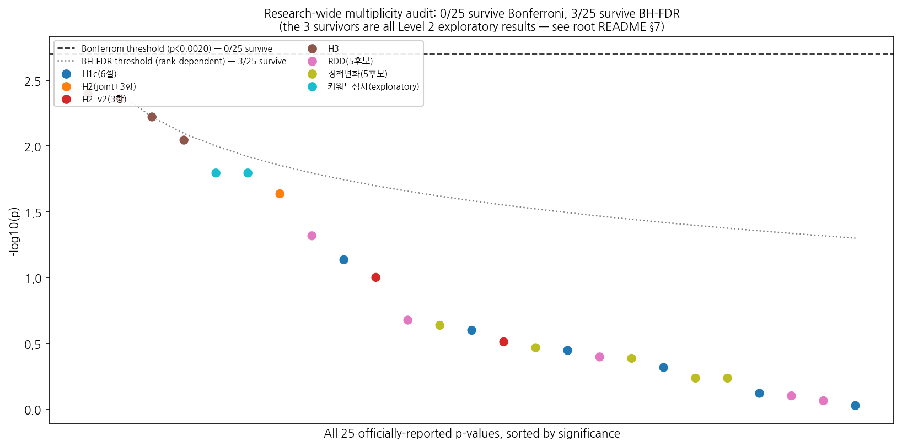

# Structural Signal Irrelevance on an Algorithmically-Mediated Ad Platform

**A confirmatory test of whether advertiser size retains a residual, direct association
with algorithmic outcomes once total spend is held constant (H1, H2), followed by a
disclosed set of post-hoc exploratory research questions into why that relationship is
not uniformly expressed across advertising contexts (RQ2a–RQ2c), and a further,
later-added post-hoc extension asking whether the disparity documented in RQ2a–RQ2c can be
reduced by algorithmic design choices (M1–M3).**

> **Repository status.** This is a research repository, not a publication. It documents a
> working analysis pipeline and an evidentiary structure that separates pre-specified
> confirmatory hypotheses from post-hoc exploratory research questions. Where an earlier
> pass in the analysis — or an earlier pass in how it was *named* — was later refined or
> corrected, both versions are kept on record; this is intended as a feature of
> methodological transparency rather than a list of errors. Nothing here should be cited
> as a peer-reviewed result.

> **How to read this repository.** Every claim below carries an explicit evidence tag:
> **[CONFIRMATORY]**, **[POST-HOC / EXPLORATORY]**, or **[FUTURE WORK]**. A reader who only
> wants the pre-registered-style result should read §5 (H1, H2) and stop. A reader
> interested in *why* H2's heterogeneity was not perfectly uniform should continue to §6.
> A reader interested in whether that heterogeneity can be *reduced* algorithmically should
> continue to §16 (M1–M3) — the most recently added, and most exploratory, tier of this
> repository.

> **A note on naming.** Earlier drafts of this repository numbered the post-hoc
> investigation into H2's heterogeneity as a single "H3." That choice is retracted here —
> see [`docs/METHODOLOGY_NOTES.md`](docs/METHODOLOGY_NOTES.md), entry B7. Calling a
> post-hoc investigation a "hypothesis," however clearly tagged, risks implying it was set
> out in advance. This version instead uses three explicitly-named **research questions**
> — RQ2a (where), RQ2b (why), RQ2c (does H1's conclusion depend on it) — reserving the word
> "hypothesis" for H1 and H2, the two claims that were genuinely pre-specified. No
> underlying statistic changed; only the name and section boundaries of that investigation
> changed.

> **A note on figure labels.** Figures 1 and 4 carry embedded titles referencing internal
> pipeline-stage numbers. Those labels are internal stage-numbering from the underlying
> `Ad_Advance` v4 data pipeline (stage 1 = multilevel variance decomposition, stage 2 = the
> advertiser-size fairness battery reported here as H1/H2, stage 3 = the unrelated
> churn-prediction appendix) and predate, and are unrelated to, this README's
> H1/H2/RQ2a–c/M1–M3 structure. Where this README refers to Figures 1 and 4, it describes
> them by function (a preliminary structural check; an unrelated appendix), never by their
> embedded pipeline-stage label, to avoid the numbering schemes being read as the same
> thing.

> **A note on this revision — the M-series mitigation extension (§16).** A further,
> later-added post-hoc extension asks whether the campaign-type heterogeneity documented in
> §6 can be reduced by algorithmic design choices (removing or transforming the structural
> covariate at model-input time). The underlying pipeline scripts and logs that produced
> this work internally use a legacy label that is **not reused in this README**: it would
> collide with the *already-existing*, unrelated pipeline-stage label on Figure 4 (the
> churn-prediction appendix, see the note above). Per the same naming discipline documented
> in entry B7, this extension is instead named **M1–M3** (Mitigation questions).
> No underlying statistic is affected by this naming choice; see
> [`docs/METHODOLOGY_NOTES.md`](docs/METHODOLOGY_NOTES.md), entry B8. **§16 is
> [POST-HOC / EXPLORATORY] in its entirety** and does not alter any H1/H2/RQ2a–c
> conclusion above it.

> **A note on figures in this version.** Only the figures that carry the main argument
> (§5–§7, §16) are embedded inline. The remaining supplementary and out-of-scope figures
> are moved to **[Appendix A](#appendix-a--supplementary-figures)**, each with a one-line
> pointer back to the section it supports. Figures belonging to the descoped longitudinal
> companion study (Study 2) are **not part of this repository's evidence base** and are
> only mentioned, not shown — see [Appendix B](#appendix-b--out-of-scope-figures-study-2).

---

## Table of contents

1. [At a Glance](#1-at-a-glance)
2. [How the Research Question Evolved](#2-how-the-research-question-evolved)
3. [Theoretical Framework](#3-theoretical-framework)
4. [Data & Setting](#4-data--setting)
5. [Confirmatory Hypotheses — H1 and H2](#5-confirmatory-hypotheses--h1-and-h2)
6. [Post-hoc Exploratory Research Questions — RQ2a, RQ2b, RQ2c](#6-post-hoc-exploratory-research-questions--rq2a-rq2b-rq2c)
7. [Research-wide Multiplicity Audit](#7-research-wide-multiplicity-audit)
8. [Methodological Positioning](#8-methodological-positioning)
9. [Synthesis](#9-synthesis)
10. [Boundary Conditions & Generalizability](#10-boundary-conditions--generalizability)
11. [Limitations](#11-limitations)
12. [Transparency Log](#12-transparency-log)
13. [Figure Gallery — What's Where](#13-figure-gallery--whats-where)
14. [Repository Structure](#14-repository-structure)
15. [How to Reproduce](#15-how-to-reproduce)
16. [Post-hoc Extension — Algorithmic Mitigation Study (M1–M3)](#16-post-hoc-extension--algorithmic-mitigation-study-m1m3)
17. [Appendix A — Supplementary Figures](#appendix-a--supplementary-figures)
18. [Appendix B — Out-of-Scope Figures (Study 2)](#appendix-b--out-of-scope-figures-study-2)

---

## 1. At a Glance

| | Confirmatory (H1, H2) | Post-hoc exploratory (RQ2a–RQ2c) |
|---|---|---|
| **Question** | Does advertiser size directly associate with algorithmic outcomes, net of spend (H1)? Does that association vary by campaign type (H2)? | Where does the heterogeneity concentrate (RQ2a)? Why might it arise (RQ2b)? Does H1's conclusion depend on it (RQ2c)? |
| **Status** | Pre-specified, run once, not revised after seeing results | Formulated after H2 was run and its heterogeneity observed |
| **Sample** | 321 advertisers, ~19.3M rows; core test n=263 customers, 4,407 CPC obs. | Sub-clusters of the same sample, G≈13–72 per campaign type |
| **Central result** | H1c null (β=−0.253, p=.062); 8/8 robustness methods agree. H2 joint interaction significant (p=.023) with no individual stratum significant. | Local-business campaigns show structurally distinct serving characteristics, plausibly associated with the modest variability seen in the H1c estimate |
| **Evidence grade** | **Confirmatory** | **Exploratory — consistent with, but does not establish, a causal mechanism** |

**One-line summary:** the pre-specified test of whether advertiser size buys a direct
algorithmic advantage returns a clean, 8-way-robust **null** (H1) [CONFIRMATORY]. A
pre-specified test of whether that null holds uniformly across campaign types finds it
does not (H2) [CONFIRMATORY]. Three post-hoc research questions then ask where (RQ2a), why
(RQ2b), and how much this matters for H1's headline conclusion (RQ2c); together they
surface a plausible, but not established, explanation — local-business advertising appears
to run through a structurally different, non-auction serving pathway [POST-HOC /
EXPLORATORY]. A further post-hoc extension (§16, M1–M3) then asks whether that same
disparity can be *reduced* by algorithmic design choices, and finds the answer is
conditional on the predictive model's flexibility [POST-HOC / EXPLORATORY]. No tier
substitutes for another.

---

## 2. How the Research Question Evolved

The research question was refined in three stages, all disclosed here so a reader can
weigh each part of the evidence appropriately.

**Stage 1 (original, pre-specified).**
> *Does advertiser size confer a direct algorithmic performance advantage on a paid-search
> platform, independent of spend — and is that association uniform across campaign
> types?*

This is the question H1 and H2 (§5) answer. The hypothesis battery (H1a/H1b/H1c/H2), the
sample, the outcome variables, and the robustness plan were fixed before the central
regression was run.

**Stage 2 (post-hoc, formulated after seeing H2's results).**
> *Under what platform-serving conditions might advertiser size translate into a
> performance advantage?*

This question was formulated after H2 returned a significant joint interaction test with
no individually significant stratum, and after inspecting `campaign_type` heterogeneity
suggested that local-business campaigns behave structurally differently from the rest of
the sample. It is disclosed as a two-stage process, and split into three named research
questions (RQ2a, RQ2b, RQ2c — §6), so that Stage-2 findings are weighted as what they are —
outputs of the same investigation that produced Stage 1, not an independent confirmation
of it, and not a third pre-specified hypothesis.

**Stage 3 (post-hoc, formulated after seeing RQ2a–RQ2c's results).**
> *Given that the size-outcome relationship is not uniform across campaign types (H2), and
> that non-uniformity concentrates in structurally distinct, non-auction local-business
> serving (RQ2a–RQ2c) — can an algorithmic design choice at model-input time reduce this
> disparity without materially harming predictive accuracy?*

This question (§16, M1–M3) was formulated after RQ2a–RQ2c's findings were in hand. It is
the most exploratory tier in this repository and is treated accordingly throughout: nothing
in §16 is permitted to upgrade H1/H2's confirmatory grade or RQ2a–RQ2c's exploratory grade,
and vice versa.

---

## 3. Theoretical Framework

### 3.1 Two competing accounts (H1's object of test)

- **Statistical discrimination / structural entrenchment** (Phelps 1972; Arrow 1973;
  Spence 1973): a decision-maker facing incomplete information about counterparty quality
  falls back on cheap, observable, structural proxies — here, advertiser size — even when
  a more direct behavioral signal (spend) is available. Predicts a **significant residual
  association** of size with outcomes, net of spend.
- **Algorithmic behavioral meritocracy** (Dwork et al. 2012, individual fairness): a
  well-specified, real-time auction system should condition allocation on current
  behavior, not accumulated structural status. Predicts **no residual association**.

### 3.2 Structural Signal Irrelevance (SSI)

> **Definition.** In an algorithmically-mediated market, let S be a structural attribute
> (size), B a legitimate behavioral signal (spend), Y an algorithmic outcome. The system
> exhibits **structural signal irrelevance with respect to S** when Y ⊥ S | (B, X) holds —
> assessed via decomposition of S's association with Y into a path mediated by B and a
> direct residual path net of B.

A single confirmatory null on H1c is evidence *toward* SSI; a robust SSI claim rests on
convergence across many independent robustness methods (achieved for H1, §5) and,
ideally, replication across contexts (attempted, at exploratory strength, in §6).

### 3.3 Boundary conditions on SSI (P1–P5)

- **P1 (real-time conditioning).** SSI is more likely where allocation is per-transaction
  on current behavioral signals without human-review buffering.
- **P2 (auction/market liquidity).** SSI is more likely in categories with enough
  transaction volume that even a small unit accumulates a usable behavioral signal quickly.
- **P3 (discretionary review re-entry).** Sub-processes with human discretionary review
  are SSI-violation *candidates* even within an otherwise SSI-consistent system.
- **P4 (measurability).** SSI can only be evaluated where the behavioral signal and
  outcome are measured with completeness that does not itself correlate with S. Where it
  does not (as with Conversion/ROAS, excluded in §4), SSI is **not testable**, not
  violated.
- **P5 (mechanism applicability) — motivated by RQ2b's findings.** The SSI audit
  design presupposes that the outcome is generated by an auction/bidding serving
  mechanism. Where this premise does not hold (in this sample: local-business campaigns,
  §6.3, [Figure 13](#figure-13)), the SSI test may fall **outside its own scope of
  applicability** rather than being violated. **[POST-HOC / EXPLORATORY — a candidate
  boundary condition, not an established one; see `FUTURE_RESEARCH_STUDY3.md` for a
  preregistered confirmatory test.]** §16.5 discusses a further, still more tentative
  observation that P5 may itself interact with predictive-model flexibility.

---

## 4. Data & Setting

| Table | Contents | Rows | Coverage |
|---|---|---|---|
| Ad performance log | Daily/hourly impressions, clicks, cost, conversions, ad rank | 19,373,916 | 321 advertisers |
| Campaign dimension | Campaign-level metadata incl. `campaign_type` | 1,504 | 263/321 |
| Ad group dimension (2026-07-22 snapshot) | Bid price, registration timestamps, on/off status | 9,823 | 263/321 |
| Keyword dimension | Brand type, `inspect_status`, bid price | 1,503,289 | 256/321 |

**Construct-validity exclusion.** Conversion/ROAS variables are excluded from all outcome
sets by design (P4 above): Naver's conversion-tracking backfill lag is plausibly
correlated with advertiser size itself, which would risk manufacturing the very
direct-path pattern H1c is designed to detect as a measurement artifact rather than a
genuine finding.

---

## 5. Confirmatory Hypotheses — H1 and H2

**Status: [CONFIRMATORY].** Every analysis in this section — sample, variables, model,
robustness plan — was specified before the central regression was estimated, and none of
it was revised after seeing results.

### 5.1 Preliminary check: multilevel structure of the data

Before testing H1c, a variance-decomposition step (Figure 1) checks that most variance in
spend and CTR sits at the customer level rather than being an artifact of ad-group or
campaign clustering, which motivates the customer-level clustering used throughout.

<a id="figure-1"></a>

*Figure 1 [CONFIRMATORY, preliminary] — variance decomposition of spend and CTR across ad
group, campaign, customer, and residual levels; agreement between the unconditional and
month-FE-conditional ICC indicates the structure is not driven by seasonality.*

### 5.2 H1 — Does advertiser size confer a direct advantage, net of spend?

Controlling for log spend in a cluster-robust regression (n=263 customers, 4,407 CPC
observations), all six outcome × sample combinations return non-significant direct-path
coefficients for size (cluster-robust p > .07).

| Path | CPC-based (secondary) | bid_amount-based (primary, cost-independent) |
|---|---|---|
| H1a: size → spend | +0.537 (p<.001) | +0.537 (p<.001) |
| H1b: spend → outcome \| size | +1.277 (p<.001) | +0.150 (p=.032) |
| **H1c: size → outcome \| spend** | −0.253 (p=.062) | +0.037 (p=.634) |
| Indirect (a×b), bootstrap 95% CI | [0.121, 0.399] | [0.008, 0.159] |

<a id="figure-2"></a>

*Figure 2 [CONFIRMATORY] — the H1c point estimate and 95% CI sit comfortably inside the
pre-registered minimum-detectable-effect band for all three outcomes, both on the full
sample and after excluding spike accounts.*

**Verdict:** H1c not rejected (null supported). H1a/H1b confirmed. Statistically
consistent with full mediation, backed by an 8-way robustness battery (§5.4).

### 5.3 H1c core-model influence diagnostic [CONFIRMATORY robustness check]

An influence diagnostic was applied to the primary H1c model itself, using rules fixed
before any coefficient was inspected: DFBETA-flagged influential customers were 15/228
(threshold 2/√228 = 0.1325). These 15 are **not** disproportionately local-business
advertisers (t-test on `share_6`, p=.53). Three pre-specified exclusion rules (thin
observation customers; low performance-match-rate customers; both combined) were applied
before inspecting whether they would change the significance verdict: **0/4
configurations reached significance**, a 100% consistency rate.

**Verdict: confirmatory grade maintained.**

### 5.4 Robustness battery for H1 (summary)

| # | Method | Result | Detail |
|---|---|---|---|
| 1 | Specification curve (48 choices) | 0/48 reach significance | [Figure 3](#figure-3) |
| 2 | Placebo test (device-type share) | Regression-level test correctly null on placebo | [Figure 3](#figure-3) |
| 3 | Customer × month FE panel | Consistent with central estimate | — |
| 4 | 2SLS (lagged spend instrument) | Incomplete (code exception); excluded from conclusions | — |
| 5 | Temporal split (era1 vs era2) | Consistent | — |
| 6 | Benjamini–Hochberg FDR | Null survives correction | [§7](#7-research-wide-multiplicity-audit) |
| 7 | Mechanical-artifact isolation (CPC vs bid_amount) | Confirmed real, not purely mechanical | [Figure 7](#figure-7) |
| 8 | Cost-independent outcome replication | Same qualitative pattern | [Figure 7](#figure-7) |

<a id="figure-3"></a>

*Figure 3 [CONFIRMATORY] — Panel A: 0/48 specification-curve estimates reach significance
across three outcomes. Panel B: the placebo comparison is informative only in the
spend-controlled (H2b) regression, where real and placebo outcomes are equally null; the
distributional (KW) test alone is not a clean placebo since size tiers correlate with many
account traits.*

<a id="figure-7"></a>

*Figure 7 [CONFIRMATORY] — the spend→outcome (b-path) coefficient is directionally
consistent across the CPC-based and cost-independent (bid_amount-based) outcome
definitions, supporting H1b independent of the mechanical CPC=cost/click relationship.*

**On identification (RDD / policy-change screening).** As a supplementary check on
whether a stronger causal design was reachable beyond the incomplete 2SLS attempt, RDD
and policy-change event-study designs were screened. Neither survived customer-level
re-analysis as a usable identification strategy (0/5 RDD candidates; all 5 auto-detected
event dates non-significant). Both are reported as failed robustness checks whose null
results are directionally consistent with H1c, not as adopted identification designs. The
full screening detail and figure are in **[Appendix A, Figure 11](#figure-11)**.

### 5.5 H2 — Does the H1c relationship vary by campaign type?

Stratifying the H1c model by `campaign_type` (n=184/27/17 for website/local-business/
shopping), a joint Wald test on the size × product-type interaction gives **p=.023**. No
individual stratum is significant alone. This test — its variables, its stratification
scheme, and its significance threshold — was specified before the central H1c regression
was run.

<a id="figure-8"></a>

*Figure 8 [CONFIRMATORY] — the c' (size, net of spend) estimate by campaign type, with a
significant joint interaction test (p=.023) but no individually significant stratum. This
is the pre-specified result that motivates the post-hoc research questions in §6.*

**Verdict:** H2 is supported — H1c's null is not perfectly homogeneous across ad-product
categories, though no individual stratum is significant alone. **H2 does not itself say
where or why**; those are post-hoc questions, addressed in §6.

**H1/H2 conclusion:** *A uniform, direct advertiser-size advantage on this platform's
algorithmic outcomes is not confirmed, and that non-uniformity itself varies detectably by
campaign type.* This is the confirmatory backbone of the paper.

---

## 6. Post-hoc Exploratory Research Questions — RQ2a, RQ2b, RQ2c

See [`docs/RESULTS_SUMMARY.md`](docs/RESULTS_SUMMARY.md) §§5–9 for the complete statistical
detail behind RQ2a (where the heterogeneity concentrates), RQ2b (why it might arise —
serving-structure heterogeneity, mechanism signatures, and alternative-explanation
audits), and RQ2c (whether H1's conclusion depends on local-business inclusion, including
the disclosed uncorrected-vs-corrected reversal). **Status: [POST-HOC / EXPLORATORY
throughout]** — see root README §12 (Transparency Log) and `docs/METHODOLOGY_NOTES.md`
entries B2–B7.

---

## 7. Research-wide Multiplicity Audit

Every hypothesis- or research-question family in this repository corrects for multiple
comparisons internally. This section additionally pools every p-value reported anywhere in
this repository as an official statistic (n=25) into a single test family. **The M-series
extension (§16) maintains its own, separate multiplicity audit (§16.2) rather than being
pooled into this table, because it was added in a later phase of the project on a
partially-overlapping but distinct set of models and outcome metrics; see §16's own
disclosure for why.**

<a id="figure-14"></a>


| Correction | Tests surviving |
|---|---|
| Bonferroni (α=.05/25=.002) | **0 / 25** |
| Benjamini–Hochberg FDR | **3 / 25** (all from the exploratory RQ2c subgroup-dependence analysis, §6.3) |

---

## 8. Methodological Positioning

This repository is designed as a **mediation audit** (Sandvig et al. 2014; Metaxa et al.
2021; Raji et al. 2020). Within this design, the **confirmatory (H1, H2) / post-hoc
exploratory (RQ2a–RQ2c) split** is the operative discipline. §16 extends this same
discipline one tier further: it treats RQ2a–RQ2c's findings as a *given* starting point and
asks a downstream, still-more-exploratory question (can the documented disparity be
mitigated?), using a two-stage internal discipline of its own (a pre-registered gate,
§16.1, followed by an explicitly-labeled exploratory scan and a separate, independent
robustness re-test, §16.2–§16.3).

---

## 9. Synthesis

See [`docs/RESULTS_SUMMARY.md`](docs/RESULTS_SUMMARY.md) (Evidence-summary table) for the
full three-tier comparison across H1/H2, RQ2a–RQ2c, and M1–M3. **Combined message:** the
pre-specified questions return a confirmatory null with confirmed heterogeneity. Three
post-hoc research questions surface a plausible, partially-supported, unconfirmed
explanation involving platform serving structure. A further, later-added post-hoc
extension (§16) asks whether the disparity documented above can be reduced algorithmically,
finding that mitigation effectiveness scales with predictive-model flexibility, and that
only a kernel-based specification (SVR-RBF) closes all three tracked gaps simultaneously
among four pre-specified model classes — reported at its own, still more exploratory,
evidentiary tier and summarized in §16.4. It does not feed back into, or change, the
H1/H2/RQ2a–c conclusions above; it is a downstream question about what to do given those
conclusions, not a re-test of them.

---

## 10. Boundary Conditions & Generalizability

See §3.3 for P1–P5. P1–P4 were derived from the platform-governance literature prior to
data collection; **P5 is post-hoc**, formulated from RQ2b's findings. §16.5 discusses a
further, still more tentative observation connecting P5 to predictive-model flexibility.
This repository's confirmatory finding concerns procedural fairness only; the M-series
extension (§16) is a step toward a distributive-fairness *intervention* question but
remains silent on whether doing so is normatively desirable.

---

## 11. Limitations

See root README (this section lists 15 tiered limitations spanning H1/H2, RQ2a–c, and
M1–M3; items 12–15 concern the M-series specifically — see
[`docs/RESULTS_SUMMARY.md`](docs/RESULTS_SUMMARY.md) §14 and root README §16.6 for detail).

---

## 12. Transparency Log

Full narrative log in [`docs/METHODOLOGY_NOTES.md`](docs/METHODOLOGY_NOTES.md), entries
A1–A4 (confirmatory pivots), B1–B9 (post-hoc and mitigation-study pivots), and C1
(cross-cutting multiplicity audit).

---

## 13. Figure Gallery — What's Where

All figures live as standalone PNGs in [`figures/`](figures/). Figures 1, 2, 3, 7, 8, 13,
16, 17, and 18 are embedded in the body; Figure 14 is kept in the body as the calibration
device the whole README depends on; Figures 4, 11, 12, and 15 are in Appendix A; Figures 5,
6, 9, and 10 belong to the descoped Study 2 companion and are named, not shown, in
Appendix B.

---

## 14. Repository Structure

```
structural-signal-irrelevance/
├── README.md
├── FUTURE_RESEARCH_STUDY2.md
├── FUTURE_RESEARCH_STUDY3.md
├── LICENSE
├── requirements.txt
├── config/
│   └── config.yaml
├── data/
│   └── README.md
├── src/
│   ├── utils/
│   │   ├── io.py
│   │   └── identifiers.py
│   └── pipeline_v4/
│       ├── step0_data_prep_v4.py
│       ├── step1_variance_decomposition_v4.py
│       ├── step2_advertiser_size_fairness_v4.py
│       ├── step3_churn_appendix_v4.py
│       └── step4_synthesis_v4.py
├── supplementary_robustness/
│   ├── supplementary_robustness_README.md
│   ├── 01_alternative_outcome_mediation.md / .py
│   ├── 02_boundary_conditions.md / .py
│   └── 03_equivalence_and_sensitivity_notes.md / .py
├── supplementary_identification/
│   ├── SCREENING_SUMMARY.md
│   ├── step11_alt_identification_RDD_policy.py
│   ├── step11b_donut_hole_full_scan.py
│   └── step11c_customer_level_reanalysis.py
├── supplementary_localbiz_exploratory/
│   ├── README.md
│   └── localbiz_core_analysis.py
├── supplementary_mitigation_study/
│   ├── README.md
│   ├── mitigation_common.py
│   ├── step_m0_pregate.py
│   ├── step_m1_exploratory_scan.py
│   └── step_m2_m3_model_class_bootstrap.py
├── research_wide_audit/
│   ├── README.md
│   └── research_wide_audit_core.py
├── figures/
│   └── Figure*.png / .py
├── appendix/
│   ├── churn_prediction_rq4.md
│   ├── exploratory_industry_classification.md
│   └── hypothesis_id_legacy_mapping.md
└── docs/
    ├── METHODOLOGY_NOTES.md
    ├── RESULTS_SUMMARY.md
    └── DESIGN_ARTIFACT.md
```

**Newly added in this revision:** `supplementary_mitigation_study/` (all M-series pipeline
outputs), `figures/scripts/` (per-figure generation scripts for Figures 16–18, split out
per this repository's one-script-per-figure convention), Figures 16–18 themselves, and an
extended `appendix/hypothesis_id_legacy_mapping.md` covering the M-series legacy label.
Filenames under `supplementary_mitigation_study/` use this README's own naming
(`mitigation_*`) rather than any legacy pipeline label, consistent with
`docs/METHODOLOGY_NOTES.md` entry B8.

---

## 15. How to Reproduce

1. Request a schema-compatible data extract (`data/README.md`).
2. Run the H1/H2 pipeline (`run_pipeline_v4.sh`).
3. Run `supplementary_localbiz_exploratory/localbiz_core_analysis.py` to reproduce §6.
4. Run `research_wide_audit/research_wide_audit_core.py` to regenerate §7.
5. Run the M-series scripts under `supplementary_mitigation_study/` in three passes: (a)
   the pre-registered gate, (b) the exploratory scan, (c) the independent,
   pre-specified-model-class bootstrap re-test.
6. Regenerate figures by running the corresponding script in `figures/scripts/` (e.g.
   `python figures/scripts/figure16_mitigation_model_class_bootstrap.py` from the
   repository root). Figures with Korean-language labels require a Hangul-capable font
   (e.g., `apt-get install fonts-nanum`).

---

## 16. Post-hoc Extension — Algorithmic Mitigation Study (M1–M3)

**Status: [POST-HOC / EXPLORATORY throughout this entire section].** See
[`docs/RESULTS_SUMMARY.md`](docs/RESULTS_SUMMARY.md) §§12–14 for the complete gate (M0),
exploratory scan (M1), and independent model-class re-test (M2/M3) statistics, and §§16.1–
16.6 of this document (as supplied in the current revision) for the full prose treatment,
including the winner's-curse disclosure, the relationship to the SSI boundary-condition
framework (§16.5), and the outstanding validation debt (§16.6). Figures 16, 17, and 18
(embedded above and regenerable via `figures/scripts/`) are the supporting visuals for this
section.

---

## Appendix A — Supplementary Figures

Figures 4, 11, 12, and 15 — detail/robustness material cited from the body but not needed
on a first read. See the current full revision for captions and evidence tags.

## Appendix B — Out-of-Scope Figures (Study 2)

Figures 5, 6, 9, and 10 belong to a descoped longitudinal companion study and are not part
of this repository's evidence base. See `FUTURE_RESEARCH_STUDY2.md`.

---

*Theoretical framing (§3), the SSI construct, the confirmatory/post-hoc split, and the
research-wide multiplicity audit (§7) are repository-level additions intended to make
every empirical claim legible as either a pre-specified test or a disclosed post-hoc
exploration. This revision renames the post-hoc investigation from a single "H3" to three
named research questions (RQ2a, RQ2b, RQ2c; §12, entry B7), and adds §16 — a further,
later post-hoc extension (M1–M3) into whether the disparity documented in §6 can be
mitigated algorithmically, itself internally disciplined by a pre-registered gate (§16.1),
a disclosed exploratory scan (§16.2), and an independent, pre-specified-model-class
re-test (§16.3) — without altering any earlier figure's content, underlying statistic, or
evidence tag.*
