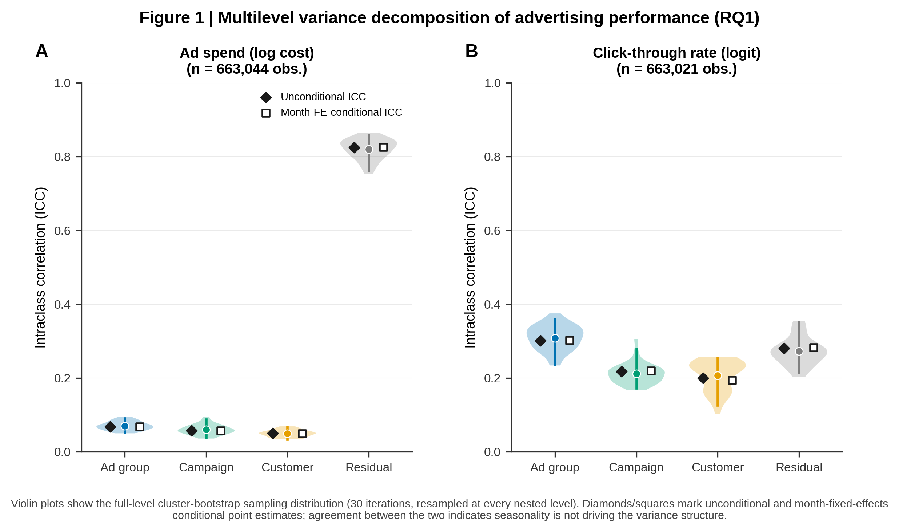
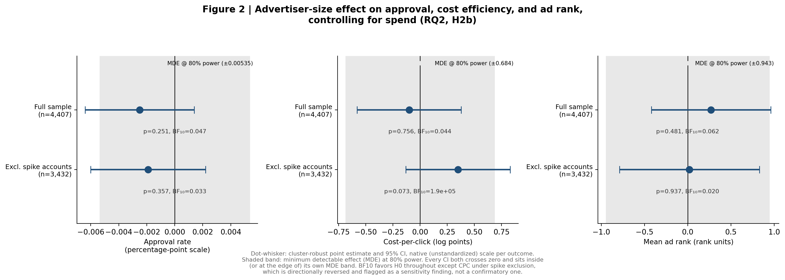
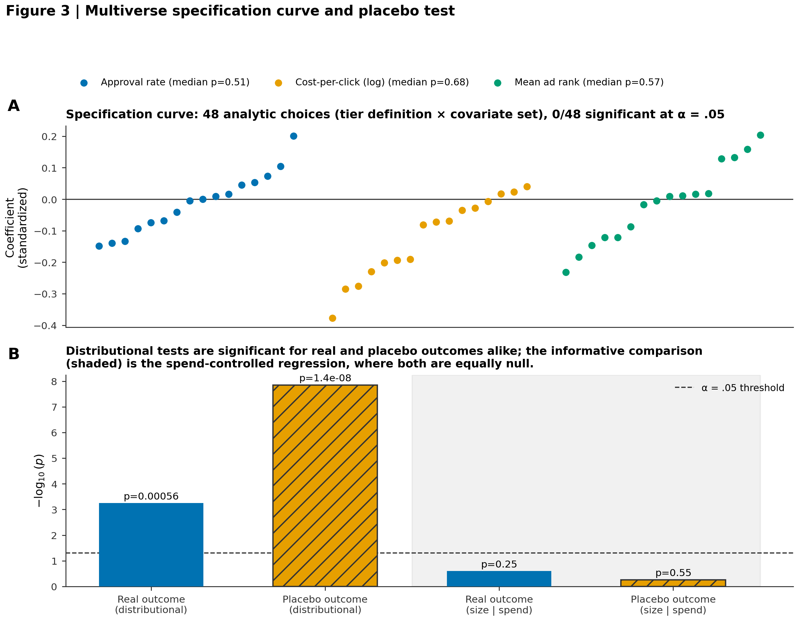
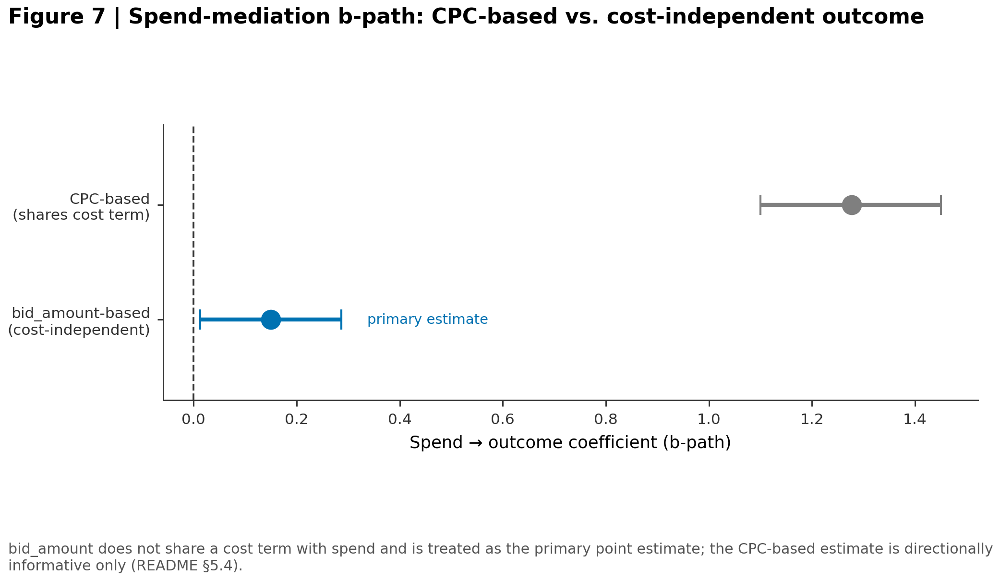
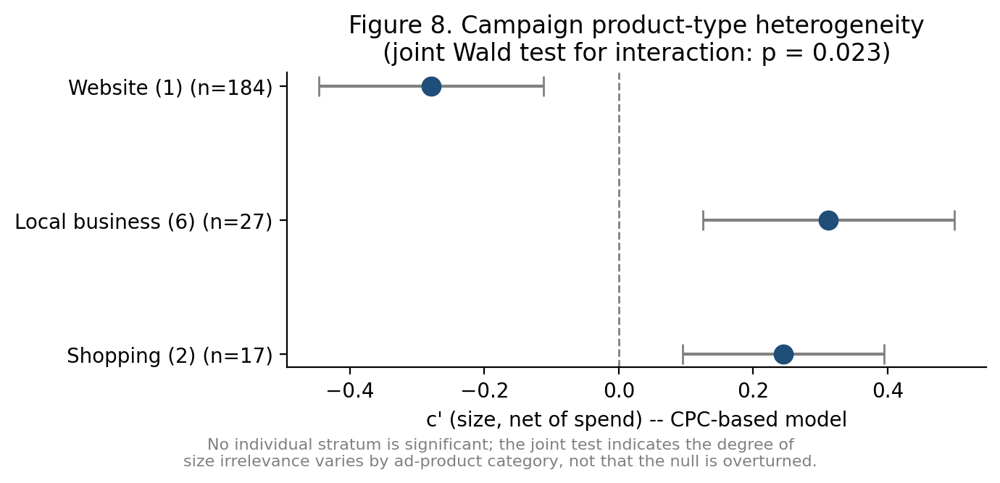
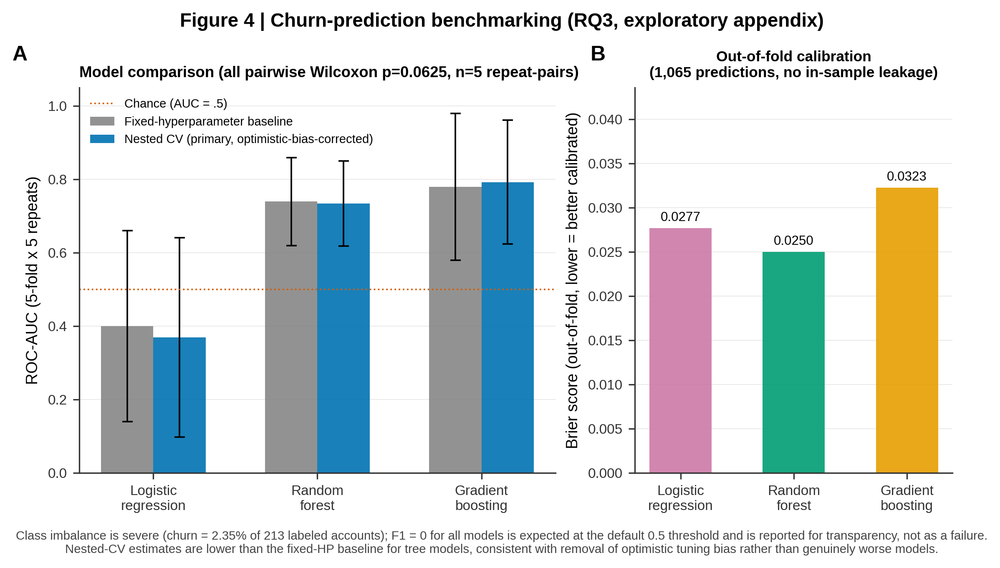
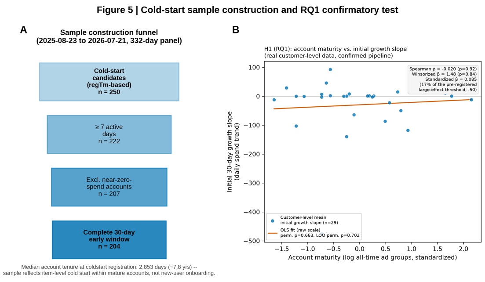
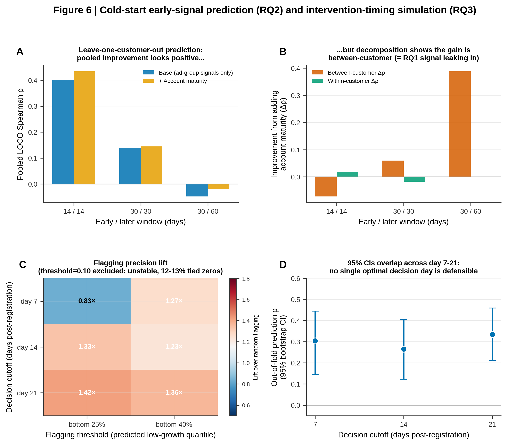
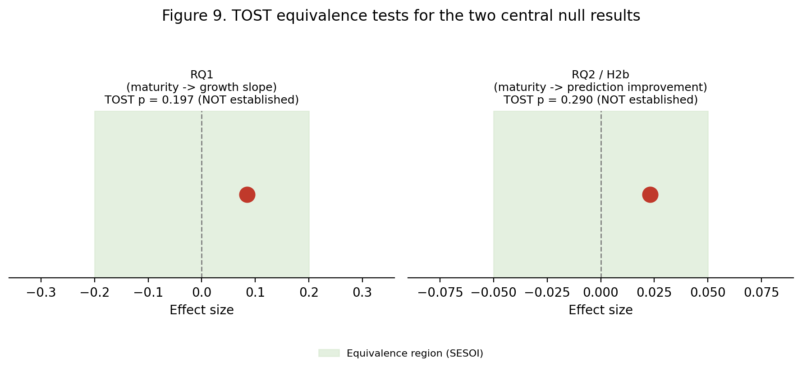

# Not New, But Renewed: Structural Attributes Don't Matter on an Algorithmically-Mediated Ad Platform

*A cross-sectional and longitudinal investigation into ad-group cold-start dynamics and advertiser-size fairness on a Korean paid-search platform.*

---

## The question we started with

Picture two advertisers on the same search-ads platform. One has been running campaigns for seven years and manages hundreds of ad groups. The other just created their very first one. If you had to bet on whose new ad group ramps up faster — or whose account gets treated more favorably by the platform's approval and ranking systems — you'd probably bet on the veteran.

This repository is the record of testing that bet, twice, with two independent datasets, two independent sets of statistical tools, and two independent chances for the answer to turn out to be "yes."

It didn't — with important qualifications that this README makes explicit rather than glossing over.

Using a panel of **321 advertisers and roughly 19.3 million rows** of daily/hourly performance data from a Korean search-ads ecosystem, we ran two studies that ask the same underlying question from different angles:

- **Study 1 (cross-sectional):** Does advertiser *size* buy a structural advantage in approval rate, cost efficiency, or ad rank — independent of how much the advertiser spends?
- **Study 2 (longitudinal):** Does an advertiser's accumulated account *history* predict how fast a brand-new ad group inside that account grows — independent of that ad group's own early performance signals?

Both studies converge on a similar answer: size and tenure appear to matter far less than spend and the unit's own real-time behavior. We call this pattern **structural blindness** — a real-time bidding and serving system that evaluates every ad group on its current signal, largely indifferent to the account's résumé. Section 2 below states this construct and the formal, permanently-numbered hypotheses it generates once, so that every later section can cite a hypothesis ID (e.g. **H-S1.1c**, **H-S2.1**) instead of re-explaining what it's testing. This README states the finding with the precision it deserves: which parts are confirmed nulls, which are non-significant-but-inconclusive, which are heterogeneous across contexts, and which are exploratory.

> **A note on how figures and source-of-truth files are woven in.** Every main-text figure below is rendered directly from `figures/`. Every place the text leans on a robustness check links straight to the corresponding file in [`supplementary_robustness/`](supplementary_robustness/), with that file's key table reproduced inline. And every place the text leans on *why a method changed* or *what the final citable number is* links to [`docs/METHODOLOGY_NOTES.md`](docs/METHODOLOGY_NOTES.md) (the narrative log of assumption → contradiction → change) or [`docs/RESULTS_SUMMARY.md`](docs/RESULTS_SUMMARY.md) (the single canonical statistics table, digested in [§4.6](#46-h-s21--h-s22--rq-s23-results-at-a-glance)) — so you don't have to leave the page to see the numbers behind the claim. And every hypothesis or research question referenced anywhere in this document uses a permanent, study-prefixed ID (H-S1.x / RQ-S1.x for Study 1, H-S2.x / RQ-S2.x for Study 2) defined once in §2 — see §2's mapping table if a figure's in-image title uses an older, unprefixed label like "RQ2" or "H2b."

---

## Table of contents

1. [The data](#1-the-data)
2. [Theoretical framing and formal hypotheses](#2-theoretical-framing-and-formal-hypotheses)
3. [Study 1 — Does size buy an advantage?](#3-study-1--does-size-buy-an-advantage-cross-sectional)
4. [Study 2 — Does history buy an advantage?](#4-study-2--does-history-buy-an-advantage-longitudinal) *(→ [4.6 Results at a glance](#46-h-s21--h-s22--rq-s23-results-at-a-glance), the `docs/RESULTS_SUMMARY.md`-sourced digest)*
5. [Where the two stories meet](#5-where-the-two-stories-meet)
6. [Boundary conditions and generalizability](#6-boundary-conditions-and-generalizability)
7. [What "null result" means here: equivalence and sensitivity](#7-what-null-result-means-here-equivalence-and-sensitivity)
8. [Limitations](#8-limitations)
9. [Methodology summary](#9-methodology-summary)
10. [Repository structure](#10-repository-structure)
11. [Reproducing the analysis](#11-reproducing-the-analysis)
12. [Figures and tables (journal-submission set)](#12-figures-and-tables-journal-submission-set)
13. [Methodological principles applied throughout](#13-methodological-principles-applied-throughout)
14. [Data availability & license](#14-data-availability--license)

---

## 1. The data

| Table | Contents | Rows | Coverage |
|---|---|---|---|
| Ad performance log | Daily/hourly impressions, clicks, cost, conversions, ad rank | 19,373,916 | 321 advertisers |
| Campaign dimension | Campaign-level metadata, incl. `campaign_type` (ad-product code) | 1,504 | 263/321 |
| Ad group dimension (snapshot) | Bid price, registration/deletion timestamps, on/off status | 9,823 | 263/321 |
| Keyword dimension | Brand type, `inspect_status` (review code), bid price | 1,503,289 | 256/321 |

Two limitations shape everything that follows:

- **Single agency, single platform.** All data comes from one Korean ad-tech provider sourced from one search platform. Generalization is bounded by that ecosystem — see [Section 6](#6-boundary-conditions-and-generalizability) for how far we think that bound reasonably extends.
- **The ad-group table is a snapshot, not a history.** It reflects ad groups as they exist *today* — anything deleted in the past has vanished from the table. Every measure of "account age" or "how many ad groups this account has ever run" is therefore a **lower bound**. This matters enormously for Study 2, where account maturity is the variable under test.

Conversion and ROAS variables were excluded from both studies entirely — the platform's conversion API retroactively backfills conversions per account on a delayed, inconsistent schedule, which breaks construct validity for anything built on top of it. This was a design decision made before any modeling began, not a post-hoc exclusion.

---

## 2. Theoretical framing and formal hypotheses

Sections 3–7 below present two studies that, read separately, look like two
unrelated null-result investigations. Read through a single theoretical
lens, they are two tests of the same construct at two different structural
levels. This section states that construct and the formal hypotheses it
generates, once, so that every later section can cite a hypothesis ID
instead of re-explaining what it's testing.

### 2.1 The construct: structural blindness

**Structural blindness** — a real-time, auction-based serving system
allocates approval, cost efficiency, and ranking primarily on a unit's
*current, real-time signal* (its bids, its clicks, its own early
performance), and is largely indifferent to *structural attributes of the
account behind that unit* (how big the account is, how long it has
existed) once the channels that structural attributes could plausibly work
through — spend, the unit's own track record — are accounted for.

This is a claim about mechanism, not about outcomes: big or old accounts
can and do perform differently from small or new ones, but this repository
asks whether that difference is *direct* (the algorithm treats you
differently for being big/old, holding everything else constant) or
*indirect* (being big/old changes what you do — how much you spend, how
your ad groups perform early on — and it's that behavior the algorithm
responds to). Structural blindness is the hypothesis that, on this
platform, it is almost entirely the latter.

The two studies test this construct at two different structural levels:

| | Structural attribute | Structural level | Candidate mediating/competing channel |
|---|---|---|---|
| **Study 1** | Advertiser size (spend-tier) | Cross-sectional, customer-level | Spend |
| **Study 2** | Account tenure/maturity | Longitudinal, ad-group-level | The ad group's own early operating signal |

### 2.2 Study 1's formal hypothesis family (H-S1)

Full mediation hypothesis, decomposed into its three legs:

- **H-S1.1a (a-path):** Advertiser size is positively associated with total
  spend.
- **H-S1.1b (b-path):** Spend is associated with outcome quality (approval
  rate / cost efficiency / ad rank), controlling for size.
- **H-S1.1c (c′-path, direct effect):** Advertiser size has **no** direct
  association with outcome quality once spend is controlled — i.e., the
  size → outcome relationship is *fully* mediated by spend, not partially.

Jointly, **H-S1.1** is supported if H-S1.1a and H-S1.1b hold and H-S1.1c's
null cannot be rejected with a well-powered test.

- **H-S1.2 (boundary condition):** H-S1.1c's null holds *homogeneously*
  across platform-defined ad-product categories (`campaign_type`) — i.e.,
  the degree of structural blindness does not depend on which approval
  pipeline a campaign routes through.

Two further checks are pre-specified as **exploratory, not confirmatory**,
because of known power or reliability limitations, and are reported as
such throughout:

- **RQ-S1.3:** Does keyword-level discretionary review status interact
  with size — a candidate channel through which structural attributes
  could re-enter the allocation process despite H-S1.1c?
- **RQ-S1.4:** Does the H-S1.1c null vary by advertiser industry?

A fully separate side investigation, unconnected to the H-S1 family, is
retained as an appendix rather than folded into the hypothesis set:

- **RQ-S1.E1:** Can account churn be predicted from approval/cost/
  efficiency features? (Exploratory; not a structural-blindness test.)

### 2.3 Study 2's formal hypothesis family (H-S2)

**A note on how this family came to be, stated up front rather than
discovered mid-narrative:** the project's original, pre-specified question
(**RQ-S2.0**, now superseded) asked whether *brand-new advertiser accounts*
ramp up differently based on some notion of account history — a "user
cold-start" framing borrowed from recommender-systems research without
adaptation. Sample construction diagnostics (§4.1) found that this
population is essentially absent from the data (0 of 222 usable ad groups
met a strict "genuinely new account" criterion; median account age behind
a "cold-start" ad group was 7.8 years). This is documented here as a
**pre-registration deviation**: RQ-S2.0 is retired, not deleted, and
replaced by an amended, data-informed question, **RQ-S2.1's ancestor**,
that asks the same structural-blindness question at the *item* level
instead of the *user* level — a change of population, not a change of
underlying theory. The full diagnostic chain behind this deviation is in
[`docs/METHODOLOGY_NOTES.md`](docs/METHODOLOGY_NOTES.md), entry 1.

- **H-S2.1:** Account maturity (a structural attribute, analogous to
  Study 1's size) is positively associated with a newly registered ad
  group's initial growth slope — the item-level cold-start analogue of
  H-S1.1's total, unconditional relationship.
- **H-S2.2a:** An ad group's own early operating signal (coverage, spend
  trend, CTR/CVR) predicts its near-term growth — the candidate mediating/
  competing channel, analogous to Study 1's spend.
- **H-S2.2b:** Account maturity improves on H-S2.2a's prediction at the
  ad-group level (within-customer), once pooled/between-customer
  confounding is removed — the Study-2 analogue of asking whether H-S1.1c's
  direct effect is truly zero rather than merely undetected.

As in Study 1, one further question is pre-specified as **exploratory /
design-science, not confirmatory**, and is evaluated by backtest rather
than a single point-null:

- **RQ-S2.3:** At what post-registration day (if any) is a low-growth ad
  group best flagged for intervention? This motivates a concrete design
  artifact, **DA-S2.1** (the Early-Warning Flagging Rule, specified in
  full in §12.8 / `supplementary_robustness/04_design_artifact_future_work.md`),
  whose design principles are grounded in H-S2.2a but whose binary-decision
  empirical advantage is not itself treated as a confirmatory claim.

### 2.4 What "confirmed" means across this hypothesis set

Every H-Sx.y hypothesis above that returns a non-significant result is
additionally subjected to a TOST equivalence test (§7) before being
described as anything stronger than "non-significant" — this repository
distinguishes *failing to reject a point-null* from *formally establishing
equivalence to zero* throughout, and the hypothesis IDs above are the
handle every later section uses to keep that distinction attached to the
right claim.

### 2.5 Quick-reference: where each hypothesis is tested

| ID | Tested in | Primary figure |
|---|---|---|
| P-S1.0 | §3.1 | Figure 1 |
| H-S1.1a / H-S1.1b / H-S1.1c / H-S1.1 | §3.3–3.4 | Figures 2, 3, 7 |
| H-S1.2 | §3.5 | Figure 8 |
| RQ-S1.3, RQ-S1.4 | §6(a) | — |
| RQ-S1.E1 | §3.6 | Figure 4 |
| RQ-S2.0 (superseded) → item-level ancestor of H-S2.1 | §4.1 | Figure 5A |
| H-S2.1 | §4.2 | Figure 5B, 9 |
| H-S2.2a / H-S2.2b | §4.3 | Figure 6A, B, 9 |
| RQ-S2.3 / DA-S2.1 | §4.4 | Figure 6C, D |

### 2.6 Unified hypothesis-numbering: master mapping table

This table is the permanent cross-reference between every hypothesis ID
used in this document and the legacy, unprefixed labels ("RQ1", "RQ2",
"H2b", ...) that still appear baked into the nine figure PNGs (see §12.1
note on why those images are not re-rendered). Once assigned, an ID never
gets reused or renumbered even if new hypotheses are added later.

| New ID | Old label(s) it replaces | What it claims | Status |
|---|---|---|---|
| **P-S1.0** | Figure 1's "(RQ1)" | Preliminary: performance variance sits mostly at ad-group/residual level, not customer level (motivates, does not itself test, H-S1.1) | Descriptive, not a hypothesis test |
| **H-S1.1a** | (unlabeled a-path, §3.4 method 8 / Table 2) | Size → total spend (a-path) | Confirmed, p<.001 |
| **H-S1.1b** | (unlabeled b-path, §3.4 method 8 / Table 2) | Spend → outcome, controlling for size (b-path), cost-independent outcome | Confirmed, p=.032 |
| **H-S1.1c** | Figure 2's "(RQ2, H2b)"; Figure 3's "(RQ2 robustness suite)" | Size → outcome, controlling for spend (c′-path, direct effect) = 0 (full mediation) | Confirmed null, 8 robustness checks |
| **H-S1.1** | — (composite label) | Indirect effect (a×b) is the entire size→outcome relationship (H-S1.1a ∧ H-S1.1b ∧ H-S1.1c jointly) | Supported |
| **H-S1.2** | Figure 8's "(joint Wald test)" | H-S1.1c's null is homogeneous across `campaign_type` strata | Rejected, p=.023 (heterogeneous) |
| **RQ-S1.3** | §6(a) / §8 keyword-review-status check | Does discretionary review leak account attributes into outcomes? | Exploratory/preliminary, underpowered |
| **RQ-S1.4** | §6(a) industry-stratification pilot | Does the H-S1.1c null vary by advertiser industry? | Piloted, not usable (label reliability) |
| **RQ-S1.E1** | Figure 4's "(RQ3, exploratory appendix)" | Can churn be predicted from approval/cost/efficiency features? | Exploratory appendix, outside the H-S1 hypothesis family entirely |
| **RQ-S2.0** | (unlabeled; §4.1 point 4 narrative) | *Superseded* — original pre-registered question: does new-*advertiser* onboarding show faster/slower ramp based on... (undefined comparison, abandoned) | Superseded by RQ-S2.1's ancestor — see §2.3 |
| **H-S2.1** | Study 2's "RQ1" / "H1" | Account maturity → initial 30-day growth slope (item-level cold start) | Null (non-sig); TOST inconclusive |
| **H-S2.2a** | Study 2's "RQ2" / "H2a" | Ad group's own early signal → later growth | Supported, decays with horizon |
| **H-S2.2b** | Study 2's "RQ2" / "H2b" | Adding account maturity improves H-S2.2a's prediction (within-customer) | Rejected; TOST inconclusive |
| **RQ-S2.3** | Study 2's "RQ3" | At what post-registration day should a low-growth ad group be flagged? | Exploratory / design-science, not confirmatory |
| **DA-S2.1** | "the design artifact," DP1–DP3 | Early-Warning Flagging Rule (input/output spec + 3 design principles) | Theoretically grounded in H-S2.2a; binary-flagging backtest inconclusive (4/9 vs 5/9) |

**Naming convention.** `H-Sx.y` = a formally testable hypothesis with a
directional or point-null prediction, belonging to Study *x*, hypothesis
family *y*. `RQ-Sx.y` = a question investigated *without* a single
confirmatory point-null (exploratory, preliminary, underpowered, or
explicitly design-science in nature). `P-Sx.y` = a preliminary/descriptive
analysis that motivates a hypothesis but does not itself test one.
`DA-Sx.y` = a design-science artifact (specification + design principles),
evaluated by backtest rather than by a single statistical test. A
superseded ID (like RQ-S2.0) is never deleted or silently dropped — it
stays in the numbering table with a "superseded by" pointer, so the
pre-registration deviation is auditable rather than hidden.

**A note on the nine figure PNGs.** The images themselves (baked-in
titles like *"RQ2, H2b"*) are static, generated from
`figures/make_figureN_*.py` against a proprietary dataset that isn't
re-rendered as part of this revision — every figure's caption below
instead carries an explicit new-ID tag alongside the legacy in-image
title, e.g. *"tests **H-S1.1c**; the in-image title 'RQ2, H2b' is this
repository's legacy label for the same hypothesis, kept for provenance."*

---

## 3. Study 1 — Does size buy an advantage? (Cross-sectional)

### 3.1 First, where would an advantage even live? (tests P-S1.0)

Before testing anything about advertiser size, we needed to know *where* performance variation actually sits — in the customer, the campaign, or the ad group. If size-related advantages exist, they should show up as customer-level variance.



**Figure 1 — Multilevel variance decomposition** (`figures/make_figure1_variance_decomposition.py`; this is preliminary analysis **P-S1.0**, motivating rather than testing H-S1.1). Across ~663K observations, log ad spend is dominated by unexplained residual variance (ICC = 0.825) — day-to-day budget execution, not who the customer is (ICC = 0.050). Click-through rate tells a similar story: the largest share of variation sits at the *ad group* level (ICC = 0.301), not the customer level (ICC = 0.200). Both patterns hold whether or not month fixed effects are added (diamond vs. square markers agree), ruling out seasonality as the explanation. This was our first hint, well before any hypothesis test: **"who the customer is" explains comparatively little of what happens.**

### 3.2 The raw gap looks real

Split advertisers into four size tiers (by spend volume) and compare approval rate, CPC, and ad rank across tiers with a Kruskal-Wallis test, and the differences are statistically significant across the board (p < .001 for CPC and ad rank; p = .0006 for approval rate). Effect sizes are small (ε² = 0.002–0.079), but the raw signal is there.

Except it isn't quite what it looks like. Ad groups belonging to the same customer share policies and aren't statistically independent — the standard Kruskal-Wallis test assumes they are. Re-running the comparison as a customer-level cluster permutation test (2,000 iterations) made most of that "significant" gap in approval rate and CPC evaporate. The raw test's significance turned out to be substantially an artifact of ignoring clustering — a first sign that the real test needed to be something sturdier.

### 3.3 The gap disappears once you control for spend (H-S1.1c)



**Figure 2 — The central confirmatory test** (`figures/make_figure2_fairness_forest_plot.py`; the confirmatory test of **H-S1.1c** — the in-image title "RQ2, H2b" is this repository's legacy label for the same hypothesis, kept for provenance). Controlling for log spend in a cluster-robust regression, all six outcome × sample combinations (approval rate, CPC, ad rank, each in the full sample and with spike-affected accounts excluded) come back **non-significant** (cluster-robust p > .07). Every 95% bootstrap confidence interval not only crosses zero — it falls entirely inside (or right at the edge of) its own minimum-detectable-effect (MDE) band, meaning this isn't underpowered null-hunting; the observed effect is smaller than anything the sample could reliably detect. Approximate Bayes factors favor the null hypothesis in five of six tests (the sixth, CPC under spike exclusion, is flagged in the figure caption as a directionally-reversed sensitivity finding, not a confirmatory one).

### 3.4 Stress-testing the result across independent methods and outcome constructions

A single regression result is easy to distrust. So we stress-tested it eight independent ways, all in service of **H-S1.1c** (with methods 7–8 additionally establishing **H-S1.1a/H-S1.1b**). Methods 1–6 are summarized here; methods 7–8 get their own figures and are documented in full in [`supplementary_robustness/01_alternative_outcome_mediation.md`](supplementary_robustness/01_alternative_outcome_mediation.md).

1. Multiverse specification curve (48 defensible analytic choices; 0/48 reach significance for any outcome)
2. Placebo test (device-type share, which size *shouldn't* predict, is significant under the raw distributional test but null under the spend-controlled regression — evidence the regression, not the raw test, is measuring the right thing)
3. Customer-and-month fixed-effects panel regression
4. Two-stage least squares with lagged spend as an instrument (first-stage F-statistic could not be recovered due to a code exception — flagged and excluded from any conclusion, not silently dropped)
5. Temporal split-sample replication
6. Benjamini-Hochberg FDR correction across the six primary hypotheses



**Figure 3 — Methods 1 and 2** (`figures/make_figure3_specification_curve_placebo.py`; robustness battery for **H-S1.1c**). Panel A: across all 48 specification choices (tier definition × covariate set), for all three outcomes, not one reaches significance at α=.05. Panel B: the distributional (Kruskal-Wallis) test is significant for *both* the real outcome and the device-share placebo — proof that a raw distributional test alone is not a clean placebo, since size tiers correlate with many unrelated account traits. The informative comparison is the spend-controlled regression matching H-S1.1c (shaded region): there, real and placebo outcomes are equally, indistinguishably null.

7. **Isolating and controlling for a mechanical artifact in the CPC outcome.** CPC = cost / click, and spend is built from cost — so any spend → CPC relationship carries a mechanical component by construction, independent of any real bidding-efficiency behavior. A customer-level permutation procedure (reshuffling click within customer while holding cost fixed, 2,000 iterations) isolates exactly how large that mechanical component is. The observed spend → log(CPC) coefficient (+1.277) falls *below* the lower bound of the resulting purely-mechanical null distribution (mean +1.552, 95% range [1.544, 1.556]) — meaning the CPC-based point estimate is not simply inflated by the artifact, but it is close enough to that mechanical distribution that we do not treat it as a stand-alone quantitative claim. A lagged replication (spend at day *t* → CPC at *t*+1 and *t*+7, immune to same-day cost-sharing) confirms a same-signed, significant relationship at both lags (β=+0.538 and +0.544, both p<.001), consistent with a genuine behavioral effect coexisting with the artifact.

8. **Replicating the mediation result on a cost-independent outcome.** `bid_amount` (the advertiser's set bid price) shares no cost or click term with spend, so it carries none of the artifact isolated in method 7. Re-estimating Study 1's mediation structure (size → spend → outcome, controlling for size) on this outcome at the customer level (n=263) gives the load-bearing result for the efficiency claim: the indirect (spend-mediated) effect is significant (bootstrap 95% CI [0.008, 0.159], excludes zero; cluster permutation p<.001) while the *direct* effect of size, net of spend, is non-significant (p=.634) — the same qualitative conclusion as the CPC-based model, now on an outcome immune to the artifact. Jointly, methods 7–8 establish **H-S1.1a** and **H-S1.1b**.



**Figure 7 — CPC-based vs. bid_amount-based b-path** (`figures/make_figure7_mediation_forest.py`; the CPC-vs-bid_amount replication underlying **H-S1.1b**). The spend → outcome coefficient shrinks from +1.277 (CPC-based, partly mechanical) to +0.150 (bid_amount-based, cost-independent) once the shared cost term is removed — the direction survives, the magnitude does not. This is the visual companion to the full step-by-step derivation in [`supplementary_robustness/01_alternative_outcome_mediation.md`](supplementary_robustness/01_alternative_outcome_mediation.md), whose key mediation table is reproduced below (§12.4, Table 2).

**Eight independent verification methods, one consistent verdict**, with method 8 — not the raw CPC coefficient — treated as the primary quantitative evidence for the efficiency-outcome claim. Jointly, methods 1–8 are the confirmatory basis for **H-S1.1** (H-S1.1a ∧ H-S1.1b ∧ H-S1.1c).

### 3.5 Is the result homogeneous across contexts? (H-S1.2)

It is close to, but not perfectly, homogeneous. Stratifying the spend-controlled CPC model by `campaign_type` (a platform-defined ad-product code — website / shopping / brand-new-product / local-business, *not* an industry classification) and running a joint Wald test on the size × product-type interaction gives **p = .023**: the *degree* to which size is irrelevant varies somewhat by ad-product category, even though no individual stratum shows a significant size effect on its own (all p > .05).



**Figure 8 — Boundary-condition forest plot** (`figures/make_figure8_boundary_condition_forest.py`; the confirmatory test of **H-S1.2**). Website campaigns show a (non-significant) negative point estimate for size net of spend, while local-business and shopping campaigns show (non-significant) positive point estimates — all three confidence intervals cross zero individually, but the joint test across strata is significant (p=.023), meaning the *pattern* of where size comes closest to mattering is not random noise even though no single stratum is itself conclusive. See [Section 6](#6-boundary-conditions-and-generalizability) and [`supplementary_robustness/02_boundary_conditions.md`](supplementary_robustness/02_boundary_conditions.md) for the full stratified results, the keyword-review-status exploratory check (**RQ-S1.3**), and why an industry-proxy stratification (**RQ-S1.4**) was piloted but ultimately not used to support any claim.

### 3.6 A side quest: can we predict churn instead? (RQ-S1.E1)

This question sits outside the fairness hypothesis entirely, but it was worth asking as an exploratory appendix: given approval/cost/efficiency features, can machine learning models predict which accounts will churn? This sits entirely outside the H-S1 hypothesis family (§2.2) — it is not a structural-blindness test.



**Figure 4 — Churn-prediction benchmarking** (`figures/make_figure4_churn_benchmark.py`; **RQ-S1.E1**, outside the H-S1 hypothesis family). Across 213 labeled accounts (a stark 2.35% churn rate), tree-based models nominally outperform logistic regression in nested cross-validation. But look closely: every pairwise model comparison returns the *exact same* Wilcoxon p-value (0.0625) — the mathematical floor achievable with only 5 repeat-pairs, not evidence of a real difference. We report this transparently rather than dressing it up as a finding. Random forest had the best-calibrated out-of-fold predictions (Brier score 0.0250).

### 3.7 What Study 1 concludes

Raw size-tier gaps in approval rate, CPC, and ad rank are statistically detectable but small, and their significance is fragile once you account for clustering. The confirmatory test — spend-controlled regression, replicated on a cost-independent outcome — returns a clean, well-powered null for the *direct* effect of size (**H-S1.1c**) across all outcome-sample combinations, backed by eight independent robustness checks, with one caveat: the size of that null effect is not perfectly homogeneous across ad-product categories (**H-S1.2**, §3.5). **The apparent advantage of being a large advertiser is, to first order, explained by spending more rather than by size itself — with modest, product-type-dependent variation in how completely that holds.**

---

## 4. Study 2 — Does history buy an advantage? (Longitudinal)

### 4.1 A detour before the test: what does "cold start" even mean here? (the RQ-S2.0 → item-level ancestor of H-S2.1 deviation)

The original plan treated "cold start" as new-advertiser onboarding: a brand-new account launching its first campaign. Before testing any hypothesis, we tried to build that sample — and the data pushed back, hard, five separate times. Each of these five detours is logged in full narrative form — what we assumed, how the diagnostic contradicted it, what changed — in [`docs/METHODOLOGY_NOTES.md`](docs/METHODOLOGY_NOTES.md); the entry numbers below point directly at the matching write-up.

1. **The numbers didn't match.** Early planning documents cited 476 "true cold-start" ad groups in one place and 250 in another. Recomputing directly from the data settled it at 250 → 222 after filtering for at least 7 active days — matching the smaller figure exactly.

2. **What looked like right-censoring wasn't.** 83.8% of the trajectory sample appeared to be "censored" — cut short by the observation window ending. But stretching the required post-registration observation window from 30 to 120 days barely moved that number (83.6% → 83.2%). If it were really about insufficient observation time, giving ad groups four times longer to be observed should have fixed most of it. It didn't. The real explanation: **these ad groups simply don't stop running** — they keep going until the data collection window ends. Applying a right-censoring lens borrowed from survival analysis was the wrong tool for this kind of data. (Full diagnostic chain — Step C's censoring flags, Step F's cutoff-sensitivity sweep, Step G's coverage measurement — in [`docs/METHODOLOGY_NOTES.md`, entry 3](docs/METHODOLOGY_NOTES.md#3-apparent-right-censoring-turned-out-to-be-a-follow-up-window-artifact-then-something-else).)

3. **Growth-curve clustering couldn't be trusted.** We tried fitting discrete latent growth classes (a group-based trajectory model) to categorize ad groups by growth pattern. A recovery simulation (200 iterations) showed that even when the true number of classes was known to be 2, the model correctly identified it only 9% of the time. This wasn't a "small sample, a bit unlucky" problem — the model structure itself couldn't reliably recover class counts. We abandoned it in favor of a continuous growth-curve (random-effects) approach. (Simulation design in [`docs/METHODOLOGY_NOTES.md`, entry 2](docs/METHODOLOGY_NOTES.md#2-discrete-latent-class-growth-models-gbtm-were-the-planned-rq1-method).)

4. **The real discovery: this isn't user cold-start at all.** Profiling the top customers and mapping the full distribution of account maturity revealed something the original framing had missed entirely. Of the 222 usable ad groups, **zero** met the strict criteria for "genuinely new account" (cold-start ratio ≥ 80% *and* account age ≤ 30 days). Even relaxing the age threshold to 90 days captured just one ad group (0.5%). More than half of the observed "cold-start" ad groups belonged to accounts with a **median age of 2,853 days — about 7.8 years.** We hadn't been finding a scarce population; we'd been looking for a population that essentially doesn't exist in this data. This forced an explicit reframing: from *user* cold-start (a brand-new advertiser) to **item cold-start** (a brand-new ad group inside an already-mature account) — a distinction long established in recommender-systems research but rarely made explicit in advertising analytics. This is the pre-registration deviation formalized as RQ-S2.0 → item-level cold start in §2.3. (Full reframing narrative, including the snapshot-artifact check that ruled out an alternative explanation, in [`docs/METHODOLOGY_NOTES.md`, entry 1](docs/METHODOLOGY_NOTES.md#1-cold-start-was-assumed-to-mean-new-advertiser-onboarding-rq-s20--h-s21-the-pre-registration-deviation).)

5. **Even the statistical model needed rebuilding.** Account maturity only takes one value per customer — every ad group from the same account shares it. Feeding that into a mixed-effects model with a customer-level random intercept creates a structural non-identifiability: the model can't tell "customer-level random variance" apart from "the maturity fixed effect." A pre-registered power simulation (500 iterations, reusing the real cluster structure) confirmed it: the mixed model's convergence failure rate was **100%**. We replaced it with a simpler, sound alternative — customer-level aggregate OLS (n≈32) — whose false-positive rate (5.2%) sat right at the nominal 5% alpha, and which could reliably detect only large effects (standardized β ≈ 0.5, 88% power). (Full non-identifiability argument in [`docs/METHODOLOGY_NOTES.md`, entry 4](docs/METHODOLOGY_NOTES.md#4-a-customer-random-intercept-mixed-model-mixedlm-was-the-planned-rq1-estimator).)

A sixth, quieter fix belongs here too: two accounts in the trajectory-usable sample turned out, on four-signal profiling (all-time scale, registration-burst pattern, template/naming signal, real spend), to be test/QA setups rather than real advertisers, and were excluded via a pre-specified rule now encoded in `config/config.yaml → sample_definition.known_test_account_ids` — logged rather than applied ad hoc ([`docs/METHODOLOGY_NOTES.md`, entry 7](docs/METHODOLOGY_NOTES.md#7-sample-exclusion-rules-were-derived-empirically-then-made-explicit)).

### 4.2 Does account maturity predict how fast a new ad group grows? (H-S2.1)

With the sample and the model finally sound, we could ask the question the study actually set out to answer.



**Figure 5(A) — The sample-construction funnel** (`figures/make_figure5_coldstart_funnel_and_rq1_null.py`; Panel A documents the RQ-S2.0 → item-level cold-start deviation, §2.3) that resulted from this five-step diagnostic journey: 250 candidates → 222 with sufficient activity → 207 excluding near-zero-spend accounts → 204 with a complete 30-day early window (29 customers once aggregated). The median account behind these "cold-start" ad groups was already 2,853 days old — visual proof that this is a story about expansion inside mature accounts, not onboarding new ones.

**Figure 5(B) — tests H-S2.1.** Account maturity (log-transformed, standardized count of all-time ad groups) was tested against each customer's mean initial 30-day growth slope (n=29). The raw-scale OLS coefficient was weakly positive (β=8.34) but non-significant (p=.576), and the pre-registered decision rule — a cluster permutation test (10,000 iterations) — agreed: p=.663. The 95% bootstrap CI [-15.84, 43.08] comfortably contained zero. Dropping the largest customer (35.8% of the sample) as a sensitivity check changed nothing (permutation p=.702) — this leave-one-out re-run isn't an afterthought; it's a **required** step in the confirmatory design precisely because that customer alone accounts for a third of the trajectory-usable sample, and profiling confirmed it as a genuine large advertiser rather than a bulk/template account worth excluding ([`docs/METHODOLOGY_NOTES.md`, entry 8](docs/METHODOLOGY_NOTES.md#8-the-largest-customers-influence-was-checked-not-assumed-away)). Most tellingly, that weak positive coefficient collapsed to β=1.48 under winsorizing and **flipped sign entirely** under a rank-based regression (β=-0.0196) — the signature of a result being driven by a couple of high-leverage outliers rather than a genuine relationship. The standardized effect size (β=.085) sits at just 17% of the large-effect threshold the pre-registered power simulation was built to detect. The full H-S2.1 statistic table — every one of these checks side by side — is reproduced in [§4.6](#46-h-s21--h-s22--rq-s23-results-at-a-glance) from the canonical source, [`docs/RESULTS_SUMMARY.md`](docs/RESULTS_SUMMARY.md).

**A formal equivalence test (TOST) puts a sharper point on this.** Failing to reject a point-null is not the same as confirming an effect is absent. A two-one-sided-test procedure against a ±0.20 standardized-effect-size equivalence margin returns **p = .197 — equivalence is not established.** The honest statement is therefore two-sided: *this sample would have detected a large effect and did not* (the pre-registered power simulation), **and** *this sample cannot formally rule out a small-to-moderate effect existing but falling below detection* (the TOST result). Both are true at once. See [Section 7](#7-what-null-result-means-here-equivalence-and-sensitivity) and [`supplementary_robustness/03_equivalence_and_sensitivity_notes.md`](supplementary_robustness/03_equivalence_and_sensitivity_notes.md).

**Verdict: H-S2.1 not supported — account maturity does not show a detectable effect on how fast a new ad group ramps up**, reported as a well-powered non-significant association rather than a confirmed null.

### 4.3 Does the ad group's own early behavior predict its near-term growth? (H-S2.2a, H-S2.2b)

If history doesn't clearly matter, what does? We tested whether an ad group's own first 14–60 days of activity — coverage, early spend trend, CTR, CVR, ROAS — predict how it performs afterward, using customer-grouped repeated splits and Leave-One-Customer-Out (LOCO) cross-validation to guard against information leakage.



**Figure 6(A,B) — The prediction result, and the trap hidden inside it** (`figures/make_figure6_rq2_horizon_rq3_lift.py`; Panels A–B test **H-S2.2a** and **H-S2.2b**; Panels C–D address the exploratory **RQ-S2.3**). Using only the ad group's own early signal, 14-day-ahead growth prediction achieved a respectable ρ=0.386 in leakage-free repeated-split validation. Adding account maturity as a feature made things *worse*, not better (ρ=0.373, Wilcoxon p=.038). But the LOCO cross-validation told the opposite story — a *positive* improvement (+0.034) from adding maturity. Which one was right?

Panel B answers that by decomposing the improvement into within-customer and between-customer components. The apparent LOCO gain turned out to be almost entirely a between-customer effect — maturity was just re-injecting the same customer-level growth-level signal from §4.2 through a pooled metric, not genuinely improving ad-group-level prediction. Within-customer improvement was essentially zero (±0.02) across all three window combinations tested. This decomposition is exactly the fix documented in [`docs/METHODOLOGY_NOTES.md`, entry 5](docs/METHODOLOGY_NOTES.md#5-a-pooled-leave-one-customer-out-loco-improvement-was-initially-read-as-rq2-support-for-h2b) — a pooled LOCO improvement was initially (mis)read as H-S2.2b support before the within/between split exposed it as leakage of the H-S2.1 signal; the confirmatory design now requires the *within-customer* number to be positive before crediting H-S2.2b, full stop.

**A second equivalence test on this specific claim** (does adding maturity improve ad-group-level prediction at all, once pooled/within confounding is controlled) again returns an inconclusive verdict: TOST against a ±0.05 Spearman-ρ margin gives **p = .290 — equivalence not established.** The directional finding (own-signal is genuinely predictive; maturity's apparent contribution is a pooling artifact) is well supported; the *complete absence* of any maturity contribution at the within-customer level is not something this sample can formally certify.

**Trusting the leakage-controlled decomposition: an ad group's own signal is genuinely predictive at short horizons (H-S2.2a supported); account maturity's apparent contribution is explained by between-customer pooling rather than genuine ad-group-level improvement (H-S2.2b rejected).** Predictive power itself also decayed sharply as the horizon extended from 14 to 30–60 days (within-customer ρ dropping to roughly 0.06–0.21).

### 4.4 When's the best day to flag a struggling ad group? (RQ-S2.3, DA-S2.1)

**Figure 6(C,D) — Timing an intervention** (same figure as above). Flagging the bottom 25–40% of predicted growers achieved a 1.2–1.4x precision lift over random flagging, and that lift held up consistently whether the decision was made at day 7, 14, or 21 post-registration (Panel C). But the 95% bootstrap confidence intervals on predictive accuracy at each of those cutoffs overlap heavily (Panel D) — there's no statistical basis for calling any single day "optimal."

We also tried to go further and quantify the *expected benefit* of intervening at each point in time, but two independent attempts at that simulation both failed the same way: the assumed intervention-effect parameters combined multiplicatively in a way that made the "optimal" answer (day 21, threshold 0.40) come out identical *no matter what values we assumed*. That's not a robust finding — it's a mathematical illusion baked into the formula. We caught it, discarded both simulations, and report the limitation openly rather than presenting a false sense of precision. (Both failed simulation designs, and exactly why each one's algebra could never have produced a different ranking, are walked through step by step in [`docs/METHODOLOGY_NOTES.md`, entry 6](docs/METHODOLOGY_NOTES.md#6-two-successive-rq3-expected-uplift-simulations-were-mathematically-incapable-of-answering-the-question-they-were-built-for).)

**Design artifact (DA-S2.1).** §4.3's within-customer result motivates a concrete decision rule — flag an ad group if its own early-window signal places it in the bottom 30% of predicted growth, evaluated at any point in a day-7–21 window. This is formalized as an explicit design-science artifact (input/output specification, three design principles) in [`supplementary_robustness/04_design_artifact_future_work.md`](supplementary_robustness/04_design_artifact_future_work.md). Its binary-flagging empirical backtest, however, is **not** reported as a confirmed advantage: the naive size/tenure comparison rule collapses to numerical zero under within-customer demeaning (a structural fact — account maturity is a customer-level constant — not a bug), and against a random-flagging baseline, the design artifact's own-signal precision wins in 4 of 9 tested specifications and loses in 5, indistinguishable from chance at this sample size (n≈20 customers per specification). The full input/output specification and the three design principles (DP1–DP3) are reproduced below in §12.8. The design principles are grounded in **H-S2.2a**'s continuous-scale result; their binary-flagging empirical superiority is left as future work.

**Verdict:** early flagging (**RQ-S2.3**, motivating **DA-S2.1**) is directionally motivated by a confirmed continuous-scale result, but neither a precise "optimal day" nor an empirically confirmed binary-flagging advantage is something this data can support yet.

### 4.5 What Study 2 concludes

> Initial ad-group growth is best explained by the ad group's *own* early operating signal (H-S2.2a), not by the parent account's accumulated history (H-S2.1, H-S2.2b), at the within-customer level tested. Getting to that conclusion required first discovering that the study's own sample definition didn't mean what it was assumed to mean (the RQ-S2.0 pre-registration deviation, §2.3), rebuilding the statistical approach twice in response, and — throughout — treating "non-significant" and "confirmed absent" as the two distinct claims they are.

### 4.6 H-S2.1 / H-S2.2 / RQ-S2.3 results at a glance

Sections 4.2–4.4 tell the story of *how* each result was reached; this section is the condensed, citable destination those sections point to. [`docs/RESULTS_SUMMARY.md`](docs/RESULTS_SUMMARY.md) is the single canonical source for every number below — the tables here are reproduced verbatim from it, so a citation to a specific statistic should point there, not here. Sample: cold-start candidates = 250 → trajectory-usable = 222 → 207 after excluding two near-zero-spend template accounts → 204/29 (H-S2.1) or the window-specific n below (H-S2.2/RQ-S2.3), depending on each analysis's completeness filter.

**H-S2.1 — does account maturity predict initial growth slope?** (visual: Figure 5B above)

| statistic | value |
|---|---|
| n (customers) | 29 |
| n (ad groups, informational) | 204 |
| OLS beta (raw scale) | 8.34 |
| OLS HC3 p-value | .576 |
| Bootstrap 95% CI (raw scale) | [-15.84, 43.08] |
| Cluster permutation p-value | .663 |
| Spearman rho | -.02 (p = .92) |
| Leave-one-out (largest customer excluded) permutation p-value | .702 (sign unchanged) |
| Winsorized (10%) OLS beta / p | 1.48 / .841 |
| Rank-rank OLS beta / p | -.02 / .924 |
| Standardized effect size (beta) | .085 |
| Pre-registered large-effect detection threshold | .50 |
| Observed effect as % of detection threshold | 16.9% |

**Verdict (per `docs/RESULTS_SUMMARY.md`): H-S2.1 not supported.** Five independent checks agree, and the standardized effect size sits well below even the small-effect band the power simulation was built to detect — this reads as a genuine null, not an under-powered non-detection.

**H-S2.2a/b — do early operating signals predict later growth, and does maturity add value?** (visual: Figure 6A,B above)

| early/later window (days) | n (ad groups) | H-S2.2a within-customer LOCO ρ | H-S2.2b within-customer LOCO ρ | within-customer improvement | repeated-split Wilcoxon p |
|---|---|---|---|---|---|
| 14 / 14 | 204 | 0.467 | 0.487 | +0.019 | .038 (H-S2.2b *worse* on repeated-split ρ) |
| 30 / 30 | 184 | 0.275 | 0.257 | -0.018 | .119 |
| 30 / 60 | 179 | 0.060 | 0.061 | +0.001 | .019 (H-S2.2b *worse* on repeated-split ρ) |

**Verdict: H-S2.2a supported at short horizons, decaying sharply beyond them; H-S2.2b not supported at any horizon.** Adding account maturity never produces a within-customer improvement exceeding +0.02, and the repeated-split design finds the addition significantly *harmful* at two of three window pairs. Positive-looking pooled/between-customer improvements (e.g., +0.388 at 30/60d) are H-S2.1-level signal leaking into a pooled metric — see [`docs/METHODOLOGY_NOTES.md`, entry 5](docs/METHODOLOGY_NOTES.md#5-a-pooled-leave-one-customer-out-loco-improvement-was-initially-read-as-rq2-support-for-h2b).

**RQ-S2.3 — at what point should a low-growth ad group be flagged?** (visual: Figure 6C,D above)

| decision cutoff (days) | out-of-fold predictive ρ (95% bootstrap CI) | lift @ threshold=0.25 | lift @ threshold=0.40 |
|---|---|---|---|
| 7 | 0.304 [0.145, 0.445] | 0.83 | 1.27 |
| 14 | 0.265 [0.123, 0.404] | 1.33 | 1.23 |
| 21 | 0.334 [0.210, 0.459] | 1.42 | 1.36 |

*(threshold = 0.10 excluded — 12.6–13.1% of ad groups have `growth_target == 0`, which destabilizes quantile cuts at this narrow a band.)*

**Verdict: directional, not precise.** Flagging achieves 1.2–1.4× lift over random across all tested cutoffs and reliable thresholds, but the 95% bootstrap CIs on predictive ρ overlap substantially across all three cutoffs — no single cutoff is statistically distinguishable as "optimal." The two discarded expected-uplift simulations (§4.4) are a designed-in limitation of that particular approach, not a finding about intervention effectiveness — see [`docs/METHODOLOGY_NOTES.md`, entry 6](docs/METHODOLOGY_NOTES.md#6-two-successive-rq3-expected-uplift-simulations-were-mathematically-incapable-of-answering-the-question-they-were-built-for).

> **Combined takeaway, per `docs/RESULTS_SUMMARY.md`:** initial ad-group growth is explained by the ad group's own early operating signal (H-S2.2a) — not by the parent account's accumulated history, whether tested at the customer level (H-S2.1, null), the ad-group level with maturity added (H-S2.2b, null/harmful), or as an input to intervention timing (RQ-S2.3, no differential value demonstrated across cutoffs). Account size or tenure should not be used as a proxy for how a new ad group will perform; its own first two weeks of activity is the more informative — and, at this sample size, the *only* reliably informative — signal.

---

## 5. Where the two stories meet

| | Study 1 (cross-sectional, size) | Study 2 (longitudinal, tenure) |
|---|---|---|
| Formal hypothesis family | H-S1.1 (a/b/c), H-S1.2 | H-S2.1, H-S2.2 (a/b) |
| Initial observation | Significant raw gap by size tier | (implicit expectation) maturity should help new units |
| Direct test of the structural attribute | Direct effect vanishes once spend is controlled; near-homogeneous across contexts (p=.023 joint heterogeneity test) | No detectable direct effect of maturity; equivalence formally inconclusive (TOST p=.197) |
| What actually drives outcomes | Spend (a mediating variable, replicated on a cost-independent outcome) | The unit's own early operating signal (within-customer confirmed) |
| Independent verification methods | 8 | 5, plus within/between decomposition and a second TOST |
| Key figures | Figures 1–3, 7, 8 | Figures 5, 6 |

These two investigations share no data, no time axis, and almost no statistical machinery in common — one is a cross-sectional mediation problem, the other a longitudinal, customer-clustered prediction problem. And yet they land on a closely aligned structural conclusion: **an account's size or history has little direct effect on unit-level performance once you account for what actually mediates it — spend, or the unit's own real-time signal** — with the qualifications (product-type heterogeneity in Study 1; TOST-inconclusive equivalence in Study 2) that keep this from being an unqualified universal claim. We call this pattern **structural blindness** (§2.1): a real-time, bid-based serving system that evaluates every ad group largely by its current behavior, only modestly conditioned by the account's past or scale.

---

## 6. Boundary conditions and generalizability

Two questions bound how far the "structural blindness" claim should travel: (a) does it hold uniformly *within* this platform, and (b) how far does it plausibly extend *beyond* this platform. Full detail for both strata below lives in [`supplementary_robustness/02_boundary_conditions.md`](supplementary_robustness/02_boundary_conditions.md).

**(a) Within-platform heterogeneity.** Two strata were tested against Study 1's central result:

- **Campaign product type** (platform-defined, well-measured; §3.5, Figure 8 above; this is **H-S1.2**): the spend-controlled size effect is not perfectly homogeneous across website / shopping / local-business / brand-new-product campaigns (joint Wald p=.023), plausibly because these route through different approval pipelines on this platform (e.g., shopping campaigns are subject to product-feed validation that standard search campaigns are not). No individual stratum shows a significant size effect.
- **Keyword review status** (a proxy for platform discretion — **RQ-S1.3**; see table below): only 0.5% of keywords in this dataset carry any non-standard `inspect_status` code, so this check is under-powered by construction. A restricted-approval-driven interaction is directionally interesting (p=.016) but does not cleanly map onto the "discretionary review as a channel for account-attribute leakage" mechanism that motivated the check, since restricted-approval denotes an already-resolved outcome rather than a pending discretionary review. Reported as preliminary, not confirmatory.

  | Definition | n (pending-share > 0) | n (all zero) | size × pending interaction p |
  |---|---|---|---|
  | Under-review only | 22 | 230 | .638 |
  | Restricted-approval only | 106 | 146 | .016 |
  | Combined | 111 | 141 | .016 |

  The combined definition's significance is driven almost entirely by the restricted-approval component (106 of 111 customers), not by an independent contribution from the under-review component — one underlying signal probed three ways, not three independent confirmations.

- **Advertiser industry** (**RQ-S1.4**) was piloted as a third stratification (text-embedding clustering + LLM-ensemble labeling against Korean Standard Industrial Classification categories) but is *not* used to support any claim: inter-rater reliability across the four-model LLM ensemble was only moderate (Randolph's free-marginal kappa = 0.557) and cross-validation against an independent rule-based classifier was weaker still (Cohen's κ = 0.363). The pipeline and reliability diagnostics are retained in `supplementary_robustness/` for transparency and as a direction for future work with a higher-reliability label source.

**(b) Cross-platform generalizability.** The mechanism this repository documents — real-time, auction-based serving that scores each unit primarily on its own current signal — is a property of the serving architecture, not of this specific platform's brand. We expect the *direction* of the structural-blindness finding to generalize to other real-time bidding-based ad platforms with comparable architecture (unit-level auctions, continuous re-ranking, no persistent account-level scoring layer). We do **not** claim the specific magnitudes generalize, and we explicitly flag conditions under which the mechanism plausibly breaks down:

- Platforms or ad categories with **mandatory human review** in the approval pipeline (e.g., regulated verticals such as healthcare, finance, or political advertising), where account-level trust signals could re-enter the process through reviewer discretion rather than the bidding algorithm itself.
- **New keyword or product categories** without established auction liquidity, where the platform may fall back on account-level heuristics in the absence of sufficient real-time signal.
- Platforms whose ranking algorithm **explicitly incorporates account tenure or verification status** as a ranking feature (unlike the platform studied here, where no such mechanism is documented in the public product literature).

This repository's single-agency, single-platform data cannot itself test these boundary conditions; they are stated here as falsifiable predictions for future replication rather than as findings.

---

## 7. What "null result" means here: equivalence and sensitivity

A non-significant p-value does not, by itself, establish that an effect is genuinely absent — it establishes that this sample could not distinguish the observed effect from zero at conventional confidence. This repository draws that distinction explicitly wherever a null result is central to the argument. Full derivations for both items below are in [`supplementary_robustness/03_equivalence_and_sensitivity_notes.md`](supplementary_robustness/03_equivalence_and_sensitivity_notes.md).



**Figure 9 — TOST equivalence plot** (`figures/make_figure9_tost_equivalence.py`; TOST equivalence for **H-S2.1** (left panel) and **H-S2.2b** (right panel)). Two central results (H-S2.1: account maturity → growth slope; H-S2.2b: does maturity improve ad-group-level prediction) were each subjected to a two-one-sided-test (TOST) procedure against a pre-specified equivalence margin (the green shaded region, or "smallest effect size of interest," SESOI). In both panels the observed point estimate sits comfortably *inside* the equivalence region, yet the TOST itself is not significant — neither reaches formal equivalence (H-S2.1: p=.197 against a ±0.20 SESOI; H-S2.2b: p=.290 against a ±0.05 Spearman-ρ SESOI). Both results are consequently reported as *non-significant, well-powered associations for which formal equivalence is inconclusive* — not as confirmed nulls — throughout §4.

**Omitted-variable-bias sensitivity (Oster's delta).** The bid_amount-based mediation result (§3.4, method 8 — **H-S1.1b**) is the primary evidentiary basis for the efficiency claim. Oster's delta quantifies how much stronger an unobserved confounder would need to be, relative to the observed controls, to explain the spend → bid_amount coefficient away. The computed value (δ*=+71.4) looks dramatically robust — but the R² increment from adding `size_z` to the model is only 0.0009, effectively zero, which places the calculation in a numerically unstable region where δ* diverges regardless of the true underlying robustness. We do not report δ* as evidence of robustness here; the R² increment itself (size adding essentially no explanatory power to bid_amount beyond spend) is the more interpretable, more conservative, and ultimately consistent takeaway. We adopt a minimum-R²-increment threshold (0.01) below which δ* is reported for transparency but not used as a robustness claim, and recommend this practice generally. Full numeric table in §12.7 below.

---

## 8. Limitations

1. **Single agency, single platform.** See §6(b) for the specific conditions under which the mechanism is expected to hold or plausibly break down elsewhere.
2. **CPC-based estimates carry a partly mechanical component.** Reported as directionally informative only; the bid_amount-based estimate is the primary quantitative claim wherever the two diverge (§3.4, Figure 7).
3. **Two central null results (H-S2.1, H-S2.2b) are non-significant but not formally equivalence-confirmed** (§7, Figure 9). We report both facts rather than rounding "non-significant" up to "confirmed absent."
4. **The industry-stratification pipeline (RQ-S1.4) has only moderate label reliability** and is not used to support any claim (§6a).
5. **The early-flagging design artifact (DA-S2.1, §4.4) is theoretically grounded but not empirically validated** as a binary-decision rule; its backtest is reported as future work.
6. **Keyword-review-status boundary-condition check (RQ-S1.3) is under-powered** (0.5% of keywords carry a non-standard status) and is reported as preliminary/exploratory (§6a).
7. **The ad-group dimension table is a snapshot**, so all account-age and account-history measures are lower bounds (§1).
8. **Two customer-defined test/QA accounts were excluded from Study 2 via a pre-specified, logged rule**, not applied ad hoc — see `config/config.yaml → sample_definition.known_test_account_ids` and [`docs/METHODOLOGY_NOTES.md`, entry 7](docs/METHODOLOGY_NOTES.md#7-sample-exclusion-rules-were-derived-empirically-then-made-explicit) for the profiling signals that identified them.

For the full narrative behind every methodological pivot referenced above, see [`docs/METHODOLOGY_NOTES.md`](docs/METHODOLOGY_NOTES.md); for the single canonical statistics table each pivot fed into, see [`docs/RESULTS_SUMMARY.md`](docs/RESULTS_SUMMARY.md) (digested in [§4.6](#46-h-s21--h-s22--rq-s23-results-at-a-glance)).

---

## 9. Methodology summary

| | Study 1 | Study 2 |
|---|---|---|
| Primary test | Cluster-robust controlled regression (HC3 / cluster SE), replicated on a cost-independent outcome | Customer-level aggregate OLS + cluster permutation test |
| Robustness battery | Cluster permutation test, bootstrap CI, approximate Bayes factor, MDE, specification curve, placebo test, 2SLS, temporal split replication, cost-sharing-artifact isolation, alternative-outcome replication | Bootstrap CI, winsorizing, rank-rank regression, leave-one-out, within/between decomposition, TOST equivalence |
| Heterogeneity / boundary conditions | campaign_type joint Wald test, H-S1.2 (p=.023); keyword review-status, RQ-S1.3 (exploratory) | — |
| Sensitivity analysis | Oster's delta (bid_amount b-path), with a numerical-stability guard | — |
| Multiple-testing correction | Benjamini-Hochberg FDR (6 primary hypotheses) | Not applicable (single confirmatory hypothesis; convergence across 5 methods used instead) |
| Methods tried and discarded | None (all retained) | Group-based trajectory modeling (class count unidentifiable, 0–9% BIC recovery), mixed-effects model (100% convergence failure, non-identified) |
| Pre-registered / post-hoc power check | MDE at 80% power | Simulation reusing real cluster structure (500 iterations); only large effects (β≈.5) reliably detectable (88% power) |
| Related figures | 1, 2, 3, 4, 7, 8 | 5, 6, 9 |
| Hypothesis family | H-S1.1 (a/b/c), H-S1.2, RQ-S1.3, RQ-S1.4, RQ-S1.E1 | H-S2.1, H-S2.2 (a/b), RQ-S2.3, DA-S2.1 |

Known code- and design-level issues (the unrecoverable 2SLS first-stage F-statistic, the Wilcoxon floor-p artifact in the churn appendix, the multiplicative-structure illusion in the intervention-uplift simulation, among others) are logged transparently in [`docs/METHODOLOGY_NOTES.md`](docs/METHODOLOGY_NOTES.md). The exact statistics each Study-2 test produced — the numbers this table summarizes qualitatively — live in [`docs/RESULTS_SUMMARY.md`](docs/RESULTS_SUMMARY.md); §4.6 above reproduces its H-S2.1/H-S2.2/RQ-S2.3 tables in full.

---

## 10. Repository structure

```
ad-coldstart-analysis/
├── README.md                          <- you are here
├── LICENSE
├── requirements.txt
│
├── config/
│   └── config.yaml                    <- all paths, thresholds, and sample-definition
│                                          rules in one place (nothing hard-coded in scripts)
│
├── data/
│   └── README.md                      <- expected schema + how to request access
│                                          (no data files committed)
│
├── src/
│   ├── utils/
│   │   ├── io.py                      <- config loading, chunked panel readers, column finders
│   │   └── identifiers.py             <- ID cleaning / timezone normalization helpers
│   │
│   ├── coldstart_v5/                  <- diagnostic pipeline (Steps A-M)
│   │   ├── _sample_construction.py
│   │   ├── step_a_period_and_spike_check.py
│   │   ├── step_b_true_coldstart_sample.py
│   │   ├── step_c_right_censoring_flags.py
│   │   ├── step_d_customer_clustering_density.py
│   │   ├── step_e_class_count_identifiability_sim.py
│   │   ├── step_f_registration_cutoff_sensitivity.py
│   │   ├── step_g_fixed_window_coverage.py
│   │   ├── step_h_top_customer_profiling.py
│   │   ├── step_i_account_maturity_distribution.py
│   │   ├── step_j_regtm_artifact_check.py
│   │   ├── step_k_power_simulation.py
│   │   ├── step_l_rq2_feature_engineering.py
│   │   └── step_m_intervention_timing_simulation.py
│   │
│   ├── pipeline_v4/                   <- earlier-generation pipeline (variance decomposition,
│   │   │                                  advertiser-size fairness suite, churn appendix)
│   │   ├── step0_data_prep_v4.py
│   │   ├── step1_variance_decomposition_v4.py
│   │   ├── step2_advertiser_size_fairness_v4.py
│   │   ├── step3_churn_appendix_v4.py
│   │   └── step4_synthesis_v4.py
│   │
│   └── analysis/                      <- confirmatory tests
│       ├── rq1_growth_curve_test.py
│       └── rq2_prediction_validation.py
│
├── supplementary_robustness/          <- extended robustness analyses, each independently
│   │                                      runnable and mapped to a specific README section
│   ├── supplementary_robustness_README.md
│   ├── 01_alternative_outcome_mediation.md    <- feeds §2.4 + Figure 7
│   ├── 01_alternative_outcome_mediation.py    <- §2.4: cost-sharing artifact isolation +
│   │                                              bid_amount mediation replication
│   ├── 02_boundary_conditions.md              <- feeds §2.5, §5 + Figure 8
│   ├── 02_boundary_conditions.py              <- §2.5, §5: campaign_type + keyword
│   │                                              review-status stratified heterogeneity
│   ├── 03_equivalence_and_sensitivity_notes.md <- feeds §3.2, §6 + Figure 9
│   ├── 03_equivalence_and_sensitivity_notes.py <- §3.2, §6: TOST equivalence tests +
│   │                                                Oster's delta sensitivity analysis
│   ├── 04_design_artifact_future_work.md      <- feeds §3.4
│   ├── 04_design_artifact_future_work.py      <- §3.4: early-flagging design artifact,
│
├── figures/                            <- one script per figure, each reads a results
│   │                                       JSON/CSV and writes a PNG to outputs/figures/
│   ├── make_figure1_variance_decomposition.py    -> Figure1_variance_decomposition.png     (§2.1)
│   ├── make_figure2_fairness_forest_plot.py      -> Figure2_fairness_forest_plot.png       (§2.3)
│   ├── make_figure3_specification_curve_placebo.py -> Figure3_specification_curve_placebo.png (§2.4)
│   ├── make_figure4_churn_benchmark.py           -> Figure4_churn_benchmark.png            (§2.6)
│   ├── make_figure5_coldstart_funnel_and_rq1_null.py -> Figure5_coldstart_funnel_and_RQ1_null.png (§3.1–3.2)
│   ├── make_figure6_rq2_horizon_rq3_lift.py      -> Figure6_RQ2_horizon_RQ3_lift.png        (§3.3–3.4)
│   ├── make_figure7_mediation_forest.py          -> Figure7_mediation_forest.png            (§2.4)
│   ├── make_figure8_boundary_condition_forest.py -> Figure8_boundary_condition_forest.png   (§2.5, §5)
│   ├── make_figure9_tost_equivalence.py          -> Figure9_tost_equivalence.png            (§6)
│   ├── Figure1_variance_decomposition.png
│   ├── Figure2_fairness_forest_plot.png
│   ├── Figure3_specification_curve_placebo.png
│   ├── Figure4_churn_benchmark.png
│   ├── Figure5_coldstart_funnel_and_RQ1_null.png
│   ├── Figure6_RQ2_horizon_RQ3_lift.png
│   ├── Figure7_mediation_forest.png
│   ├── Figure8_boundary_condition_forest.png
│   └── Figure9_tost_equivalence.png
│
├── docs/
│   ├── METHODOLOGY_NOTES.md
│   └── RESULTS_SUMMARY.md
│
├── run_diagnostics.sh                 <- runs Steps A-M in order (coldstart_v5)
├── run_pipeline_v4.sh                 <- runs the v4 pipeline (step0-step4) end-to-end
└── run_supplementary_robustness.sh    <- runs all four supplementary_robustness/*.py scripts
```

---

## 11. Reproducing the analysis

```bash
git clone <this-repo>
cd ad-coldstart-analysis
python -m venv .venv && source .venv/bin/activate
pip install -r requirements.txt

# point config/config.yaml at your local copy of the extract
# (see data/README.md for the required schema)

# 1. Diagnostic pipeline (sample construction, censoring checks, power
#    simulations, feature/window design) -- produces the evidence base
#    that the confirmatory design in src/analysis/ relies on
bash run_diagnostics.sh

# 2. Confirmatory H-S2.1/H-S2.2 tests
python -m src.analysis.rq1_growth_curve_test --config config/config.yaml
python -m src.analysis.rq2_prediction_validation --config config/config.yaml

# 3. Earlier-generation v4 pipeline (variance decomposition, advertiser-size
#    fairness suite with multiverse + placebo tests, churn-prediction appendix)
bash run_pipeline_v4.sh

# 4. Supplementary robustness analyses (mediation artifact isolation + bid_amount
#    replication, boundary conditions, TOST/Oster's delta, design-artifact backtest)
bash run_supplementary_robustness.sh
# equivalently, run each script directly, e.g.:
python -m supplementary_robustness.01_alternative_outcome_mediation
python -m supplementary_robustness.02_boundary_conditions
python -m supplementary_robustness.03_equivalence_and_sensitivity_notes
python -m supplementary_robustness.04_design_artifact_future_work

# 5. Figures (including the three journal-submission additions, Figures 7-9,
#    which read supplementary_robustness/outputs/*.json and fall back to the
#    literal values documented in the corresponding .md files if absent)
for f in figures/make_figure*.py; do python "$f"; done
```

Every step prints its own diagnostics and writes a JSON/CSV artifact to `outputs/` or `supplementary_robustness/outputs/`; nothing is silently overwritten, and every script can be re-run independently as long as its upstream artifact exists.

---

## 12. Figures and tables (journal-submission set)

This section consolidates every figure and table referenced above into the set typically expected for a top-tier submission (e.g., a Decision/Information-Systems or e-commerce-analytics outlet): main-text figures, main-text tables, and appendix/robustness tables. All numbers below are drawn from the analyses described in §3–§7; figure-generation scripts are in `figures/`, and the four `supplementary_robustness/*.md` files are the canonical source for §12.4–§12.8.

### 12.1 Main-text figures

| Figure | Title | Script | Tests | Rendered in |
|---|---|---|---|---|
| [1](figures/Figure1_variance_decomposition.png) | Multilevel variance decomposition (spend, CTR) | `make_figure1_variance_decomposition.py` | P-S1.0 | §3.1 |
| [2](figures/Figure2_fairness_forest_plot.png) | Fairness forest plot — spend-controlled regression, 6 outcome×sample combinations | `make_figure2_fairness_forest_plot.py` | H-S1.1c | §3.3 |
| [3](figures/Figure3_specification_curve_placebo.png) | Specification-curve analysis (48 specs) + placebo test | `make_figure3_specification_curve_placebo.py` | H-S1.1c | §3.4 |
| [5](figures/Figure5_coldstart_funnel_and_RQ1_null.png) | Cold-start sample-construction funnel + growth-slope null result | `make_figure5_coldstart_funnel_and_rq1_null.py` | RQ-S2.0 deviation; H-S2.1 | §4.1–4.2 |
| [6](figures/Figure6_RQ2_horizon_RQ3_lift.png) | Early-signal prediction horizon decay + intervention-timing lift | `make_figure6_rq2_horizon_rq3_lift.py` | H-S2.2a/b; RQ-S2.3 | §4.3–4.4 |
| **[7](figures/Figure7_mediation_forest.png) (new)** | Spend-mediation b-path: CPC-based vs. cost-independent (bid_amount-based) outcome | `make_figure7_mediation_forest.py` | H-S1.1b | §3.4 |
| **[8](figures/Figure8_boundary_condition_forest.png) (new)** | Campaign product-type heterogeneity in the spend-controlled size effect | `make_figure8_boundary_condition_forest.py` | H-S1.2 | §3.5, §6 |
| **[9](figures/Figure9_tost_equivalence.png) (new)** | TOST equivalence plot for the two central null results | `make_figure9_tost_equivalence.py` | H-S2.1, H-S2.2b | §7 |

### 12.2 Appendix figure

| Figure | Title | Script | Tests | Rendered in |
|---|---|---|---|---|
| [4](figures/Figure4_churn_benchmark.png) | Churn-prediction benchmarking (exploratory appendix) | `make_figure4_churn_benchmark.py` | RQ-S1.E1 | §3.6 |

### 12.3 Table 1 — Data description

*(see §1 above; reproduced here for direct use in a manuscript "Data" section)*

| Table | Contents | Rows | Coverage |
|---|---|---|---|
| Ad performance log | Daily/hourly impressions, clicks, cost, conversions, ad rank | 19,373,916 | 321 advertisers |
| Campaign dimension | Campaign-level metadata, incl. `campaign_type` | 1,504 | 263/321 |
| Ad group dimension | Bid price, registration/deletion timestamps, on/off status | 9,823 | 263/321 |
| Keyword dimension | Brand type, `inspect_status`, bid price | 1,503,289 | 256/321 |

### 12.4 Table 2 — Spend-mediation results, by outcome construction (H-S1.1a/b/c)

*Source: [`supplementary_robustness/01_alternative_outcome_mediation.md`](supplementary_robustness/01_alternative_outcome_mediation.md); visualized in Figure 7.*

| Path | CPC-based | bid_amount-based (primary) |
|---|---|---|
| H-S1.1a (a-path): size → total spend | +0.537 (p<.001) | +0.537 (p<.001) |
| H-S1.1b (b-path): spend → outcome \| size | +1.277 (p<.001) | +0.150 (p=.032) |
| H-S1.1c (c'-path): size → outcome \| spend (direct) | -0.253 (p=.062) | +0.037 (p=.634) |
| c-path: size → outcome, unconditional (total) | 0.000 (p=.999) | +0.117 (p=.072) |
| Indirect effect (a×b) | +0.253 | +0.081 |
| Bootstrap 95% CI, indirect | [0.121, 0.399] | [0.008, 0.159] |
| Permutation p, indirect | <.001 | <.001 |
| Status | Directionally informative only (mechanical cost-sharing artifact) | **Primary quantitative evidence** |

Supporting detail from the same file: the mechanical-artifact isolation (2,000-iteration customer-level permutation, holding cost fixed and reshuffling click) put the purely mechanical spend → log(CPC) null distribution at mean +1.552 (95% range [+1.544, +1.556]) — the observed +1.277 falls *below* that range, and a lagged replication (spend at day *t* → CPC at *t*+1/*t*+7, immune to same-day cost-sharing) confirms a same-signed, significant relationship at both lags (β=+0.538, p<.001; β=+0.544, p<.001).

### 12.5 Table 3 — Boundary-condition stratified results (campaign_type) (H-S1.2)

*Source: [`supplementary_robustness/02_boundary_conditions.md`](supplementary_robustness/02_boundary_conditions.md); visualized in Figure 8.*

| Product type | n (rows) | n (customers) | c′ (size, net of spend) | p |
|---|---|---|---|---|
| Website (1) | 11,894 | 184 | -0.279 | .052 |
| Local business (6) | 1,306 | 27 | +0.312 | .211 |
| Shopping (2) | 2,161 | 17 | +0.245 | .151 |
| **Joint Wald test (size × product-type)** | | | | **.023** |

### 12.6 Table 4 — TOST equivalence test results (H-S2.1, H-S2.2b)

*Source: [`supplementary_robustness/03_equivalence_and_sensitivity_notes.md`](supplementary_robustness/03_equivalence_and_sensitivity_notes.md); visualized in Figure 9.*

| Test | Observed effect | Equivalence margin (SESOI) | TOST p | Equivalence established? |
|---|---|---|---|---|
| H-S2.1: maturity → growth slope | β = 0.085 | ±0.20 (std. effect) | .197 | No |
| H-S2.2b: maturity → prediction improvement | Δρ = +0.023 | ±0.05 (Spearman ρ) | .290 | No |

### 12.7 Table 5 — Oster's delta sensitivity (bid_amount b-path) (H-S1.1b)

*Source: [`supplementary_robustness/03_equivalence_and_sensitivity_notes.md`](supplementary_robustness/03_equivalence_and_sensitivity_notes.md).*

| Quantity | Value |
|---|---|
| Restricted model (spend only): coefficient | +0.170 |
| Restricted model: R² | 0.0273 |
| Full model (spend + size): coefficient | +0.150 |
| Full model: R² | 0.0282 |
| R² increment from adding size | 0.0009 |
| Rmax (1.3 × R²_full, capped at 1.0) | 0.0367 |
| δ* (Oster's delta) | +71.4 (reported for transparency; not used as a robustness claim — see §7) |

### 12.8 Table 6 — Early-flagging design-artifact specification and backtest summary (RQ-S2.3, DA-S2.1)

*Source: [`supplementary_robustness/04_design_artifact_future_work.md`](supplementary_robustness/04_design_artifact_future_work.md).*

**Artifact: Ad-Group Early Warning Flagging Rule (DA-S2.1)**

| Field | Value |
|---|---|
| Input | `predicted_growth_rank_percentile` (float, [0,1]); `day_since_registration` (int) |
| Output | `flag` (bool), `reason` (str) |
| Parameters | `flag_threshold` = 0.30; valid decision window = day 7–21 post-registration |
| DP1 | Base flagging solely on the ad group's own early-period signal — never on account-level history (H-S2.2a, §4.3) |
| DP2 | Evaluate at any point within a bounded window (day 7–21), not a single fixed day (§4.4) |
| DP3 | Threshold on relative rank (percentile) within cohort, not absolute growth value |

| Backtest metric | Value |
|---|---|
| Specifications tested | 9 (active-day-threshold × early-window × later-window grid) |
| Naive (size/tenure) rule within-customer std after demeaning | ~1e-17 (degenerate in all 9 specs — structural, not a bug) |
| Own-signal precision vs. random baseline, specs won | 4 / 9 |
| Own-signal precision vs. random baseline, specs lost | 5 / 9 |
| Conclusion | Design principles (DP1–DP3) grounded in confirmed continuous-scale result (H-S2.2a, §4.3); binary-flagging empirical advantage not confirmed at this sample size — future work |

---

## 13. Methodological principles applied throughout

1. **No result is trusted from a single method.** Every confirmatory test in this repository is checked against at least two independent inferential approaches (e.g., parametric OLS + distribution-free permutation test; repeated split-sample validation + Leave-One-Customer-Out CV). Where they disagree, the more conservative, assumption-light method is treated as authoritative — see [`docs/METHODOLOGY_NOTES.md`, entry 5](docs/METHODOLOGY_NOTES.md#5-a-pooled-leave-one-customer-out-loco-improvement-was-initially-read-as-rq2-support-for-h2b) for a worked example of exactly this disagree-and-defer-to-the-conservative-method pattern.
2. **Every "cutoff" or date threshold is derived from the data at run time**, never hard-coded, so a re-extract of the underlying panel cannot silently invalidate downstream thresholds.
3. **Information leakage is checked, not assumed away.** All train/test splits are customer-grouped, and every repeated-split loop verifies (and logs) that no customer appears in both the train and test partitions of any single split.
4. **Sample-exclusion rules are pre-specified and logged**, not applied ad hoc — see [`docs/METHODOLOGY_NOTES.md`, entry 7](docs/METHODOLOGY_NOTES.md#7-sample-exclusion-rules-were-derived-empirically-then-made-explicit) for the two test-account exclusions this produced.
5. **Null results are reported with the same rigor as positive ones — and are not conflated with confirmed nulls unless a formal equivalence test says so.** Every non-significant central result in this repository (H-S1.1c, H-S2.1, H-S2.2b) is accompanied by (a) a pre-registered power simulation establishing what effect sizes the sample could and could not have detected, and (b), where central to the argument, a TOST equivalence test establishing whether the absence of an effect can be formally bounded (Figure 9).
6. **A single quantitative point estimate is never taken at face value when a structural artifact could inflate it.** Where an outcome construction shares a mechanical term with a predictor (§3.4), the mechanical component is explicitly isolated and the conclusion is re-anchored on an artifact-free alternative outcome (Figure 7).
7. **Sensitivity statistics are checked for numerical stability before being reported as evidence.** A large-looking robustness statistic (Oster's delta) computed in a numerically unstable regime is reported transparently but is not used to support a robustness claim (§7, §12.7).
8. **Every hypothesis or research question is assigned a permanent, study-prefixed ID (§2) before its results are reported**, so that a claim, a figure, and a statistics table can always be traced back to the same, unambiguous test — and so a superseded or retired question (e.g. RQ-S2.0) stays auditable rather than silently disappearing from the record.

---

## 14. Data availability & license

The underlying panel data (ad-group dimension table, daily/hourly performance logs) are **proprietary and are not included in this repository**. They were processed and provided by a Korean ad-tech data and analytics provider under a research data-sharing agreement. Researchers interested in replication should contact the data provider directly to request access to an equivalent extract; see [`data/README.md`](data/README.md) for the expected schema, so the pipeline can be pointed at a differently sourced but schema-compatible dataset.

All code in this repository is runnable end-to-end against any dataset that matches the schema described there. No proprietary data, sample rows, or platform-identifying details are committed to version control.

Code is released under the MIT License (see `LICENSE`). This license covers the analysis code only — it does not extend to any data, which remains the property of the original data provider and is not distributed with this repository.
