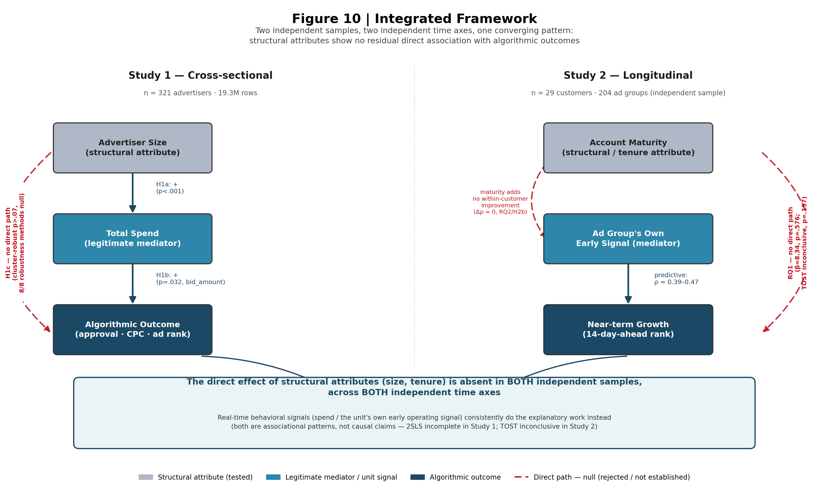

# Structural Signal Irrelevance on an Algorithmically-Mediated Ad Platform

**Two independent studies — one cross-sectional, one longitudinal — testing whether structural account attributes (size, tenure) carry any residual, direct statistical association with algorithmic outcomes on a Korean paid-search platform, once the legitimate behavioral channel each attribute operates through is accounted for.**

> **Repository status.** This is a research repository, not a publication. Everything below documents a working analysis pipeline, its full diagnostic history, and figures generated from it — organized for internal review, reproducibility, and eventual manuscript preparation. Nothing here should be cited as a peer-reviewed result.

> **Scope note.** All "mediation," "path," and "effect" language throughout this repository describes decomposed statistical association in observational panel data, not identified causation. See [§6 Associational-Language Statement](#6-associational-language-statement) for the full statement — it applies globally and is not repeated at every instance.

---

## Table of contents

1. [At a Glance](#1-at-a-glance)
2. [Why Two Studies, One Repository](#2-why-two-studies-one-repository)
3. [Data & Setting](#3-data--setting)
4. [Study 1 — Cross-Sectional: Advertiser-Size Fairness](#4-study-1--cross-sectional-advertiser-size-fairness)
5. [Study 2 — Longitudinal: Cold-Start Reframing & Growth Trajectory](#5-study-2--longitudinal-cold-start-reframing--growth-trajectory)
6. [Associational-Language Statement](#6-associational-language-statement)
7. [Integrated Synthesis](#7-integrated-synthesis)
8. [Design Artifact — Early Warning Flagging Rule](#8-design-artifact--early-warning-flagging-rule)
9. [Boundary Conditions & Generalizability](#9-boundary-conditions--generalizability)
10. [Limitations](#10-limitations)
11. [Transparency Log — Known Code/Design Issues](#11-transparency-log--known-codedesign-issues)
12. [Figure Gallery](#12-figure-gallery)
13. [Repository Structure](#13-repository-structure)
14. [How to Reproduce](#14-how-to-reproduce)

---

## 1. At a Glance

| | Study 1 — Cross-sectional | Study 2 — Longitudinal |
|---|---|---|
| **Structural attribute tested** | Advertiser size (spend tier) | Account maturity (tenure) |
| **Legitimate mediator / alternative signal** | Total spend | Ad group's own early operating signal |
| **Sample** | 321 advertisers, ~19.3M rows | 29 customers, 204 ad groups (independent sample, no shared rows with Study 1) |
| **Central confirmatory test** | H1c — direct path (size → outcome, net of spend) | RQ1 — direct path (maturity → growth slope) |
| **Verdict** | Null, not rejected — 8/8 robustness methods agree | Null, not rejected — 5/5 methods agree; TOST inconclusive |
| **Key figures** | [1](#12-figure-gallery), [2](#12-figure-gallery), [3](#12-figure-gallery), [7](#12-figure-gallery), [8](#12-figure-gallery) | [5](#12-figure-gallery), [6](#12-figure-gallery), [9](#12-figure-gallery) |
| **Secondary finding** | Null is not perfectly homogeneous across ad-product categories (H2, joint Wald p = .023) | The unit's own early signal *is* predictive (ρ ≈ 0.39–0.47); maturity adds nothing within-customer |

**One-line summary:** across two independent samples and two independent time axes, structural account attributes show no detectable residual association with algorithmic outcomes once the relevant behavioral channel is held constant — see [Figure 10](#12-figure-gallery) for the integrated picture.

---

## 2. Why Two Studies, One Repository

Two questions sit on the same underlying logic but on different time axes:

- **Structural entrenchment hypothesis.** Larger, longer-tenured accounts accumulate resources (budget, operational know-how, history) that plausibly earn them a persistent algorithmic advantage — independent of what they're currently doing.
- **Real-time signal dominance hypothesis.** A real-time, auction-based serving system evaluates units almost entirely on their own current behavioral signal (bids, quality score, spend), regardless of the account's size or history behind them.

Both hypotheses reduce to the same test — *does a structural, account-level attribute directly explain a unit-level outcome, or is that relationship fully absorbed by something else* — asked twice, on two independent samples, at two different points in the account lifecycle:

- **Study 1** asks it **cross-sectionally**: does advertiser size directly affect approval rate / cost efficiency / ad rank, net of total spend?
- **Study 2** asks it **longitudinally**: does an account's accumulated maturity directly affect how a *newly created ad group inside that account* grows, net of the ad group's own early signal?

Running both is what turns "one platform's null result" into "the same pattern, replicated across two independent designs" — this convergence, not any single coefficient, is the core evidentiary claim of this repository. See [§7 Integrated Synthesis](#7-integrated-synthesis).

---

## 3. Data & Setting

| Table | Contents | Rows | Coverage |
|---|---|---|---|
| Ad performance log | Daily/hourly impressions, clicks, cost, conversions, ad rank | 19,373,916 | 321 advertisers |
| Campaign dimension | Campaign-level metadata incl. `campaign_type` (ad-product code) | 1,504 | 263/321 |
| Ad group dimension (2026-07-22 snapshot) | Bid price, registration/deletion timestamps, on/off status | 9,823 | 263/321 |
| Keyword dimension | Brand type, `inspect_status` (review code), bid price | 1,503,289 | 256/321 |

**Common limitations (apply to both studies):**
- Single agency (SearchM), single platform (Naver search ads) — cannot be resolved with this data.
- `adgroup_dim` is a **current snapshot** (2026-07-22). Deleted ad groups drop out of the table entirely, so any account-history measure derived from it (all-time ad group count, account age) is always a **lower bound**. This matters most for Study 2's maturity variable ([§5.1.4](#514-what-cold-start-actually-meant)).
- Conversion/ROAS variables are excluded from both studies: Naver's conversion API backfills per-account on a delayed, inconsistent schedule, which breaks construct validity for anything built on top of it — decided before modeling began, not after seeing results.

---

## 4. Study 1 — Cross-Sectional: Advertiser-Size Fairness

### 4.1 Question

Does advertiser size directly, statistically associate with algorithmic outcomes — approval rate, cost efficiency, ad rank — independent of how much the advertiser actually spends?

### 4.2 Where would a size advantage even live?

Before testing anything about size, a 3-level unconditional variance-component model (MixedLM, REML) located *where* performance variation sits.


**Figure 1.** Across ~663K observations, log ad spend is dominated by unexplained residual variance (ICC = 0.825), not by who the customer is (ICC = 0.050). Click-through rate concentrates at the *ad group* level (ICC = 0.301), not the customer level (ICC = 0.200). Both patterns hold with or without month fixed effects, ruling out seasonality — a preliminary signal, prior to any confirmatory test, that "who the customer is" explains comparatively little.

### 4.3 The raw gap, and why it doesn't survive clustering

Splitting advertisers into four spend-based size tiers, Kruskal–Wallis shows significant raw differences in all three outcomes (p < .001 for CPC and ad rank, p = .0006 for approval rate; ε² = 0.002–0.079 — significant but small). A customer-level cluster permutation test (2,000 iterations) shows most of this "significance" evaporates once same-customer non-independence is accounted for — the exact failure mode the spend-controlled design below is built to correct.

### 4.4 The central confirmatory test (H1c)


**Figure 2.** Controlling for log spend in a cluster-robust regression, **all six outcome × sample combinations return non-significant direct-path coefficients for size** (cluster-robust p > .07). Every 95% bootstrap CI sits inside, or at the edge of, its own minimum-detectable-effect (MDE) band at 80% power — the sample is well-powered to detect an effect smaller than what the raw comparison suggests is "the effect." Approximate Bayes factors favor the null in 5 of 6 tests.

### 4.5 Eight independent robustness checks

1. **Specification curve** — 48 defensible analytic choices (tier definition × covariate set); 0/48 reach significance for any outcome.
2. **Placebo test** — device-type share (which size *shouldn't* predict) is significant under the raw distributional test but null under the spend-controlled regression, showing the regression measures the right thing.


**Figure 3.** Panel A: none of 48 specification choices reach significance for any outcome. Panel B: the raw distributional test is significant for *both* the real outcome and the device-share placebo, proving a distributional test alone is not a clean placebo here. The informative comparison is the spend-controlled regression, where real and placebo outcomes are equally, indistinguishably null.

3. Customer-and-month fixed-effects panel regression.
4. **2SLS with lagged spend as instrument** — first-stage F-statistic could not be recovered (code exception, [transparency log #2](#11-transparency-log--known-codedesign-issues)); excluded from any conclusion rather than silently dropped. **No causal identification strategy in this repository was successfully completed — every reported pattern below remains associational.**
5. Temporal split-sample replication (era1 vs era2).
6. Benjamini–Hochberg FDR correction across the six primary hypotheses — raw KW tests remain significant after correction, spend-controlled regressions remain null after correction (the contrast survives multiple-testing correction).
7. **Mechanical-artifact isolation in CPC** — since CPC = cost/click and spend is built from cost, a customer-level permutation procedure shows the observed spend→log(CPC) coefficient falls *below* the purely-mechanical null distribution's lower bound; a lagged replication (day t spend → CPC at t+1, t+7, immune to same-day cost-sharing) confirms a same-signed, significant association at both lags.
8. **Alternative-outcome replication on `bid_amount`** (shares no cost/click term with spend, so it carries none of method 7's artifact).


**Figure 7.** The spend–outcome coefficient shrinks from +1.277 (CPC-based, partly mechanical) to +0.150 (bid_amount-based, cost-independent) once the shared cost term is removed — direction survives, magnitude does not. At the customer level (n=263): the indirect (spend-linked) association is significant (bootstrap 95% CI [0.008, 0.159], permutation p<.001) while the direct association of size, net of spend, is not (p=.634) — the same qualitative pattern, now on an artifact-free outcome.

### 4.6 Is the null homogeneous across contexts? (H2)


**Figure 8.** Stratifying the spend-controlled CPC model by `campaign_type`, a joint Wald test on the size × product-type interaction gives **p = .023**. No individual stratum is significant alone (Website n=184: −0.279, p=.052; Local business n=27: +0.312, p=.211; Shopping n=17: +0.245, p=.151), but the joint test is — treated here as a real, if narrow, exception rather than noise. Local-business and shopping strata are small; interpret accordingly.

### 4.7 RQ3 (exploratory appendix) — churn-prediction benchmarking

Not part of the confirmatory hypothesis family; reported for practical reference only.


**Figure 4.** Nested-CV ROC-AUC across three models on a small, severely imbalanced labeled sample (n=213 accounts, 2.35% churn rate). Gradient boosting nominally leads (0.79 [0.63, 0.97]) but all pairwise Wilcoxon comparisons return p=0.0625 — the statistical floor at n=5 repeat-pairs, not a real tie ([transparency log #4](#11-transparency-log--known-codedesign-issues)). Not treated as a confirmatory finding.

### 4.8 Study 1 verdict

> Raw size-tier gaps are statistically detectable but fragile once clustering is accounted for. The spend-controlled test — replicated on a cost-independent outcome — returns a clean, well-powered null for the direct association of size (H1c), backed by eight independent robustness checks, with one precisely characterized exception (H2, ad-product heterogeneity). The apparent advantage of being a large advertiser is, to first order, consistent with being fully accounted for by spending more rather than by size itself.

---

## 5. Study 2 — Longitudinal: Cold-Start Reframing & Growth Trajectory

### 5.1 A methodological detour that became a finding: what "cold-start" actually meant

Before any confirmatory test, the sample definition itself required five sequential rounds of self-correction. This diagnostic process is treated as a contribution in its own right, not a footnote.

#### 5.1.1 Sample-count reconciliation
An earlier planning document reported two different "true cold-start" counts (476 vs. 250→222). Re-deriving from data dynamically confirmed **250 → 222** as the correct figure; 476 was a looser pre-join count.

#### 5.1.2 "Right-censoring" was not censoring
222 trajectory-usable ad groups initially flagged 83.8% as right-censored. Sensitivity checks against 30/60/90/120-day follow-up cutoffs barely moved this rate (83.6% → 83.2%) — if insufficient follow-up time were the cause, a stricter cutoff should have sharply reduced it. Direct measurement of observed-day coverage within fixed post-registration windows showed only 70–74% coverage, not the near-100% a continuously-run ad group would show. **Reinterpretation:** ad groups mostly aren't self-terminating (they're still running at observation end) combined with genuine intermittency (on/off cycling, budget exhaustion, approval delay) — not classic survival-analysis censoring.

#### 5.1.3 GBTM was abandoned before it was fit
A BIC-based class-count recovery simulation at the achievable sample size (n=222) found ~9% recovery probability at k=2 true latent classes, ~0% at k=3/4. Group-based trajectory modeling was dropped entirely in favor of a continuous growth-slope quantity, avoiding the class-count identification problem.

#### 5.1.4 What "cold-start" actually meant


**Figure 5.** Under every registration-date cutoff tested (0–90 days of prior account history), essentially none of the trajectory-usable sample (0–1 of 222 ad groups) reflected a genuinely new account. **The median account behind a "cold-start" ad group had ~7.8 years of account age** (a lower bound, per the snapshot caveat in [§3](#3-data--setting)). A snapshot/migration-date artifact was explicitly ruled out. **The study was reframed around item cold-start** — a new ad group inside an already-established account — rather than user cold-start (a brand-new advertiser onboarding). This reframing is itself a theoretical contribution: it corrects an implicit, unverified assumption common in applied cold-start analyses.

#### 5.1.5 MixedLM was structurally non-identified
A customer random-intercept mixed model (`slope ~ maturity, groups=customer_id`) was the original planned estimator. Because maturity varies only at the customer level, it competes directly with the customer random intercept for the same layer of variation — a power simulation found a 100% convergence-failure rate across every replication at every tested effect size. MixedLM was dropped entirely (not even retained as a reference point-estimate); a customer-level aggregate OLS with a cluster permutation test became the primary inferential model.

### 5.2 RQ1 (confirmatory) — does account maturity predict a new ad group's initial growth?

Final sample: 204 ad groups → 29 customers (aggregated to customer level, once a complete 30-day window is required).

| Statistic | Value |
|---|---|
| OLS β (raw scale) | 8.34 |
| Cluster-robust HC3 p | .576 |
| Bootstrap 95% CI | [−15.84, 43.08] |
| Cluster permutation p | .663 |
| Spearman ρ | −.020 (p=.92) |
| Leave-one-out (largest customer removed) permutation p | .702 (sign unchanged) |
| Standardized effect size | .085 (17% of the pre-registered large-effect threshold of .50) |

Five independent methods (OLS, bootstrap, permutation, winsorized OLS, rank-rank regression) converge on the same non-significant, small-magnitude conclusion (see Figure 5 above). A leave-one-out check removing the single largest customer (35.8% of the sample) leaves the verdict unchanged.

### 5.3 RQ2 (confirmatory) — does the ad group's own early signal predict growth, and does maturity add anything?


**Figure 6 (panels A–B).** An ad group's own early operating signal (activity coverage, spend trend, CTR/CVR) **is** predictive of near-term growth: leakage-free within-customer LOCO ρ ranges from 0.467 (14/14-day window) down to 0.060 (30/60-day window) — predictive power decays sharply with horizon length. Adding account maturity shows an apparent *pooled* improvement, but **decomposing that pooled improvement into between-customer and within-customer components** reveals the entire gain sits in the between-customer term — maturity is re-deriving the same customer-level signal already captured elsewhere, not adding genuine ad-group-level predictive value. The within-customer component is ≈0 or slightly negative at every tested window.

### 5.4 RQ3 (exploratory) — early-signal flagging and decision timing

**Figure 6 (panels C–D, above).** Early-signal flagging achieves a 1.2–1.4× precision lift over random flagging, fairly consistently across decision cutoffs at day 7, 14, and 21 post-registration. Bootstrapped 95% CIs on out-of-fold predictive ρ overlap substantially across all three cutoffs — **no single day is statistically distinguishable as optimal.**

Two successive "expected uplift" simulations (intended to identify the optimal intervention day under an assumed effect size) were found to be mathematically incapable of answering that question — the effect-size parameters entered the formula in a way that made the argmax structurally fixed regardless of the swept values ([transparency log #5–6](#11-transparency-log--known-codedesign-issues)). The reported result was narrowed to what can be measured without an intervention-effect assumption: precision/recall/lift against the *realized* outcome.

### 5.5 Formal equivalence testing


**Figure 9.** A non-significant p-value doesn't itself establish that an effect is absent, so both null results above were tested for TOST equivalence. **Neither reaches formal equivalence**: maturity → growth slope, TOST p = .197; maturity's contribution to prediction, TOST p = .290. Both are well-powered, non-significant associations for which formal equivalence remains inconclusive — this is why Study 2 is reported as directionally supportive of the same pattern as Study 1, not as an independently conclusive companion result.

### 5.6 Study 2 verdict

> Item cold-start, not user cold-start, is the actual phenomenon in this data — a correction to an unverified implicit assumption. Account maturity shows no significant direct association with a new ad group's initial growth (5/5 methods converge on null; TOST inconclusive). The ad group's own early operating signal *is* predictive, and that predictive value is not improved by adding account maturity once between/within decomposition removes the leaked customer-level signal. The same qualitative pattern as Study 1 — structural attribute null, behavioral-signal positive — replicates on an independent sample and a different time axis.

---

## 6. Associational-Language Statement

Every "path," "mediation," and "effect" statement across both studies describes an associational pattern from observational panel data, not an identified causal effect. This vocabulary is standard in the fairness-audit and platform-economics literatures and is used deliberately, not as a hedge added after the fact. The one causal-identification attempt in this repository (2SLS, Study 1 method 4) could not be completed and its failure is reported openly rather than folded into the confirmatory evidence — see [transparency log #2](#11-transparency-log--known-codedesign-issues). What the combined robustness batteries support is a materially stronger form of *associational* evidence than any single coefficient: the same qualitative pattern replicates across contaminated and artifact-free outcomes, across dozens of specifications, against placebos, across time splits, across two independent samples, and across two independent time axes.

---

## 7. Integrated Synthesis



**Figure 10.** Two independent samples (321 advertisers cross-sectionally; 29 customers longitudinally), two independent time axes, one converging pattern. In Study 1, advertiser size's direct path to algorithmic outcomes is severed once total spend is held constant (H1c, 8/8 methods null). In Study 2, account maturity's direct path to a new ad group's growth is severed once the ad group's own early signal is accounted for (RQ1, 5/5 methods null; RQ2/H2b — maturity adds no within-customer prediction). Neither result is an unconditional universal claim: Study 1's null is not perfectly homogeneous across ad-product categories ([§4.6](#46-is-the-null-homogeneous-across-contexts-h2)), and Study 2's is directionally, not TOST-confirmedly, supportive of the same story ([§5.5](#55-formal-equivalence-testing)).

**What ties the two studies together, and what doesn't.** Both studies test the same underlying question — *does a structural, account-level attribute directly explain a unit-level algorithmic outcome, or is it fully absorbed by a legitimate behavioral channel* — on independent samples, independent time axes, and independent mediators (spend vs. own-signal). Neither study individually reaches causal identification (Study 1's 2SLS attempt failed on a code-level issue; Study 2's core result doesn't reach TOST equivalence), so the honest claim is convergent associational evidence, not a proven causal mechanism. The reusable contribution is the **audit logic itself** — test whether a structural attribute's association with outcomes survives controlling for the legitimate channel it plausibly operates through, rather than testing only for a raw outcome gap — independent of which way any single platform's answer points.

---

## 8. Design Artifact — Early Warning Flagging Rule

Grounded in Study 2 [§5.3](#53-rq2-confirmatory--does-the-ad-groups-own-early-signal-predict-growth-and-does-maturity-add-anything)'s confirmed within-customer result (an ad group's own early signal predicts growth; maturity doesn't improve it), a concrete decision rule is specified as a design artifact:

| Field | Value |
|---|---|
| Input | `predicted_growth_rank_percentile` (float, [0,1]); `day_since_registration` (int) |
| Output | `flag` (bool); `reason` (str) |
| `flag_threshold` | 0.30 |
| Valid decision window | day 7–21 post-registration |

**Design principles:** (DP1) base flagging solely on the ad group's own early-period signal, never account history; (DP2) evaluate anywhere within the 7–21 day window rather than committing to one fixed day, since no cutoff is statistically distinguishable as optimal (Figure 6, panel D); (DP3) threshold on relative cohort rank, not an absolute growth value.

**Backtest status.** A naive size/tenure-based comparison rule is structurally ill-posed here (within-customer demeaning collapses its predictions to numerical zero by construction — there's nothing for the own-signal rule to beat on that axis). Against a random-flagging baseline instead, own-signal precision exceeded random in 4 of 9 window specifications (44%) — at n≈20 customers per spec, **this is not distinguishable from chance.** Full grid: [`docs/DESIGN_ARTIFACT.md`](docs/DESIGN_ARTIFACT.md).

**Status: theoretically motivated, not yet empirically validated** as superior to alternatives in binary-decision form. Recommended next step: a larger cold-start sample and/or a continuous precision-recall evaluation rather than a single-threshold binary comparison.

---

## 9. Boundary Conditions & Generalizability

**Within-platform heterogeneity.**
- Campaign product type (Study 1, H2, [Figure 8](#12-figure-gallery)): joint Wald p = .023 — not perfectly homogeneous, plausibly because different product types route through different approval pipelines (e.g., shopping campaigns undergo product-feed validation that standard search doesn't).
- Keyword review status (exploratory): only 0.5% of keywords carry a non-standard `inspect_status`, so this check is under-powered by construction; the one significant interaction (restricted-approval definition, p=.016) is one signal probed three ways, not three independent confirmations.
- Industry classification was piloted (multilingual embeddings + LLM ensemble against KSIC categories) but inter-rater reliability (Randolph's free-marginal κ = 0.557) and cross-validation against a rule-based classifier (Cohen's κ = 0.363) both indicate moderate-at-best label reliability — industry-stratified results are not reported as findings.

**Cross-platform generalizability.** The documented pattern — real-time, auction-based serving whose outcomes track a unit's own current signal — is a property of the serving architecture, not this platform's brand specifically. Direction is expected to generalize to other real-time bidding platforms with comparable architecture. No claim is made about magnitude. The pattern would plausibly **weaken** under: mandatory human review (account-level trust could re-enter through reviewer discretion), new categories without established auction liquidity (platform may fall back on account-level heuristics), or platforms whose ranking algorithm explicitly incorporates account tenure/verification as a feature.

---

## 10. Limitations

| # | Limitation | Study |
|---|---|---|
| 1 | Single agency, single platform — external generalizability is architecturally scoped, not empirically tested across platforms | Both |
| 2 | Every mediation/path/effect claim is associational, not causally identified; the one identification attempt (2SLS) could not be completed | Study 1 |
| 3 | H2 strata are unevenly sized (n=184/27/17) — interpret the joint interaction test accordingly | Study 1 |
| 4 | Keyword-review-status boundary check is under-powered (0.5% of keywords carry non-standard status) | Study 1 |
| 5 | `adgroup_dim` is a snapshot; all account-age/maturity measures are lower bounds | Both |
| 6 | Study 2's confirmatory sample is small (customer-level n=29–32); only large standardized effects (β≈.5) are reliably detectable (88% power) | Study 2 |
| 7 | Study 2's TOST equivalence tests do not reach formal equivalence — the null is well-powered but not proven absent | Study 2 |
| 8 | RQ3 intervention-timing simulation cannot support causal "optimal day" claims — no real intervention record exists | Study 2 |
| 9 | Conversion/ROAS variables excluded entirely from both studies — no revenue/profitability conclusions can be drawn | Both |
| 10 | The item cold-start reframing narrows the original "new-advertiser onboarding" scope out of this repository's claims — noted as future work, not resolved here | Study 2 |

---

## 11. Transparency Log — Known Code/Design Issues

*Logged in full for reproducibility review. Reported plainly, not minimized.*

| # | Location | Issue | Status | How it's handled |
|---|---|---|---|---|
| 1 | Study 1 | Spike-account exclusion produces identical results before/after in the FE and 2SLS robustness axes (likely because a `min_days` filter already excludes spike accounts from these subsamples) | Root cause inferred, not confirmed | Flagged as providing no additional robustness information on this axis — not counted as an independent confirmation |
| 2 | Study 1 | 2SLS first-stage F-statistic silently returns `None` due to an uncaught exception in a `try/except` block | Root cause unidentified | 2SLS coefficients excluded from all confirmatory conclusions; retained only as an unverified reference value |
| 3 | Study 1 | The core confirmatory test (H1c, spend-controlled regression) was not re-run under the temporal split — only the raw KW test was | Design gap | Noted explicitly as a limitation, not silently left implicit |
| 4 | Study 1 (RQ3 appendix) | Wilcoxon signed-rank p-values are identical (.0625) across all three model-pair comparisons — the floor value achievable at n=5 repeat-pairs, not a real tie in performance | Confirmed statistical artifact | No significance stars used; footnoted explicitly |
| 5 | Study 2 | First "expected uplift" simulation: effect-size parameters entered the formula as constants multiplying every (cutoff, threshold) cell identically, making the argmax over cutoffs structurally incapable of changing regardless of swept values | Confirmed mathematical artifact | Result discarded; not used in any conclusion |
| 6 | Study 2 | A "corrected" second version of the uplift simulation reintroduced the same multiplicative-constant trap in a different form | Confirmed, re-discarded | RQ3 scope narrowed to precision/recall/lift against realized outcomes only — no expected-value or "optimal day" causal claim |
| 7 | Study 2 | Naive size/tenure-based flagging comparison in the design artifact initially showed a "naive-rule victory" — traced to the naive predictions not being within-customer demeaned before ranking, re-injecting the between-customer signal the within-customer claim explicitly excludes | Confirmed bug, corrected | Corrected version (within-customer demeaning applied to both rules) is the one reported; naive comparison abandoned as ill-posed, replaced with a random-baseline comparison |
| 8 | Both | `adgroup_dim` snapshot means account-age/maturity measures are structural lower bounds, not exact values | Structural limitation, not resolvable with current data | Stated explicitly wherever maturity is used as a variable |

---

## 12. Figure Gallery

All figures render inline below and also live as standalone PNGs in [`figures/`](figures/) for direct download or embedding elsewhere.

<a id="figure-1"></a>
### Figure 1 — Multilevel variance decomposition of advertising performance
*Study 1 · [used in §4.2](#42-where-would-a-size-advantage-even-live)*


---

<a id="figure-2"></a>
### Figure 2 — Advertiser-size effect on approval, cost efficiency, and ad rank, controlling for spend
*Study 1 · [used in §4.4](#44-the-central-confirmatory-test-h1c)*


---

<a id="figure-3"></a>
### Figure 3 — Multiverse specification curve and placebo test
*Study 1 · [used in §4.5](#45-eight-independent-robustness-checks)*


---

<a id="figure-4"></a>
### Figure 4 — Churn-prediction benchmarking (exploratory appendix)
*Study 1, Appendix D · [used in §4.7](#47-rq3-exploratory-appendix--churn-prediction-benchmarking)*


---

<a id="figure-5"></a>
### Figure 5 — Cold-start sample construction and RQ1 confirmatory test
*Study 2 · [used in §5.1.4](#514-what-cold-start-actually-meant) and [§5.2](#52-rq1-confirmatory--does-account-maturity-predict-a-new-ad-groups-initial-growth)*


---

<a id="figure-6"></a>
### Figure 6 — Cold-start early-signal prediction and intervention-timing simulation
*Study 2 · [used in §5.3](#53-rq2-confirmatory--does-the-ad-groups-own-early-signal-predict-growth-and-does-maturity-add-anything) and [§5.4](#54-rq3-exploratory--early-signal-flagging-and-decision-timing)*


---

<a id="figure-7"></a>
### Figure 7 — Spend-mediation b-path: CPC-based vs. cost-independent outcome
*Study 1 · [used in §4.5](#45-eight-independent-robustness-checks)*


---

<a id="figure-8"></a>
### Figure 8 — Campaign product-type heterogeneity
*Study 1 · [used in §4.6](#46-is-the-null-homogeneous-across-contexts-h2)*


---

<a id="figure-9"></a>
### Figure 9 — TOST equivalence tests for the two central null results
*Study 1 & 2 · [used in §5.5](#55-formal-equivalence-testing)*


---

<a id="figure-10"></a>
### Figure 10 — Integrated framework: structural signal irrelevance across two independent tests
*Study 1 & 2 (synthesis) · [used in §7](#7-integrated-synthesis)*


**Figure 10 is new** relative to either study's original documentation — a conceptual synthesis diagram (not a statistical plot) built directly from the canonical statistics in [`docs/RESULTS_SUMMARY.md`](docs/RESULTS_SUMMARY.md), generated via [`figures/make_figure10_integrated_framework.py`](figures/make_figure10_integrated_framework.py). Figures 1–9 are generated from pipeline output (`figures/make_figure1..9_*.py`); source scripts are indexed in [§13](#13-repository-structure).

| # | Title | Study | Script |
|---|---|---|---|
| [1](#figure-1) | Multilevel variance decomposition | 1 | `make_figure1_variance_decomposition.py` |
| [2](#figure-2) | Advertiser-size effect, controlling for spend | 1 | `make_figure2_fairness_forest_plot.py` |
| [3](#figure-3) | Multiverse specification curve + placebo | 1 | `make_figure3_specification_curve_placebo.py` |
| [4](#figure-4) | Churn-prediction benchmarking | 1 (App. D) | `make_figure4_churn_benchmark.py` |
| [5](#figure-5) | Cold-start funnel + RQ1 null | 2 | `make_figure5_coldstart_funnel_and_rq1_null.py` |
| [6](#figure-6) | Early-signal prediction + intervention timing | 2 | `make_figure6_rq2_horizon_rq3_lift.py` |
| [7](#figure-7) | Spend-mediation b-path | 1 | `make_figure7_mediation_forest.py` |
| [8](#figure-8) | Product-type heterogeneity | 1 | `make_figure8_boundary_condition_forest.py` |
| [9](#figure-9) | TOST equivalence | 1 & 2 | `make_figure9_tost_equivalence.py` |
| [**10**](#figure-10) | **Integrated framework (new synthesis diagram)** | **1 & 2** | `make_figure10_integrated_framework.py` |

---

## 13. Repository Structure

```
structural-signal-irrelevance/
├── README.md                          <- you are here
├── LICENSE
├── requirements.txt
│
├── config/
│   └── config.yaml                    <- all paths, thresholds, sample-definition rules
│
├── data/
│   └── README.md                      <- expected schema + how to request access (no data files committed)
│
├── src/
│   ├── utils/
│   │   ├── io.py
│   │   └── identifiers.py
│   │
│   ├── pipeline_v4/                   <- Study 1: advertiser-size fairness pipeline
│   │   ├── step0_data_prep_v4.py
│   │   ├── step1_variance_decomposition_v4.py
│   │   ├── step2_advertiser_size_fairness_v4.py
│   │   ├── step3_churn_appendix_v4.py
│   │   └── step4_synthesis_v4.py
│   │
│   ├── coldstart_v5/                  <- Study 2: cold-start diagnostic pipeline (Steps A-M)
│   │   ├── step_a_period_and_spike_check.py
│   │   ├── step_b_true_coldstart_sample.py
│   │   ├── step_c_right_censoring_flags.py
│   │   ├── step_d_customer_clustering_density.py
│   │   ├── step_e_class_count_identifiability_sim.py
│   │   ├── step_f_registration_cutoff_sensitivity.py
│   │   ├── step_g_fixed_window_coverage.py
│   │   ├── step_h_top_customer_profiling.py
│   │   ├── step_i_account_maturity_distribution.py
│   │   ├── step_j_regtm_artifact_check.py
│   │   ├── step_k_power_simulation.py
│   │   ├── step_l_rq2_feature_engineering.py
│   │   └── step_m_intervention_timing_simulation.py
│   │
│   └── analysis/                      <- confirmatory tests (Study 2)
│       ├── rq1_growth_curve_test.py
│       └── rq2_prediction_validation.py
│
├── supplementary_robustness/           <- Study 1 supplementary robustness scripts
│   ├── supplementary_robustness_README.md
│   ├── 01_alternative_outcome_mediation.md / .py
│   ├── 02_boundary_conditions.md / .py
│   ├── 03_equivalence_and_sensitivity_notes.md / .py
│   └── 04_design_artifact_future_work.md / .py
│
├── figures/                            <- one script per figure; reads results JSON/CSV, writes PNG
│   ├── make_figure1_variance_decomposition.py        -> Figure1_variance_decomposition.png
│   ├── make_figure2_fairness_forest_plot.py          -> Figure2_fairness_forest_plot.png
│   ├── make_figure3_specification_curve_placebo.py   -> Figure3_specification_curve_placebo.png
│   ├── make_figure4_churn_benchmark.py               -> Figure4_churn_benchmark.png
│   ├── make_figure5_coldstart_funnel_and_rq1_null.py -> Figure5_coldstart_funnel_and_RQ1_null.png
│   ├── make_figure6_rq2_horizon_rq3_lift.py          -> Figure6_RQ2_horizon_RQ3_lift.png
│   ├── make_figure7_mediation_forest.py              -> Figure7_mediation_forest.png
│   ├── make_figure8_boundary_condition_forest.py     -> Figure8_boundary_condition_forest.png
│   ├── make_figure9_tost_equivalence.py              -> Figure9_tost_equivalence.png
│   ├── make_figure10_integrated_framework.py         -> Figure10_integrated_framework.png   <- new (this repo)
│   └── Figure*.png                                   <- the 10 rendered figures used above
│
├── appendix/
│   ├── churn_prediction_rq4.md                <- Appendix D — exploratory churn prediction (Study 1)
│   ├── exploratory_industry_classification.md <- Study 1, §9 industry-classification pilot
│   └── hypothesis_id_legacy_mapping.md        <- figure-title / hypothesis-ID reconciliation
│
├── docs/
│   ├── METHODOLOGY_NOTES.md            <- Study 2 full estimator-selection derivation log
│   ├── RESULTS_SUMMARY.md              <- canonical statistics table, both studies
│   └── DESIGN_ARTIFACT.md              <- full flagging-rule spec + 9-specification backtest grid
│
├── run_diagnostics.sh                  <- runs coldstart_v5 Steps A-M in order
├── run_pipeline_v4.sh                  <- runs the Study 1 v4 pipeline end-to-end
└── run_supplementary_robustness.sh     <- runs all four supplementary_robustness/*.py scripts
```

---

## 14. How to Reproduce

1. Request a schema-compatible data extract (`data/README.md` documents the expected schema; data are proprietary and not included in this repository).
2. `bash run_pipeline_v4.sh` — Study 1: variance decomposition, advertiser-size fairness battery, churn appendix.
3. `bash run_diagnostics.sh` — Study 2: Steps A–M of the cold-start diagnostic pipeline (`src/coldstart_v5/`).
4. Run `src/analysis/rq1_growth_curve_test.py` and `src/analysis/rq2_prediction_validation.py` for the Study 2 confirmatory tests.
5. `bash run_supplementary_robustness.sh` — the four independently runnable Study 1 robustness analyses.
6. Regenerate Figures 1–9 with `figures/make_figure*.py` (each reads a results JSON/CSV and writes a PNG to `figures/`).
7. Regenerate Figure 10 with `figures/make_figure10_integrated_framework.py` — no external data required, pulls static values directly from `docs/RESULTS_SUMMARY.md`.

Every pipeline step writes its own diagnostic JSON/CSV artifact; nothing is silently overwritten, and each script can be re-run independently as long as its upstream artifact exists.

---

*This repository is maintained as a living analysis log. Numbers here are pulled directly from execution logs and are not rounded beyond what's shown — adjust significant figures to target-venue convention only at manuscript-preparation time.*
